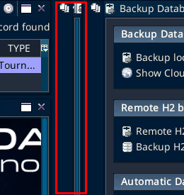
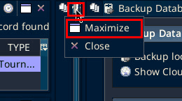
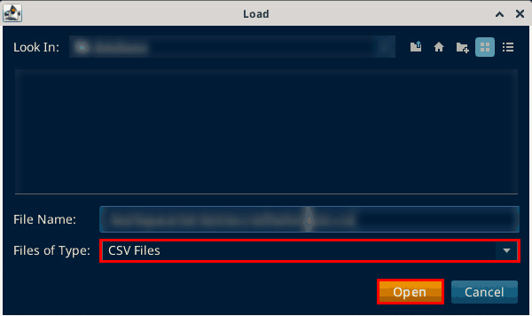
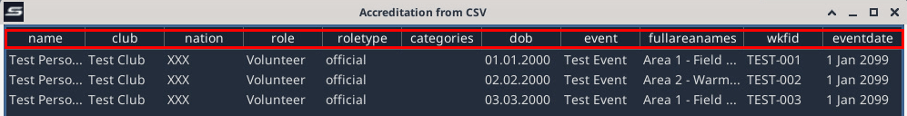
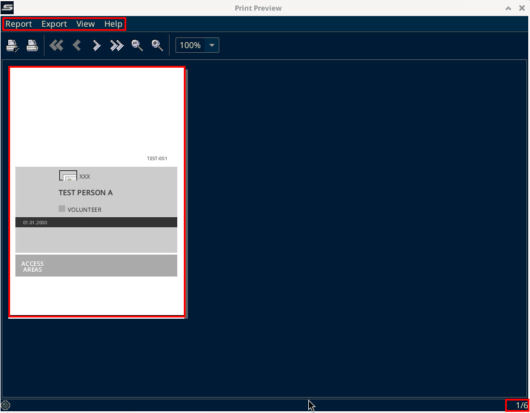
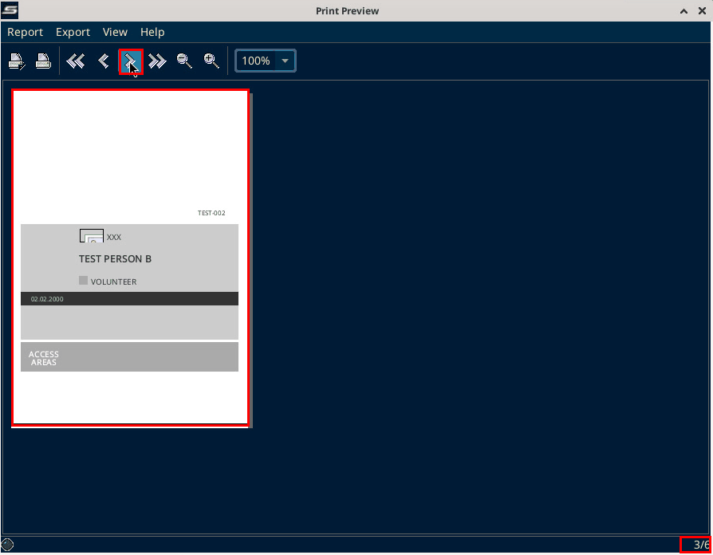

# Accreditations

Source: process document added 3 Oct 2026. The menu paths on this page were checked on SET 12.2.0 build 3 on 6 Oct 2026.

Accreditations are generated and sent to every club. That includes athletes, coaches, referees, and officials.

They go out both online and by email (SMTP).

## Accreditation panel

Open Panels, then "Accreditation".


Tip: if Panels, then "Accreditation" seems to do nothing, the panel may be docked in a very narrow column. On SET 12.2.0 build 3 (local test, 6 Oct 2026) it sat between Events / Welcome and Backup Database and was nearly invisible.



Click the icon in the header of that column. A menu with "Maximize" and "Close" opens. Choose "Maximize" to open the panel full size.



The "Accreditation" section has "Accreditation Participant (by Club)", "Accreditation Coach (by Club)", "Accreditation Referee (by Club)", "Accreditation Officials (by Club)", "Accreditation (by Club)", "Accreditation Template", the same four "(by Person)" links, and "Press-Accreditation (by Person)".


Further down are "Accreditation Settings" and the "Accreditation from CSV" button.


Not found on SET 12.2.0 build 3 (local test, 6 Oct 2026): a "Send Accreditation" button, or Athlete, Coach, Referee and Officials as choices in one dialog. Found instead: the separate "(by Club)" and "(by Person)" links above, one per group. The venue photo below shows the same links. "Generate Accreditation" does exist, but only in the "Accreditation from CSV" window after a CSV file is loaded. See "Accreditation from CSV" below.

On the same local test, "Overviews / Statistics", then "All entries", opens "Athlete Entries". Its "Edit" menu has "Reset Accreditation Print Status". It had no "Accreditation - send by email" item. SET shows that item only when it runs in online server mode, and the local copy was offline. The menu ran past the bottom of the screen after "Teams", so the items below it were not seen. No send path was seen, and nothing was sent.


## Accreditation cards by club

On SET 12.2.0 build 3 (local test, 6 Oct 2026):

1. In the "Accreditation" panel, click "Accreditation Participant (by Club)". Only the participant link was tested.


2. The "Accreditation Participant" window has a search field and the club list. On the local copy it showed "Number: 39". Select a club. In the test it was Champions Boxing.


3. The buttons are "Select all", "Print selection", "Refresh" and "Save ind. Accred.". Click "Print selection".


4. A "Print Preview" window opens straight away, with no format question. For Champions Boxing it showed card 1 of 3, headed "7. BERNER CUP 2026", with the country, the athlete name, "ATHLETE", the club and the category. Nothing was printed. The birth date and the number on the card are blurred in the screenshot.


The panel also says "Single cards can be printed directly from the entries in the main tree!".

## Accreditation from CSV

On SET 12.2.0 build 3 (local test, 6 Oct 2026): "Generate QR code for access control" and "Print as PDF" are under "Other settings" in "Accreditation Settings". Under "Access Areas" is the checkbox "Ask for Access Areas before generating Accreditation". It is a setting, not a button.


"Accreditation from CSV" opens a "Load" file dialog straight away, with "Files of Type: CSV Files". The folder list is blurred in the screenshot.


On SET 12.2.0 build 3 (local test, 6 Oct 2026) a test file with three fake people was loaded. Choose the CSV file and click Open. The folder and the file path are blurred in the screenshot.



The "Accreditation from CSV" window opens. It shows the file as a table with one column per field. In the test the columns were name, club, nation, role, roletype, categories, dob, event, fullareanames, wkfid and eventdate.



At the bottom it shows the row count, here "Number of records: 3", and the "Generate Accreditation" button.


"Generate Accreditation" opens a "Print Preview" window with the menus Report, Export, View and Help. In the test it had 6 pages for 3 people. Page 1/6 was the card for TEST PERSON A. Page 2 was blank.



The next page arrow moves through the pages. Page 3/6 was the card for TEST PERSON B. Nothing was printed or exported in the test.



### CSV format

Source: SET 12.2.0 build 3 program files and the local test on 6 Oct 2026.

- Separate the values with semicolons (;).
- Save the file as UTF-8 without BOM. With a BOM the first column name is not read as name.
- The first row holds the column names in lowercase. They must match the field names on the card template: name, club, nation, role, roletype, categories, dob, event, fullareanames, wkfid, eventdate.
- Leave out the picture, qrcode and logo columns. A URL in one of them is fetched from the internet.
- "Generate Accreditation" only opens a print preview. It writes nothing to the database and sends nothing.

Example with fake data:

```
name;club;nation;role;roletype;categories;dob;event;fullareanames;wkfid;eventdate
Test Person A;Test Club;XXX;Volunteer;official;;01.01.2000;Test Event;Area 1 - Field of Play;TEST-001;1 Jan 2099
Test Person B;Test Club;XXX;Volunteer;official;;02.02.2000;Test Event;Area 2 - Warm-up;TEST-002;1 Jan 2099
```

## Email settings (SMTP)

The "Settings" menu has "Settings", "Email Smtp" and "Language". Choose "Email Smtp".


The "SMTP Settings" window has "Host name", "Port number", "Username", "Password", "Reply to - separate multiple with ," and "Save". The fields were empty on the local copy.


## Venue photo

In the venue photo (SET 12.2.0 build 2), "Settings" is open on "Email Smtp". The "Accreditation" panel is open.


