# Accreditations

Source: process document added 3 Oct 2026. The menu paths on this page were checked on SET 12.2.0 build 3 on 6 Oct 2026.

Accreditations are generated and sent to every club. That includes athletes, coaches, referees, and officials.

They go out both online and by email (SMTP).

## Accreditation panel

Open Panels, then "Accreditation".

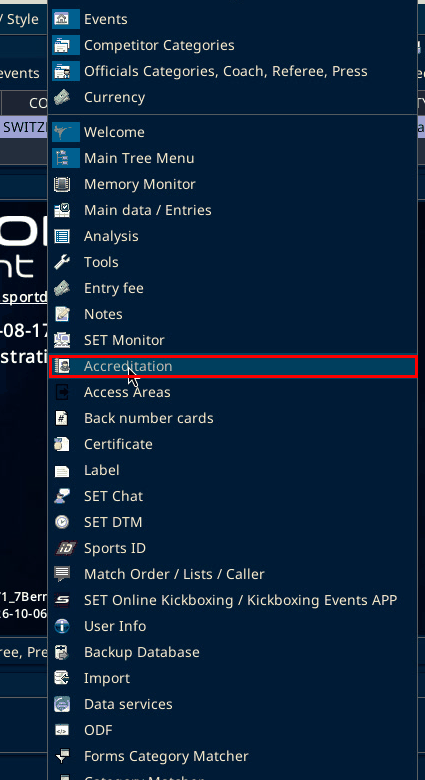

The "Accreditation" section has "Accreditation Participant (by Club)", "Accreditation Coach (by Club)", "Accreditation Referee (by Club)", "Accreditation Officials (by Club)", "Accreditation (by Club)", "Accreditation Template", the same four "(by Person)" links, and "Press-Accreditation (by Person)".

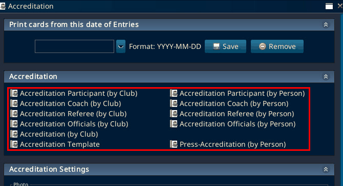

Further down are "Accreditation Settings" and the "Accreditation from CSV" button.

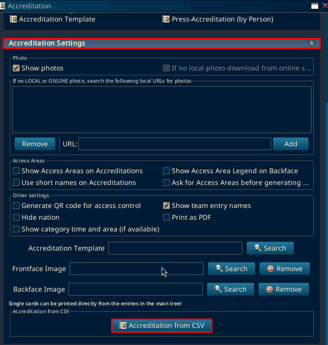

Not found on SET 12.2.0 build 3 (local test, 6 Oct 2026): a "Generate Accreditation" or "Send Accreditation" button, or Athlete, Coach, Referee and Officials as choices in one dialog. Found instead: the separate "(by Club)" and "(by Person)" links above, one per group. The venue photo below shows the same links. The only similar label in the panel is the checkbox "Ask for Access Areas before generating Accreditation". See "Accreditation from CSV" below.

On the same local test, "Overviews / Statistics", then "All entries", opens "Athlete Entries". Its "Edit" menu has "Reset Accreditation Print Status". It had no "Accreditation - send by email" item. SET shows that item only when it runs in online server mode, and the local copy was offline. The menu ran past the bottom of the screen after "Teams", so the items below it were not seen. No send path was seen, and nothing was sent.

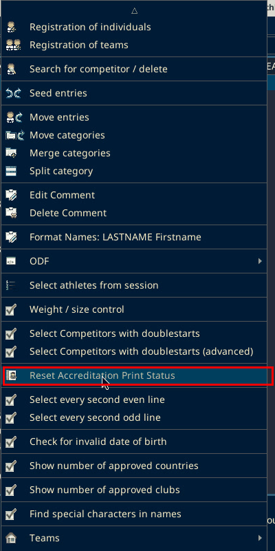

## Accreditation cards by club

On SET 12.2.0 build 3 (local test, 6 Oct 2026):

1. In the "Accreditation" panel, click "Accreditation Participant (by Club)". Only the participant link was tested.

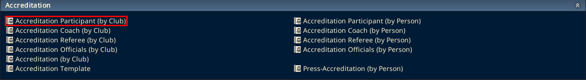

2. The "Accreditation Participant" window has a search field and the club list. On the local copy it showed "Number: 39". Select a club. In the test it was Champions Boxing.

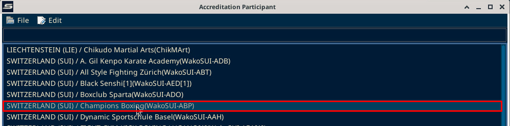

3. The buttons are "Select all", "Print selection", "Refresh" and "Save ind. Accred.". Click "Print selection".

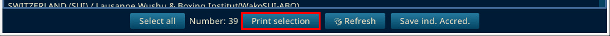

4. A "Print Preview" window opens straight away, with no format question. For Champions Boxing it showed card 1 of 3, headed "7. BERNER CUP 2026", with the country, the athlete name, "ATHLETE", the club and the category. Nothing was printed. The birth date and the number on the card are blurred in the screenshot.

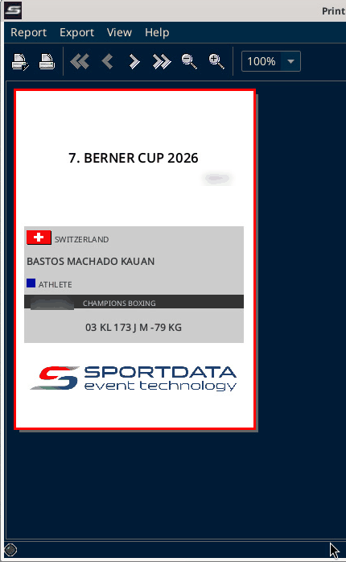

The panel also says "Single cards can be printed directly from the entries in the main tree!".

## Accreditation from CSV

On SET 12.2.0 build 3 (local test, 6 Oct 2026): "Generate QR code for access control" and "Print as PDF" are under "Other settings" in "Accreditation Settings". Under "Access Areas" is the checkbox "Ask for Access Areas before generating Accreditation". It is a setting, not a button.

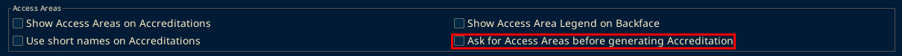

"Accreditation from CSV" opens a "Load" file dialog straight away, with "Files of Type: CSV Files". In the test Cancel was clicked, so no CSV file was loaded. No "Generate Accreditation" button showed on this path. SET's code has a "Generate Accreditation" label in the window that previews a loaded CSV file. That window was not seen. The folder list is blurred in the screenshot.

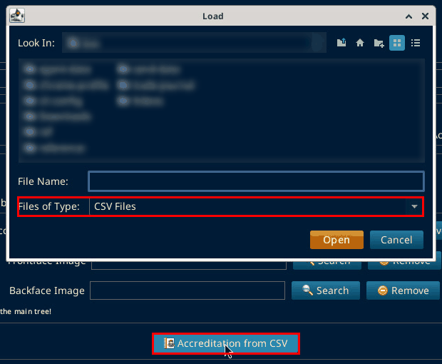

## Email settings (SMTP)

The "Settings" menu has "Settings", "Email Smtp" and "Language". Choose "Email Smtp".

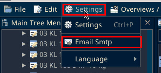

The "SMTP Settings" window has "Host name", "Port number", "Username", "Password", "Reply to - separate multiple with ," and "Save". The fields were empty on the local copy.

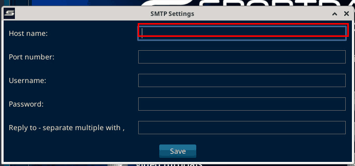

## Venue photo

In the venue photo (SET 12.2.0 build 2), "Settings" is open on "Email Smtp". The "Accreditation" panel is open.

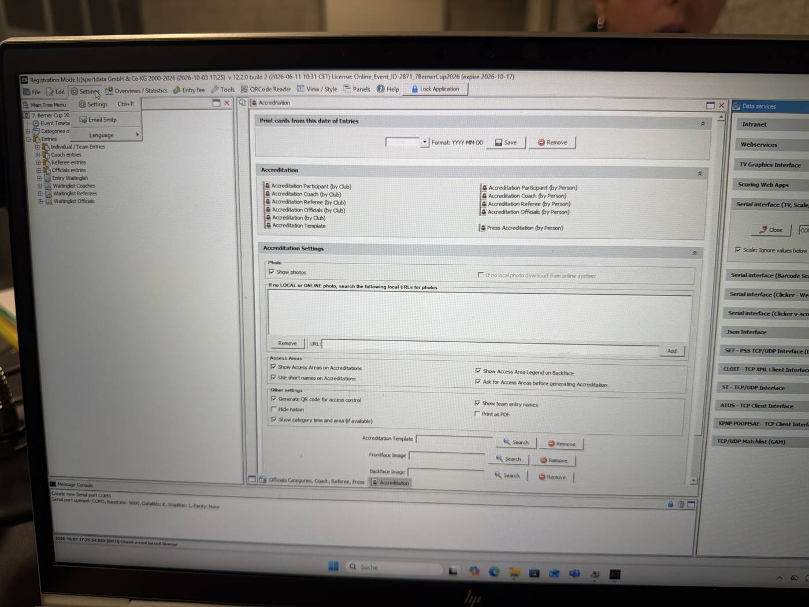
