# Save a SQL backup

Source: Sport Data's export/import demo, and Lucas opening Backup Database in SET on 30 Sep 2026.

Checked on SET 12.2.0 build 3 on 6 Oct 2026, on a local copy that uses the integrated H2 database. File paths are blurred in the screenshots.

[Export / import database demo](https://set.sportdata.org/knowledge-base/demos/Export-import-database-demo/Export_Import_Database_demo.html)

## In SET

1. Panels, then Backup Database.
2. Backup online database.
3. Pick the folder in Backup save directory. The top backup line is the one that runs the save.

Backup Database is open. Backup online database and Backup save directory are on the window. The password box is empty.

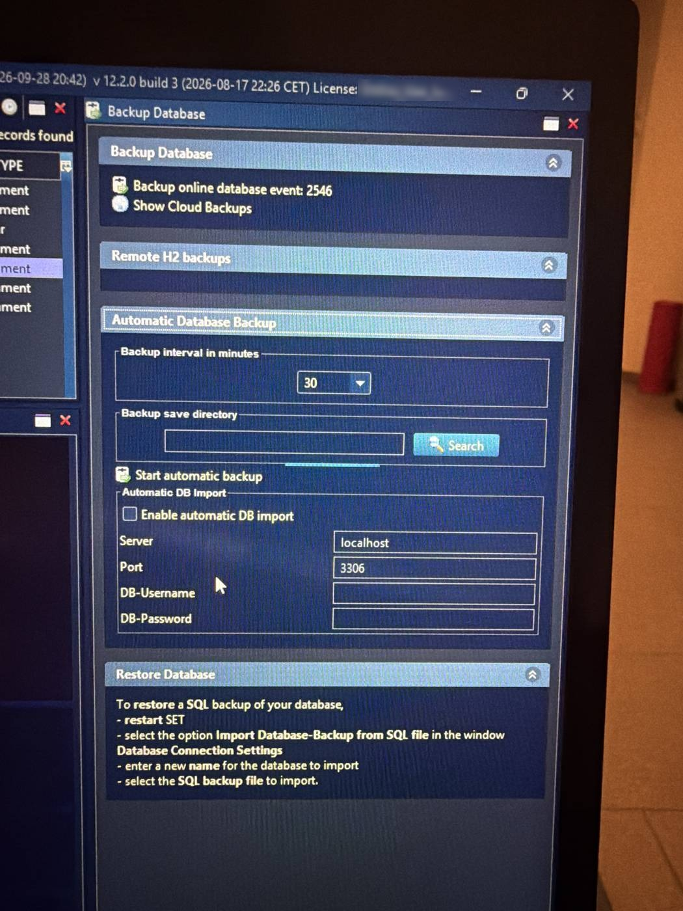

The top line follows the connection type. At the venue, with the online database, it read Backup online database. On the local H2 copy it reads Backup local database. The next line is Show Cloud Backups. Do not click it.

Not found on SET 12.2.0 build 3 (local test, 6 Oct 2026): picking the folder in Backup save directory for this backup. Found instead: Backup save directory is an empty field under Automatic Database Backup, and its search control is a thin unlabeled bar under the field. The backup asks for the folder in its own Save in directory ... box (step 4 below).

On SET 12.2.0 build 3 (local test, 6 Oct 2026), with the Backup Database panel maximized, the thin bar shows its parts. "Backup save directory" is a group with an empty field, Search and Remove. It belongs to Automatic Database Backup. Search was not clicked.

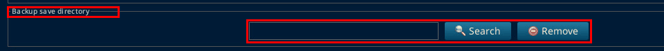

Show Cloud Backups has the tooltip "Cloud Backups". It was only hovered.

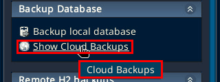

### Steps on build 3 (local database)

1. Panels, then Backup Database.

   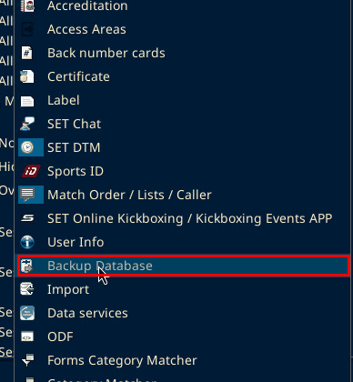

2. Click Backup local database.

   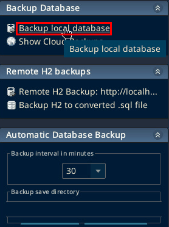

3. A box titled "Attention!" asks "The backup will block the system for some time. Do you really want to proceed with the backup?" It has OK and Cancel. Click OK.

   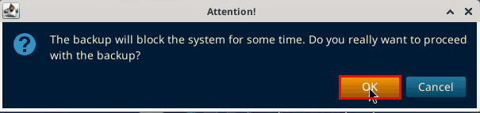

4. The Save in directory ... box opens. Files of Type is SQL/H2 Files. Choose the folder and click Open. In a second run on 6 Oct 2026 Files of Type showed CSV Files. Only the folder is picked here, and the backup was still saved as .h2.

   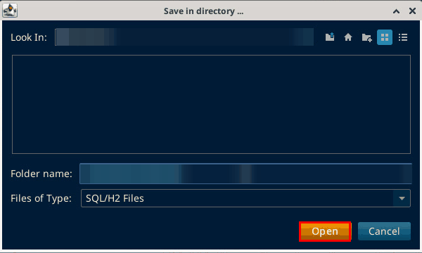

5. The Backup of local database window shows "-> Backup of local database", "-> File: ...", "-> Processing...Please wait!" and then "-> Backup Database to sql file -> finished". A box titled "Attention!" shows "Backup Database to sql file -> finished: " followed by the file path. Click OK.

   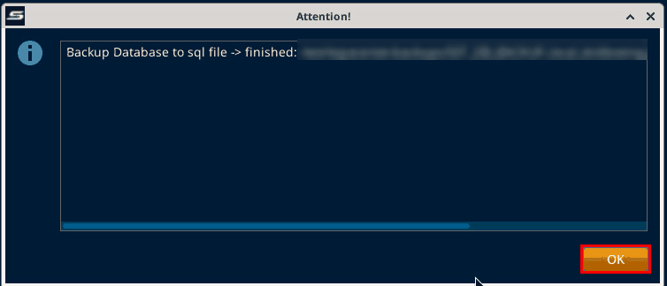

6. A second "Attention!" box asks "Do you want to store this backup on the Online Cloud?" It has only OK and Cancel. There is no No button. Click Cancel to keep the backup local. Choose Cancel unless you mean to upload the backup to the Online Cloud.

   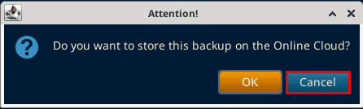

7. Click Close. It is next to Print.

   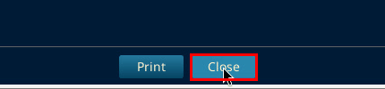

The file is saved as .h2, even though the window says sql file. The name looks like `SET_DB_BACKUP_local_kickboxing_<date>_<time>_<dbname>.h2`.

On SET 12.2.0 build 3 (local test, 6 Oct 2026) the log line read "-> File:" with the folder and then "SET_DB_BACKUP_local_kickboxing_20261006_180504_bernercup2026_b2.h2". The folder is blurred in the screenshot.

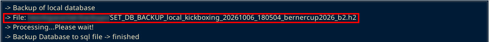

## On the website

Event, then Export event data, then Export as SQL.

This is on the Sportdata website, not in SET, so it was not checked in the 6 Oct 2026 test.

To open a backup on another PC, see [Open a SET database backup](open-sql-backup.md).
