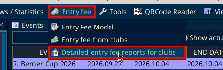
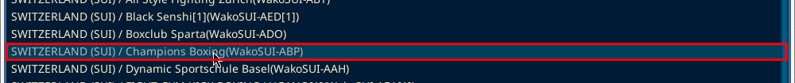
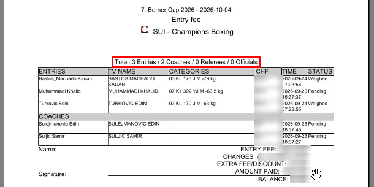
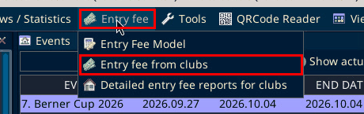
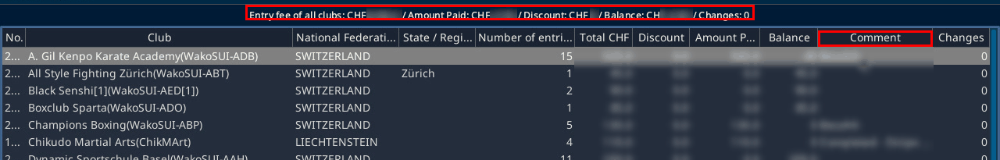
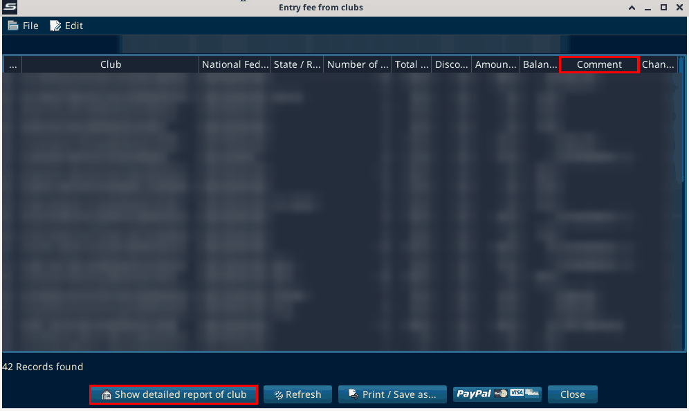
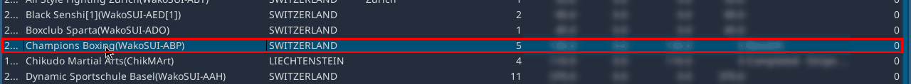
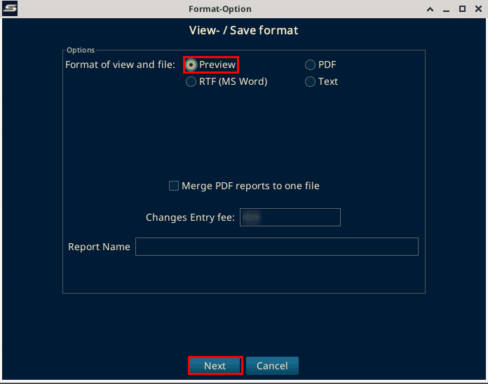
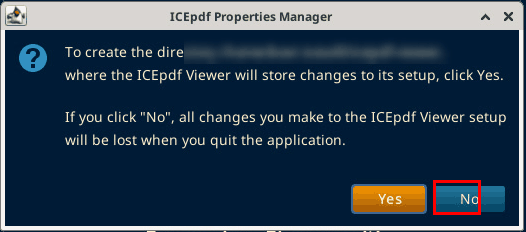
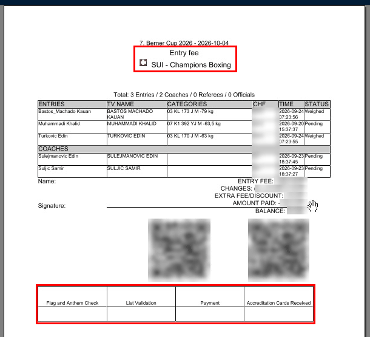

# Entry and payments

Source: process document added 3 Oct 2026. The menu locations on this page were checked on SET 12.2.0 build 3 on 6 Oct 2026.

At the entry point, athletes are checked for payment.

The "Entry fee" menu on the menu bar has three items: "Entry Fee Model", "Entry fee from clubs" and "Detailed entry fee reports for clubs".

## Detailed entry fee reports for clubs

Sportdata admins generate the detailed entry fee reports for all clubs. That produces a detailed payment list and a lot of paper.

1. On the menu bar, open "Entry fee" and choose "Detailed entry fee reports for clubs". It is in the Entry fee menu, not in Overviews / Statistics.

2. The window lists the clubs. The buttons at the bottom are "Select all", "Print selection" and "Refresh".

3. Select a club, then click "Print selection". On SET 12.2.0 build 3 (local test, 6 Oct 2026): Champions Boxing was selected.

4. The "Format-Option" window opens. It is the same window as for "Show detailed report of club" below. Keep "Preview" and click "Next". The preview shows the "Entry fee" report for the club. With several clubs selected, the checkbox "Merge PDF reports to one file" in that window joins them into one file. Only one club was tested, and nothing was printed.

## Entry fee from clubs

The per-club payment view with comments (Twint payments, and so on) is "Entry fee from clubs". SET has no item called "payment summary".

1. On the menu bar, open "Entry fee" and choose "Entry fee from clubs".

2. The window shows a summary line for all clubs at the top and one row per club below it. Payment notes such as Twint go in the "Comment" column.

The summary line reads "Entry fee of all clubs: CHF … / Amount Paid: CHF … / Discount: CHF … / Balance: CHF … / Changes: …". The columns are "No.", "Club", "National Federation", "State / Region", "Number of entries", "Total CHF", "Discount", "Amount Paid", "Balance", "Comment" and "Changes". On the local copy the footer said "42 Records found".

3. The report for one club is "Show detailed report of club". Select the club first. The other buttons are "Refresh", "Print / Save as…", "PayPal" and "Close".

On SET 12.2.0 build 3 (local test, 6 Oct 2026): Champions Boxing was selected, then "Show detailed report of club" was clicked.

4. A "Format-Option" window opens, headed "View- / Save format". It offers "Preview", "PDF", "RTF (MS Word)" and "Text", the checkbox "Merge PDF reports to one file", the field "Changes Entry fee" and "Report Name". Keep "Preview" and click "Next".

The first time a preview opens on a computer, an "ICEpdf Properties Manager" box can ask to create a folder for the viewer settings. Yes keeps changes to the viewer setup. No loses them when SET closes. In the local test No was clicked.

5. The preview opens in "PDFViewer". The report is titled "Entry fee" with the club, here "SUI - Champions Boxing". Below the line "Total: 3 Entries / 2 Coaches / 0 Referees / 0 Officials" it lists the entries with "ENTRIES", "TV NAME", "CATEGORIES", "CHF", "TIME" and "STATUS", then the coaches. Then come "ENTRY FEE", "CHANGES", "EXTRA FEE/DISCOUNT", "AMOUNT PAID", "BALANCE", a name and signature line and two QR codes. At the bottom are boxes for "Flag and Anthem Check", "List Validation", "Payment" and "Accreditation Cards Received".

The amounts, balances, comments and QR codes are blurred in the screenshots.
