# Extra match

Lucas stated this path on 4 Oct 2026, after matches had already started.

Steps 12 to 23 (the draw and the draw record) were tested on a local copy of the Berner Cup 2026 database with SET 12.2.0 build 3 on 6 Oct 2026. The whole path was run on that copy.

Do this on a new _copy category. Do not generate or save draw records for categories that already have results.

The "Categories: 1" check in step 21 is what keeps the other categories safe.

## A. Copy the category

1. In the Main Tree Menu, right-click "Categories of this event" and choose "Categories of this event".

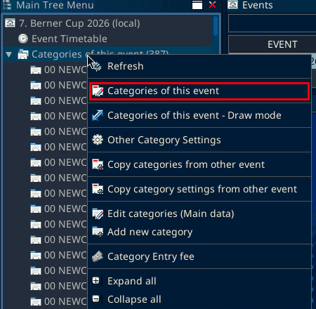

2. An "Attention!" box says: use the same age-limit for registration mode "YEAR OF EVENT" as for "DAY OF EVENT". The conversion and check is made by the system. This is information only. Click OK.

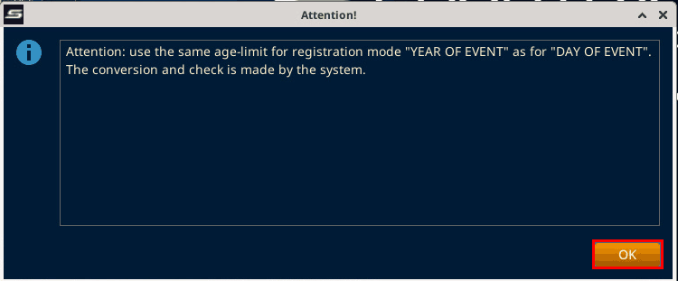

3. Highlight the source category row. In the test this was "00 NEWCOMER 02 LC 1129 S M -63 kg". Tip: the Categories window has no entry count column. Check in Move entries first that the source category has athletes, because the Take from list there only shows categories that have entries.

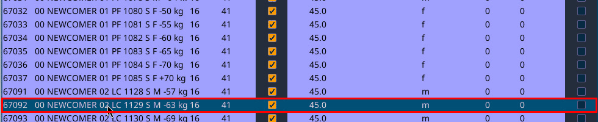

4. Click "Copy data". The Category Manager opens with the name ending in _copy. Click "save".

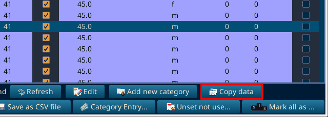

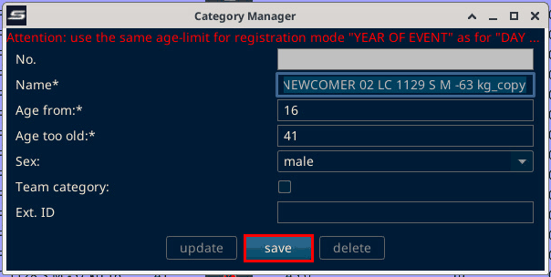

5. "Attention! Do you want to use the new category for this event?" Click Yes.

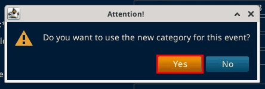

## B. Copy the two athletes

6. Right-click "Individual / Team Entries" and choose "Move entries".

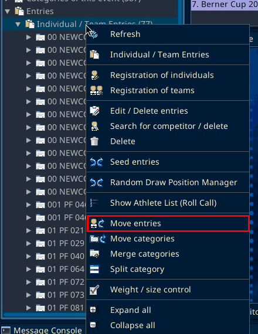

7. Open the "Take from" dropdown and pick the source category. The athletes in it are listed below.

8. Open the "Move to" dropdown and pick the _copy category. If it is missing, close Move entries and open it again.

9. Check "Copy entries (keep entries in old category)". This keeps the athletes in the old category and also puts them in the new one.

10. Click the first athlete, then Shift-click the second. In the test these were Doka Anton and Sarikabadayi Ada.

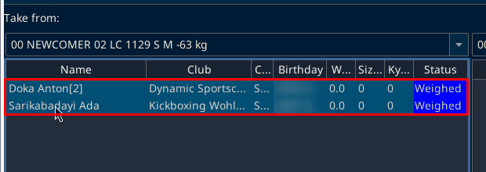

11. Click "Move". "Attention! Do you really want to move the competitors?" Click Yes. The athletes now appear in both categories.

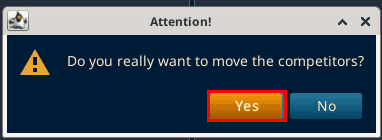

## C. Draw for the new category only

12. Right-click "Draw" in the tree and choose "Generate draws". This is the single-category item. Do not use "Generate all draws", "Generate all individual draws" or "Generate draws by selection".

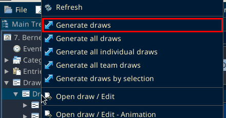

13. In the Draw window, open "Individual categories" and pick the _copy category.

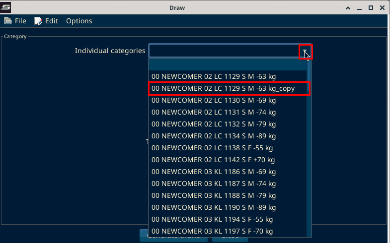

14. Click "Generate draws". A window titled "Generate all draws" (Club / Nation display options) opens. It is SET's shared options screen and only runs for the selected category. Leave the defaults and click Next.

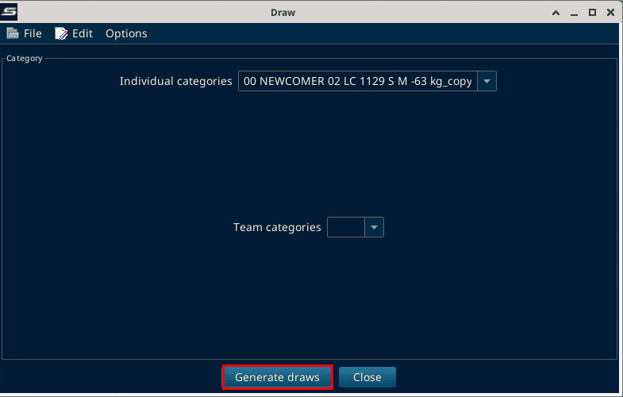

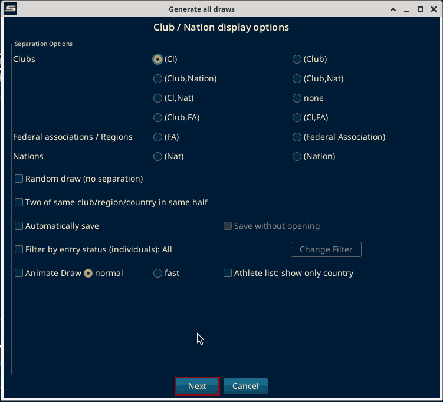

15. "Attention! Process finished!" Click OK. The draw shows one Final with the two athletes.

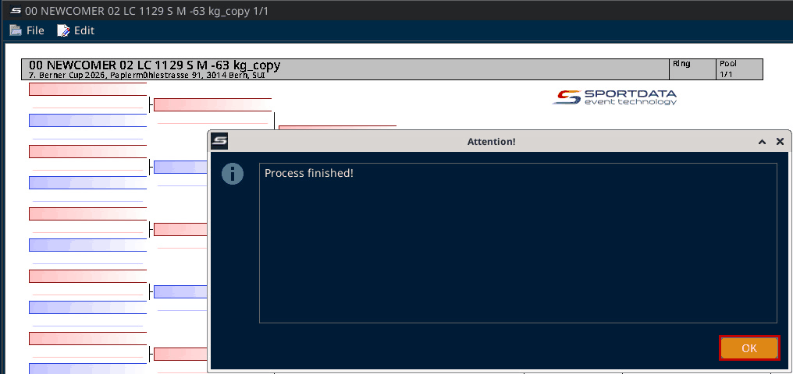

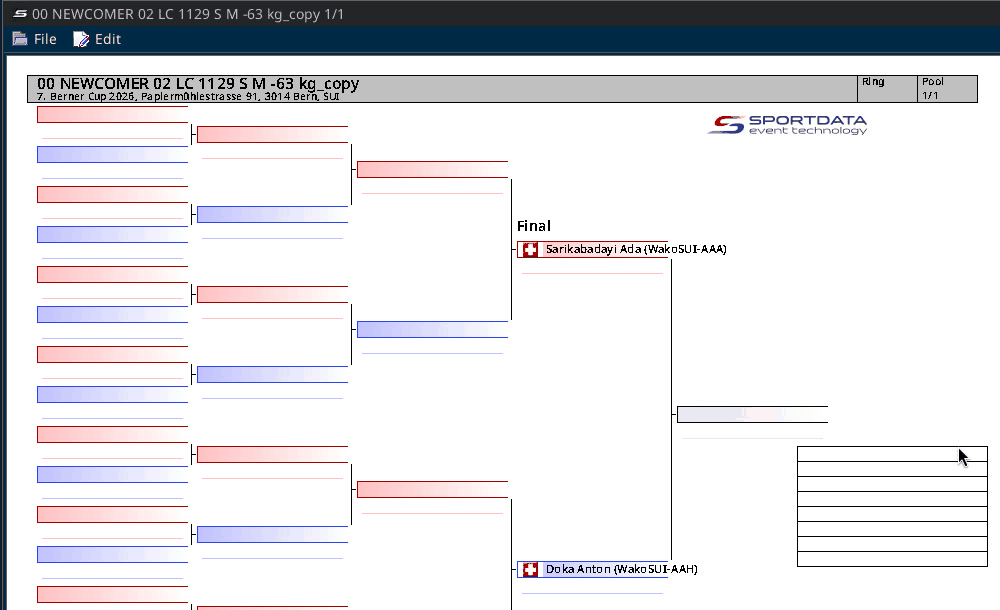

16. In the draw window, open the File menu and click Save.

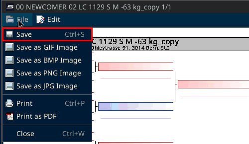

17. Click Close on the Draw window.

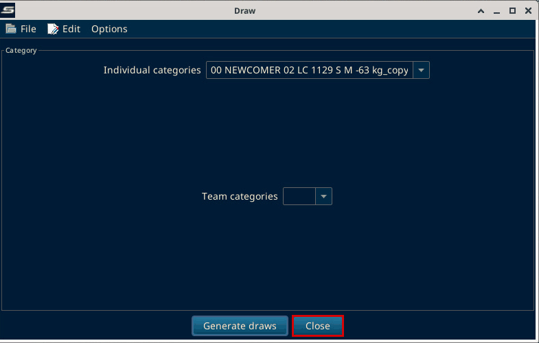

## D. Draw record for the new category only

18. Right-click "Draw record" in the tree and choose "Save draws as draw records by selection". The window "Save all draws as draw records" opens.

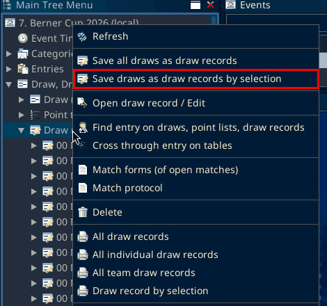

19. Click only the _copy category's row. Rows are highlighted, there are no checkboxes. Do not use "Select all" or "Select draws not saved as draw records".

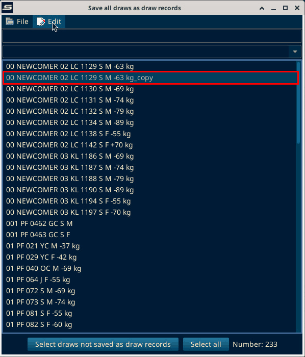

20. If OK is not visible, maximize the window. Click OK.

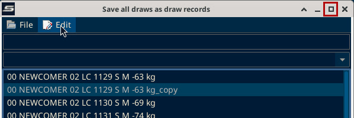

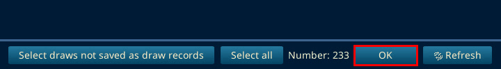

21. "Attention! Do you really want to save all draws as draw records? -> Categories: 1". Check that it says Categories: 1. If it shows any other number, click No. Click Yes. Then "Process finished!" appears. Click OK.

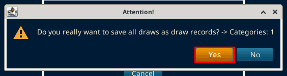

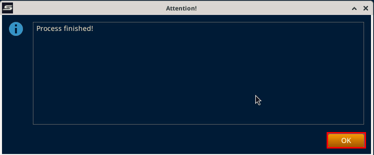

22. Right-click "Draw record" and choose Refresh. The count goes up by 1 (77 to 78 in the test).

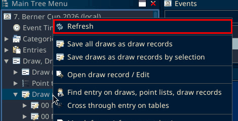

23. Under Draw record, double-click the _copy category, then double-click "Pool 1 / 1". The tree cuts the name off, so the _copy entry is the second "00 NEWCOMER 02 LC 1129 S M" line, right after the source category. The draw record opens with the match.

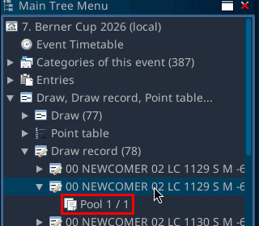

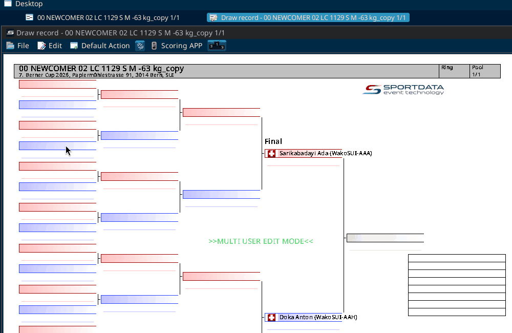
