# Final fixes

Source: process document added 3 Oct 2026. The menu paths on this page were checked on SET 12.2.0 build 3 on 6 Oct 2026.

Admins move people into the new categories or remove them.

## Move or remove athletes

In the Main Tree Menu, right-click "Individual / Team Entries". The same menu has "Delete" and "Move entries".

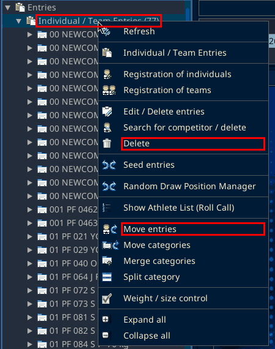

To move athletes into a new category, follow [Extra match](extra-match.md).

"Delete" opens the "Delete entry" window. It has a search field, a category list, "Select all", "OK" and "Refresh".

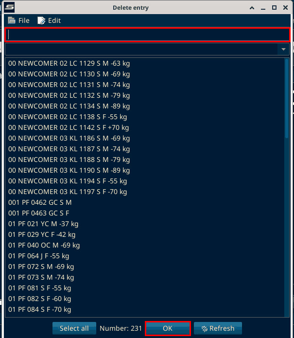

On SET 12.2.0 build 3 (local test, 6 Oct 2026): OK was not clicked, so no entry was deleted.

## Find who has not shown up

Also check who has not shown up. They are still Pending. Clarify why.

1. Right-click "Individual / Team Entries" and choose "Weight / size control".

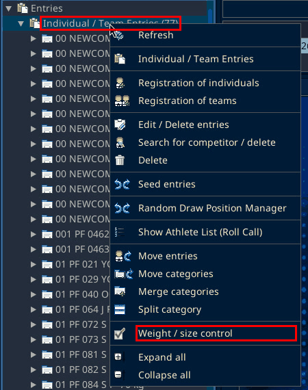

2. Click the Entries Status column header to sort by status. The header is cut off as "En...". Pending rows (yellow) come to the top. The footer shows counts, for example "P: 11 (4%)" for Pending. There is no separate status filter.

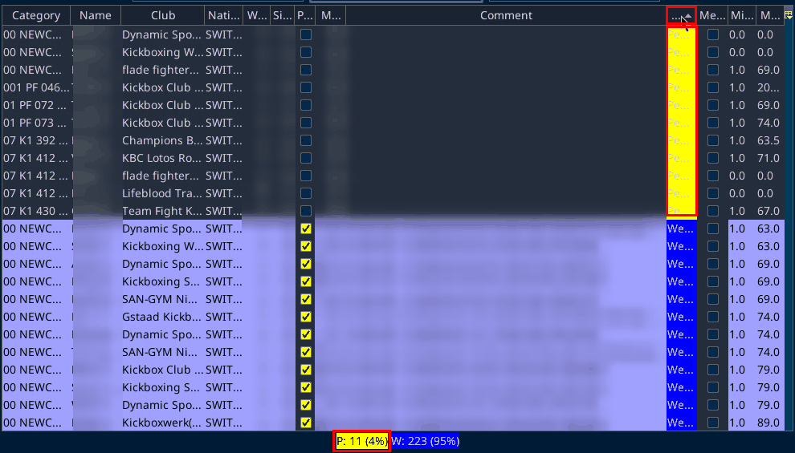

Athlete names and weights are blurred in this screenshot.

- If an athlete is on the way and will probably arrive soon, leave them on the draw. They are weighed afterwards.
- If a late athlete is overweight, no further moves are possible. Delete them. Cross them through on the draw so no fight takes place. See [Cross through an athlete](final-fixes.md?id=cross-through-an-athlete).
- Double-check categories that still have only one athlete.

The process document called this "cross-block". That is not a SET label. The SET item is "Cross / Undo cross through competitor on this table".

To double-check categories with only one athlete, open "Overviews / Statistics", then "Categories and entries" (Ctrl+4), and click the "Entries" header to sort. See [Fixes after registration closes](fixes.md?id=find-categories-with-only-one-entry).

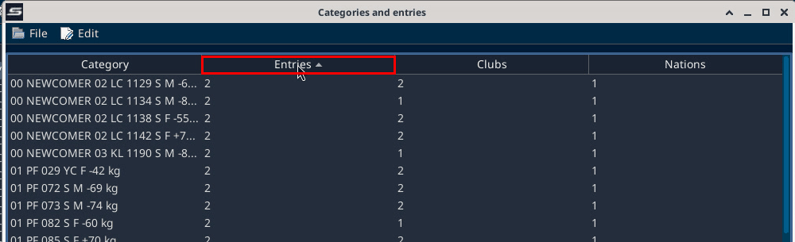

## Cross through an athlete

1. In the Main Tree Menu, under "Draw", right-click the category and choose "Open draw / Edit".

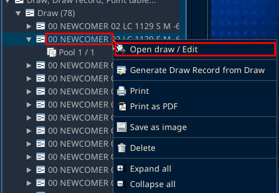

2. In the draw window, open the "Edit" menu, then "Cross / Undo cross through competitor on this table". The submenu lists the athletes in that draw. Pick the athlete. Right-clicking an athlete in the draw itself does nothing.

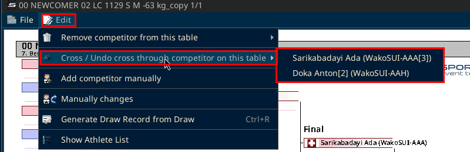

On SET 12.2.0 build 3 (local test, 6 Oct 2026): the test category was 07 K1 412 OJ M -71 kg_copy, with one Final, Meier George against Roriz de Matos Aaron. After Meier George was picked in the submenu, his name showed crossed through on the draw.

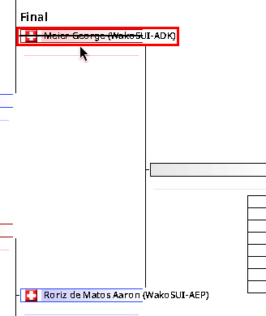

3. When you close the draw window, SET asks "Do you want to save this table?".

The box is titled "Attention!". Yes saves the table with the cross-through. In the local test No was clicked, so the cross-through was not saved.

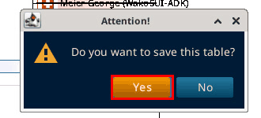

"Cross through entry on tables" is also in the Main Tree Menu, in the right-click menu on "Draw" and on "Draw record".

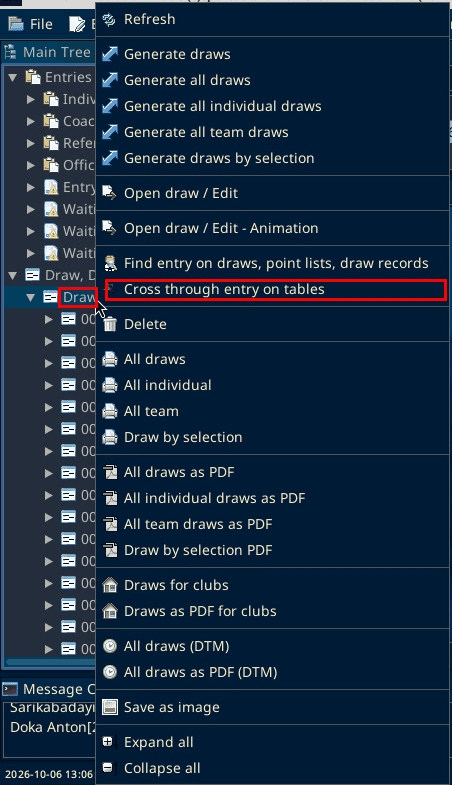

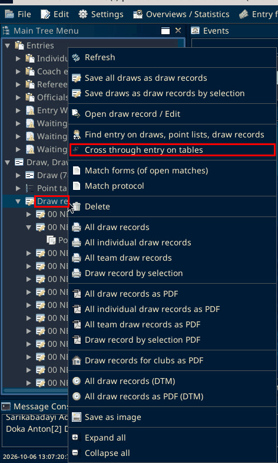

It opens a window titled "Cross through entry on tables". It has a File menu, a "Search for competitor" button, a list and the footer "(Edit with double-click)". On the local copy the list was empty.

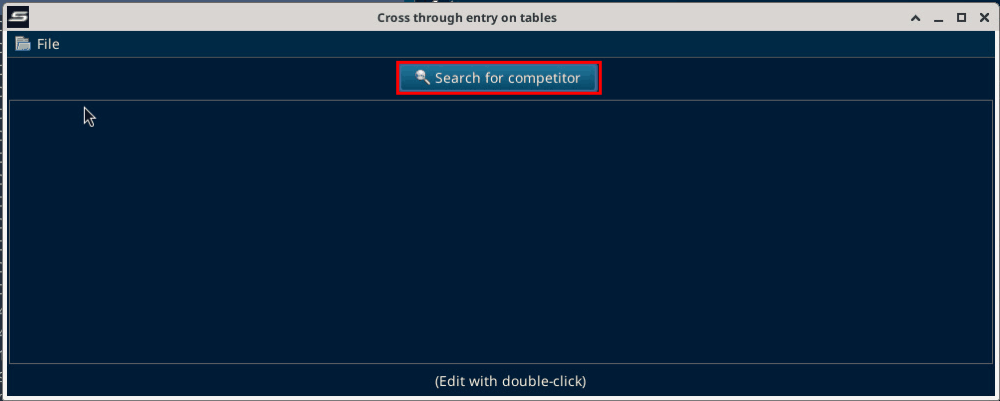
