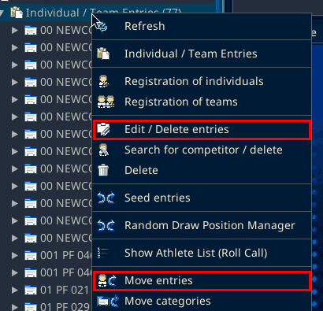
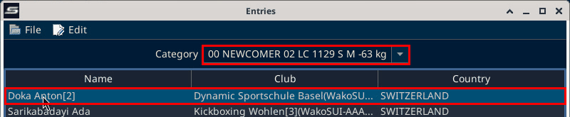
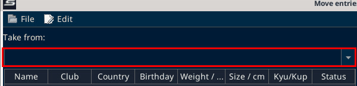
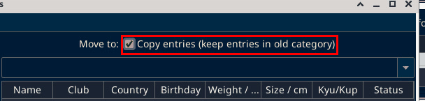
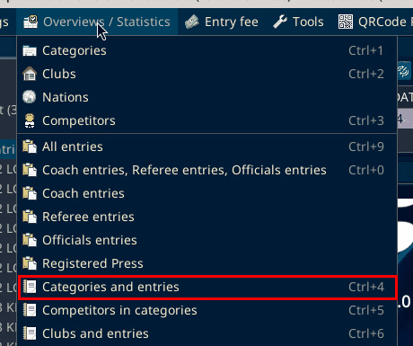
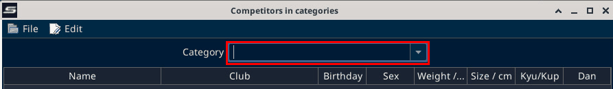

# Fixes after registration closes

Source: process document added 3 Oct 2026.

After registration is closed, the event organizers:

- make fixes
- move or copy entries
- align with the coaches
- ideally clear every category that has only one entry
- take the last-minute changes

## Edit or delete entries

In the Main Tree Menu, right-click "Individual / Team Entries". The menu has "Edit / Delete entries", "Search for competitor / delete", "Delete" and "Move entries".

"Edit / Delete entries" opens the "Entries" window. Pick the category in the "Category" dropdown, then select the athlete row.

The buttons at the bottom are "Edit", "Refresh" and "Delete".

## Move or copy entries

"Move entries" opens the "Move entries" window. Pick the source category under "Take from:".

Pick the target category under "Move to:". Tick "Copy entries (keep entries in old category)" to keep the athletes in the old category as well.

Select the athletes and click "Move". The full steps are on [Extra match](extra-match.md?id=b-copy-the-two-athletes).

## Find categories with only one entry

Open "Overviews / Statistics", then "Categories and entries" (Ctrl+4).

The window has the columns Category, Entries, Clubs and Nations. Click the "Entries" header to sort. Categories with one entry come to the top. SET sorts this column as text, so 10 can appear before 2.

On SET 12.2.0 build 3 (local test, 6 Oct 2026): the lowest count on the local copy was 2, so no category had only one entry.

"Competitors in categories" (Ctrl+5) in the same menu shows one category at a time. Pick it in the "Category" dropdown.

