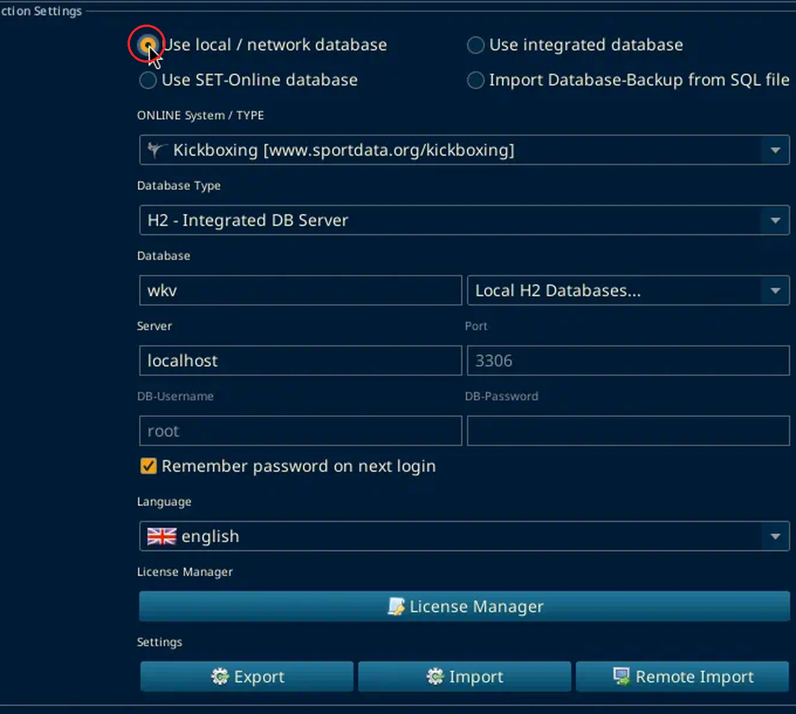

# Go offline

Checked on SET OVR 12.2.0 build 3, 3 Oct 2026. The Settings window parts were checked again on 6 Oct 2026 on a local copy.

There is no Go offline command in File, Settings, or Tools.

The Settings menu has three items: Settings (Ctrl+P), Email Smtp, and Language.

The local server is the connection window that opens when SET starts. Red boxes mark the control. The connection screenshot below uses a red ring.

## Connect to the local database

Start SET. After the license, the window is Connection Settings.

Choose **Use local / network database**.

The other choices on that window are Use integrated database, Use SET-Online database, and Import Database-Backup from SQL file.

With local / network selected, the form shows ONLINE System / TYPE, Database Type, Database, Server, Port, DB-Username, DB-Password, Test connection, and Connect. Kickboxing is `www.sportdata.org/kickboxing`.

Create DB User for remote access stayed greyed out. Do not use the names already in the boxes. They are whatever this install last stored, not the event setup. This session stopped before Connect, so a finished local login is not confirmed here.

## Checks from the process document

Open Settings, then Settings (Ctrl+P). You need to be in Administration Mode.

Administration Mode shows at the start of the title bar and on the Welcome panel.

### User

Open the User tab. In the User section, click User / Password.

A dialog titled User-Management opens. Its heading is Add new user/Change password. It has two checkboxes, Change password and Add new user, and the buttons OK and Close.

Tick Add new user. The login is the one from the backup. The form behind that checkbox was not opened, and no user was created.

### Seeding

Open the Seeding tab.

The Seed Mode section lists Mode 1 to Mode 7. The process document says Mode 3. That row is `Mode 3:[1,8,5,4:3,6,7,2]`. Mode 2 was already selected on this screen. It was not changed. On 6 Oct 2026, Mode 2:[8,4,6,2:7,3,5,1] was still the selected one.

### Draw record

Open the Draw / Draw record tab.

The block is Club / Nation display options. The process document says Club/Nat. The matching label on this screen is `(Club,Nat)`. `(Club,Nation)` is the similar one beside it. The selected radio was left as it was. The full list is (Cl), (Club), (Club,Nation), (Club,Nat), (Cl,Nat), none, (Club,FA), (Cl,FA), (FA), (Federal Association), (Nat), and (Nation). On the local copy, (Cl) was selected.

### Area names

Open the Monitor / DTM Area Name Replace tab.

Fill Name Original and Name New, then Add. The process document example is Ring 1 replaced with Tatami 1. The fields are Name Original: and Name New: along the bottom, with Add at the bottom right and Remove at the bottom left. The list was empty. Nothing was added. The venue list at the Berner Cup was not empty. See [Wrong name monitor (workaround)](wrong-name-monitor.md).

### Close Settings

The Settings window has no Cancel or Close button. Close it with the X in its title bar.

Wrong name: monitor on the display is a separate workaround: [Wrong name monitor (workaround)](wrong-name-monitor.md).
