# Go offline

Checked on SET OVR 12.2.0 build 3, 3 Oct 2026. The Settings window parts were checked again on 6 Oct 2026 on a local copy.

There is no Go offline command in File, Settings, or Tools.

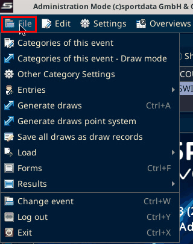

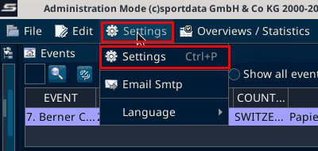

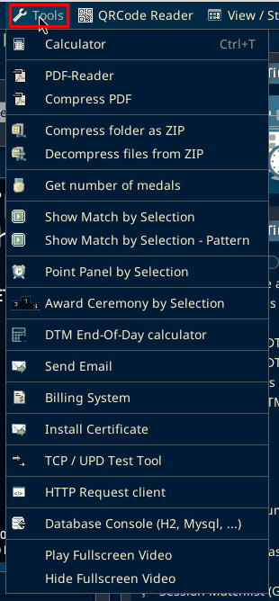

The Settings menu has three items: Settings (Ctrl+P), Email Smtp, and Language.

The local server is the connection window that opens when SET starts. Red boxes mark the control.

## Connect to the local database

Start SET. On 6 Oct 2026 (build 3, local test) two windows came before the connection window:

- Select network interface, with a network dropdown, Do not ask again, and OK. Click OK.

  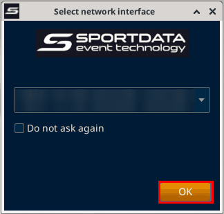

  The dropdown lists the network interfaces of the PC with their addresses. On SET 12.2.0 build 3 (local test, 6 Oct 2026) it listed tailscale0, docker0 and enp0s4. The addresses are blurred in the screenshot.

  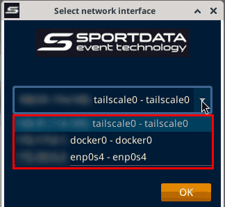

- SET OVR License Grant and Restriction. Click OK.

  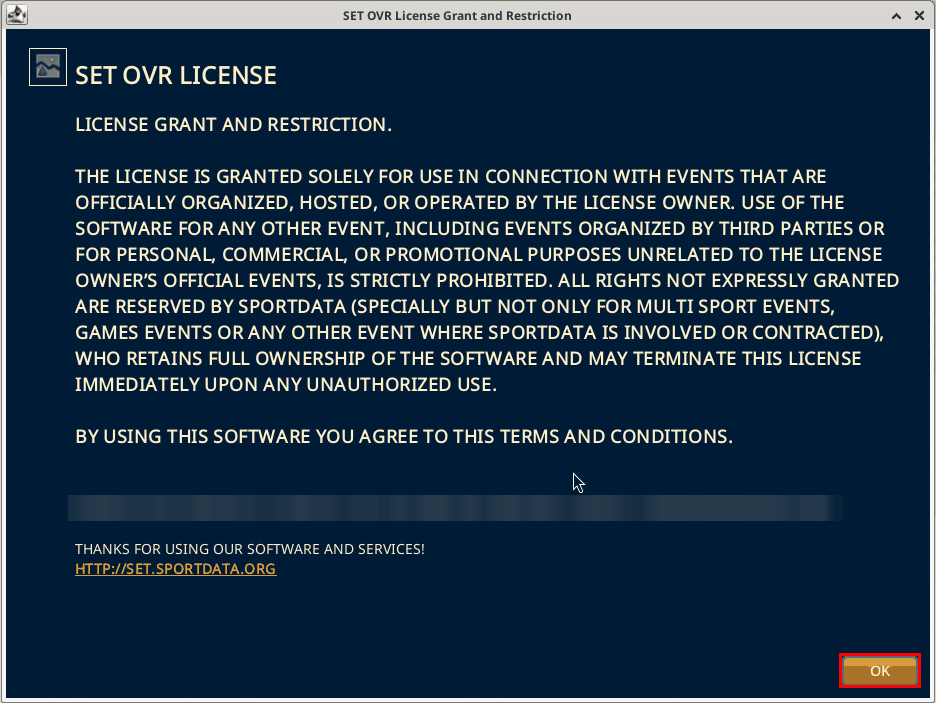

The connection window is titled with the SET version, for example SET v 12.2.0 build 3 (2026-08-17 22:26 CET). The group inside it is labelled Connection Settings.

Choose **Use local / network database**.

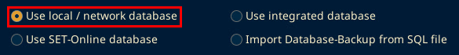

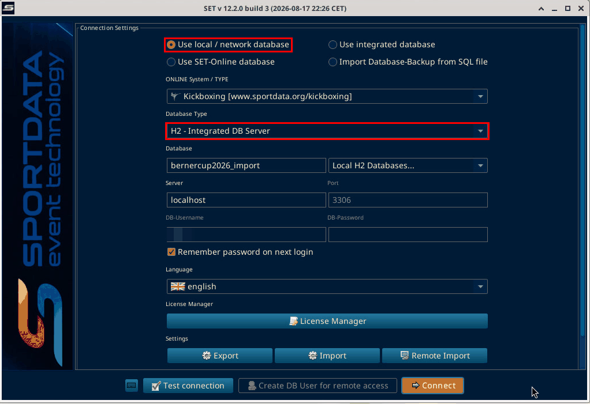

The other choices on that window are Use integrated database, Use SET-Online database, and Import Database-Backup from SQL file.

With local / network selected, the form shows the fields below, from top to bottom. The close-ups are from SET 12.2.0 build 3 (local test, 6 Oct 2026). The fields were hovered, not changed, except Database Type in the test on [Local server without MariaDB](local-server.md).

ONLINE System / TYPE shows Kickboxing [www.sportdata.org/kickboxing]. Kickboxing is `www.sportdata.org/kickboxing`.

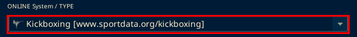

Database Type offers only two values: H2 - Integrated DB Server and MYSQL - External DB Server. At the Berner Cup the venue used MYSQL - External DB Server on port 27000. See [Local server without MariaDB](local-server.md). On SET 12.2.0 build 3 (local test, 6 Oct 2026): the restored local copy uses H2 - Integrated DB Server.

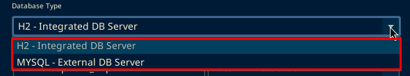

Database holds the database name. Next to it is the "Local H2 Databases..." dropdown. On the local copy the name was bernercup2026_b2.

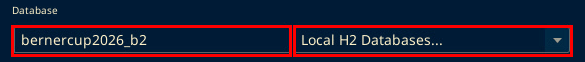

On SET 12.2.0 build 3 (local test, 6 Oct 2026): Server showed localhost and Port showed 3306, greyed out with H2. These are local defaults, not a correction of the venue port 27000.

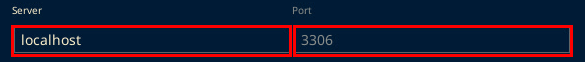

DB-Username showed root, greyed out with H2. Next to it is DB-Password. Below them is "Remember password on next login", ticked on the local copy. The DB-Password field is blurred in the screenshot.

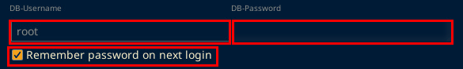

Language showed english. Below it is the "License Manager" button.

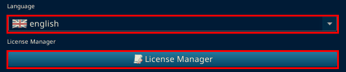

Settings has three buttons: Export, Import and Remote Import. None of them was clicked in the test.

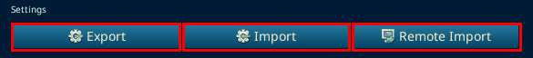

Create DB User for remote access stayed greyed out. It was greyed out again on 6 Oct 2026 with H2. With MYSQL - External DB Server it becomes active. Do not use the names already in the boxes. They are whatever this install last stored, not the event setup. Click Test connection before Connect.

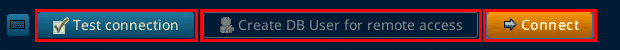

On SET 12.2.0 build 3 (local test, 6 Oct 2026): Test connection with H2 - Integrated DB Server and bernercup2026_b2 opened an "Attention!" box: "Connecting the database was successful". Click OK, then Connect.

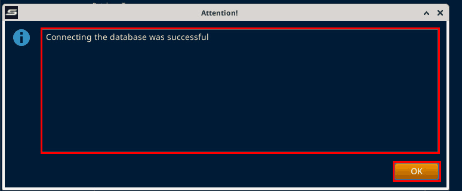

On SET 12.2.0 build 3 (local test, 6 Oct 2026): Connect with H2 - Integrated DB Server opened the SET Login window. The full local login is below.

**Warning: do not pick Use integrated database to reopen a restored copy.** On SET 12.2.0 build 3 (local test, 6 Oct 2026): picking Use integrated database greys out the database fields. Connect then opens SET's default integrated database, not the restored event. Logging in with the event's user then fails with Wrong SET-Username or SET-Password!. To reopen a restored local copy, keep Use local / network database with H2 - Integrated DB Server and the copy's database name.

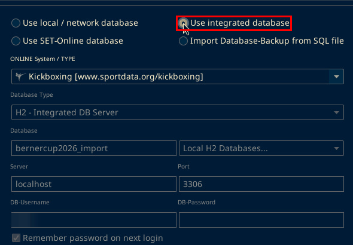

The SET Login window has SET-Username, SET-Password, Remember password on next login, and the modes Registration Mode, RING Mode, Administration Mode, Referee Mode, and Terminal Mode, with Log in and Cancel. Choose Administration Mode for the checks below, then click Log in. On SET 12.2.0 build 3 (local test, 6 Oct 2026): the username and password were already filled in because "Remember password on next login" was ticked at the last login. The login fields are blurred in the screenshot.

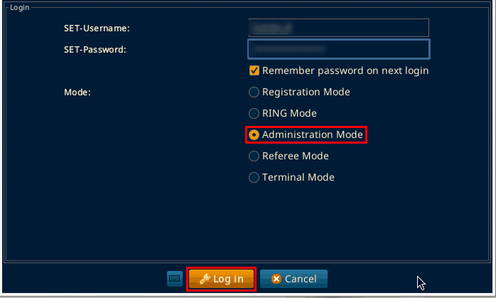

The "Event data" window opens. Click the event row, here 7. Berner Cup 2026 (2026.10.04, SWITZERLAND, Id 2871), then click Next. The main window opens with Administration Mode at the start of the title bar. The Main Tree Menu shows 7. Berner Cup 2026 (local).

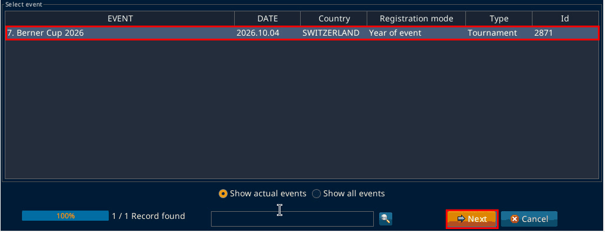

## Checks from the process document

Open Settings, then Settings (Ctrl+P). You need to be in Administration Mode.

Administration Mode shows at the start of the title bar and on the Welcome panel.

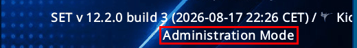

### User

Open the User tab.

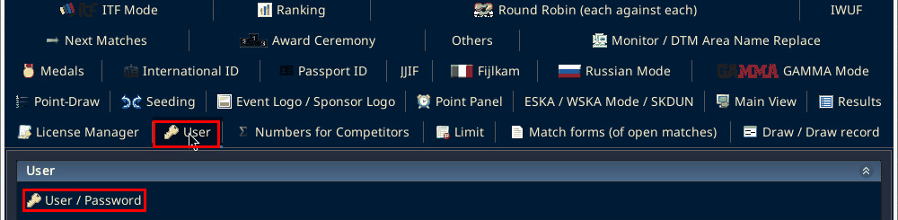

In the User section, click User / Password.

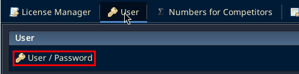

A dialog titled User-Management opens. Its heading is Add new user/Change password. It has two checkboxes, Change password and Add new user, and the buttons OK and Close.

Tick Add new user. The login is the one from the backup.

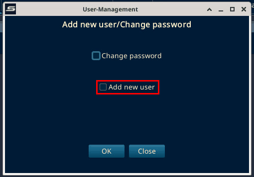

On SET 12.2.0 build 3 (local test, 6 Oct 2026): ticking Add new user only ticked the checkbox. No form fields appeared. Unticking it closed the dialog. OK was not clicked and no user was created.

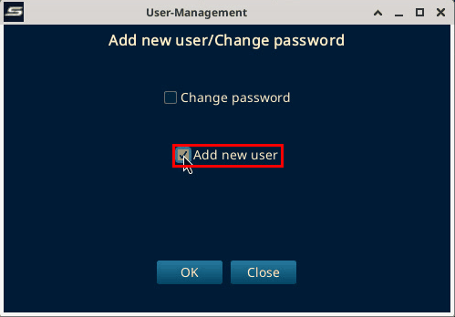

### Seeding

Open the Seeding tab.

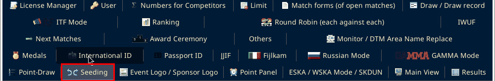

The Seed Mode section lists Mode 1 to Mode 7. The process document says Mode 3. That row is `Mode 3:[1,8,5,4:3,6,7,2]`. Mode 2 was already selected on this screen. It was not changed. On 6 Oct 2026, Mode 2:[8,4,6,2:7,3,5,1] was still the selected one.

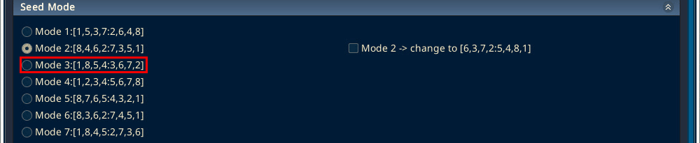

### Draw record

Open the Draw / Draw record tab.

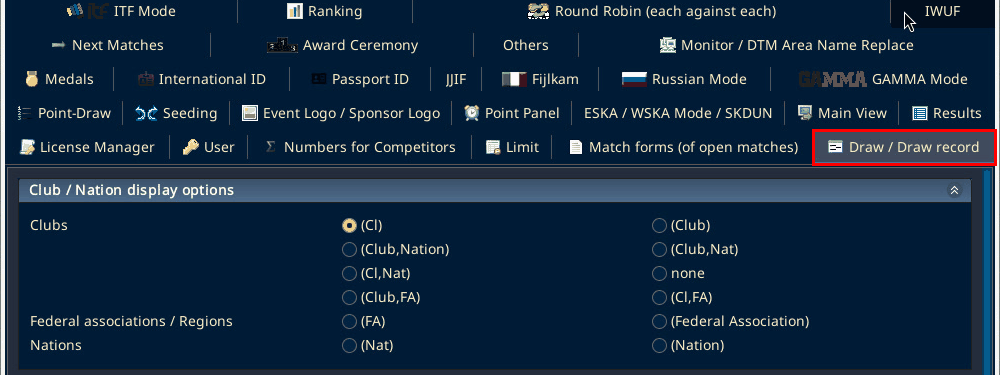

The block is Club / Nation display options. The process document says Club/Nat. The matching label on this screen is `(Club,Nat)`. `(Club,Nation)` is the similar one beside it. The selected radio was left as it was. The full list is (Cl), (Club), (Club,Nation), (Club,Nat), (Cl,Nat), none, (Club,FA), (Cl,FA), (FA), (Federal Association), (Nat), and (Nation). On the local copy, (Cl) was selected.

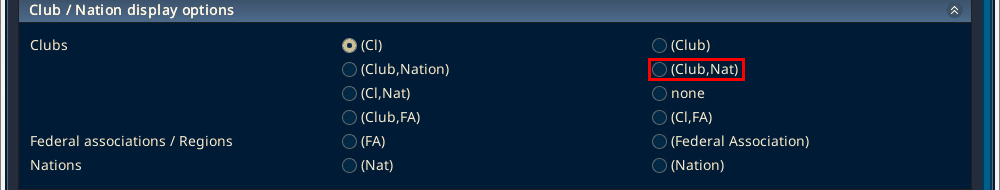

### Area names

Open the Monitor / DTM Area Name Replace tab.

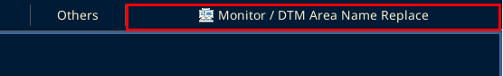

Fill Name Original and Name New, then Add. The process document example is Ring 1 replaced with Tatami 1. The fields are Name Original: and Name New: along the bottom, with Add at the bottom right and Remove at the bottom left. The venue list at the Berner Cup was not empty. See [Wrong name monitor (workaround)](wrong-name-monitor.md).

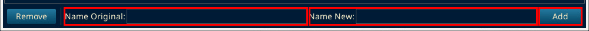

On SET 12.2.0 build 3 (local test, 6 Oct 2026): the list was empty on the local copy. Ring 1 went into Name Original and Tatami 1 into Name New. Then Add.

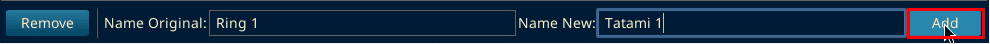

After Add the list showed one row, Ring 1:Tatami 1.

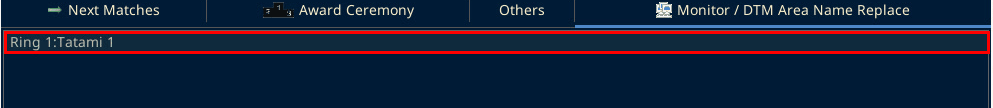

To take a row off, select it and click Remove. The test row was removed this way.

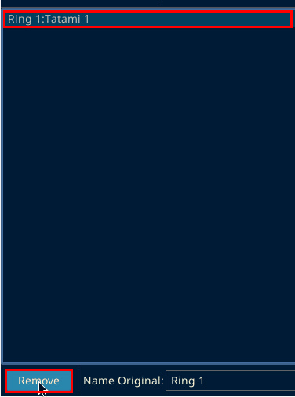

After Remove the list was empty again and Remove was greyed out.

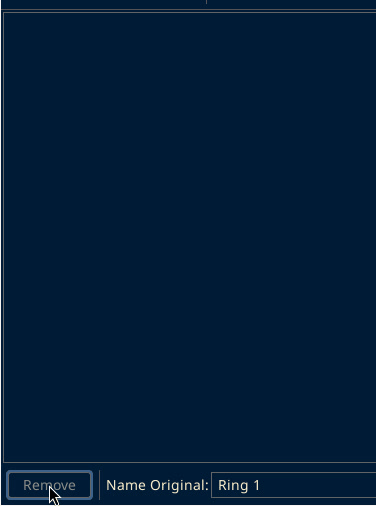

### Close Settings

The Settings window has no Cancel or Close button. Close it with the X in its title bar.

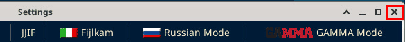

On SET 12.2.0 build 3 (local test, 6 Oct 2026): closing with the X gave no save prompt.

Wrong name: monitor on the display is a separate workaround: [Wrong name monitor (workaround)](wrong-name-monitor.md).
