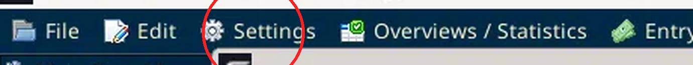
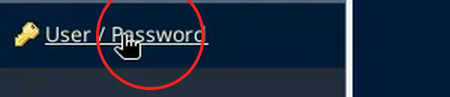
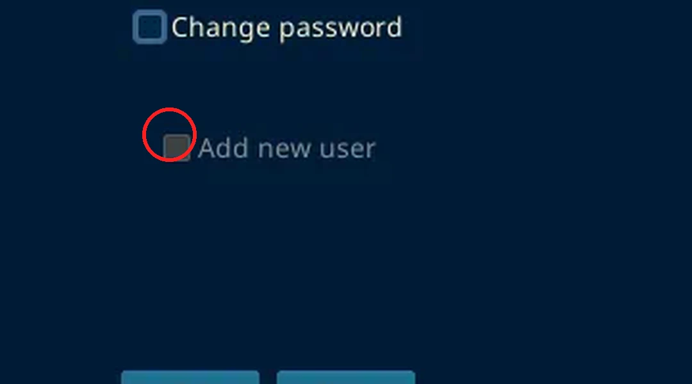
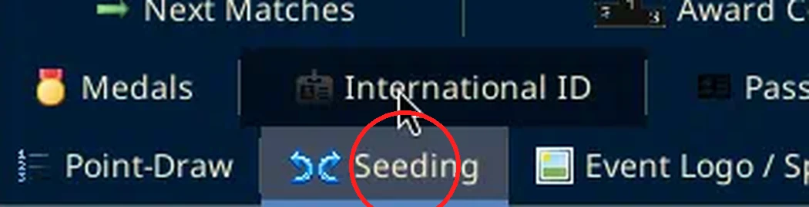
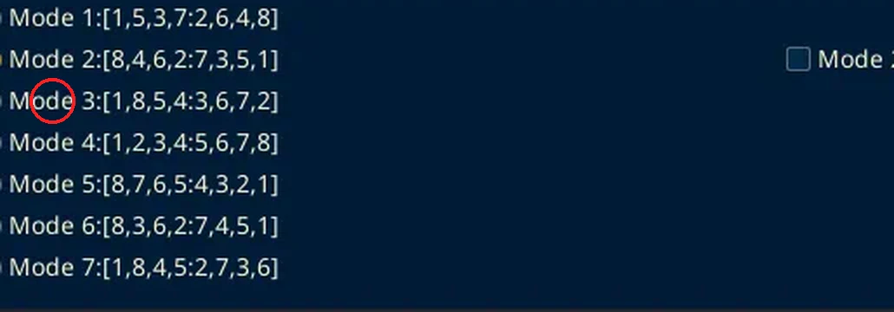
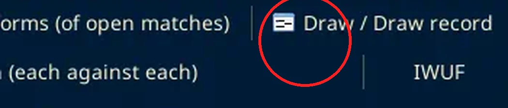
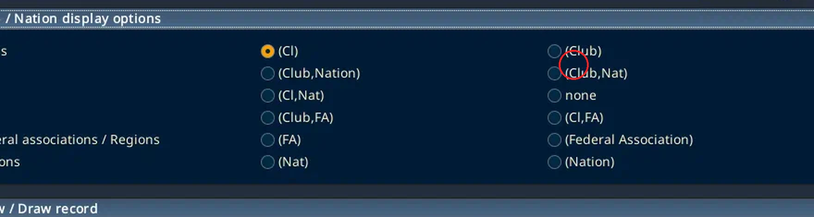
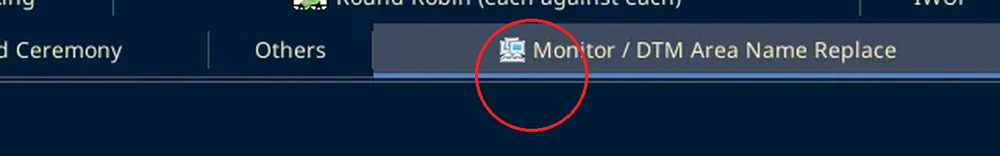
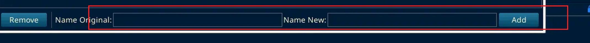

# Go offline

Checked on SET OVR 12.2.0 build 3, 3 Oct 2026.

There is no Go offline command in File, Settings, or Tools. The local server is the connection window that opens when SET starts. Red rings mark the click.

## Connect to the local database

Start SET. After the license, the window is Connection Settings.

Choose **Use local / network database**.

The other choices on that window are Use integrated database, Use SET-Online database, and Import Database-Backup from SQL file.

With local / network selected, the form shows ONLINE System / TYPE, Database Type, Database, Server, Port, DB-Username, DB-Password, Test connection, and Connect. Kickboxing is `www.sportdata.org/kickboxing`.

Create DB User for remote access stayed greyed out. Do not use the names already in the boxes. They are whatever this install last stored, not the event setup. This session stopped before Connect, so a finished local login is not confirmed here.

## Checks from the process document

Open Settings from the menu bar. You need to be in Administration Mode.

### User

In that Settings window, open User / Password.

Tick Add new user. The process document says the local user is set/set. The form behind that checkbox was not opened, and no user was created.

### Seeding

Open Seeding.

The process document says Mode 3. That row is `Mode 3:[1,8,5,4:3,6,7,2]`. Mode 2 was already selected on this screen. It was not changed.

### Draw record

Open Draw / Draw record.

The block is Club / Nation display options. The process document says Club/Nat. The matching label on this screen is `(Club,Nat)`. `(Club,Nation)` is the similar one beside it. The selected radio was left as it was.

### Area names

Open Monitor / DTM Area Name Replace.

Fill Name Original and Name New, then Add. The process document example is Ring 1 replaced with Tatami 1. The list was empty. Nothing was added.

