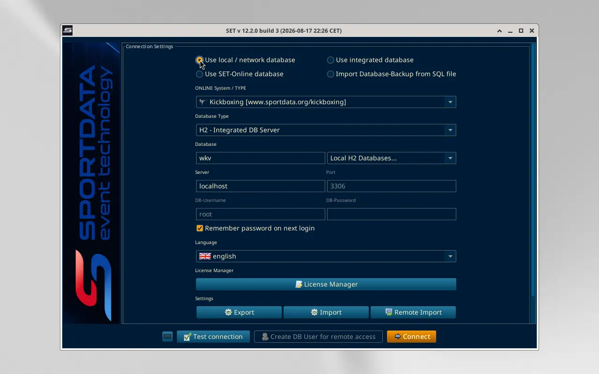
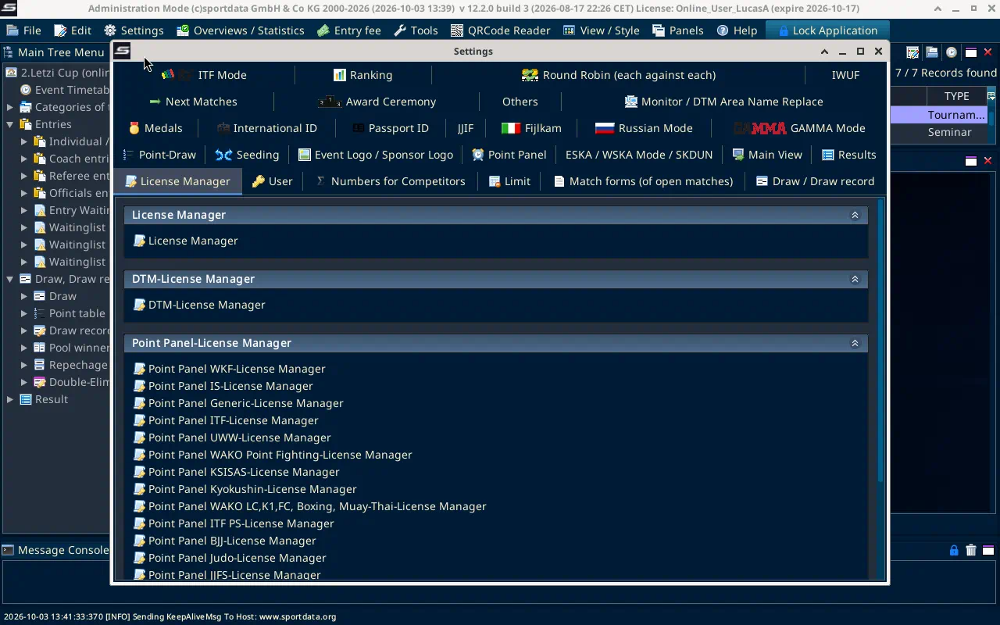
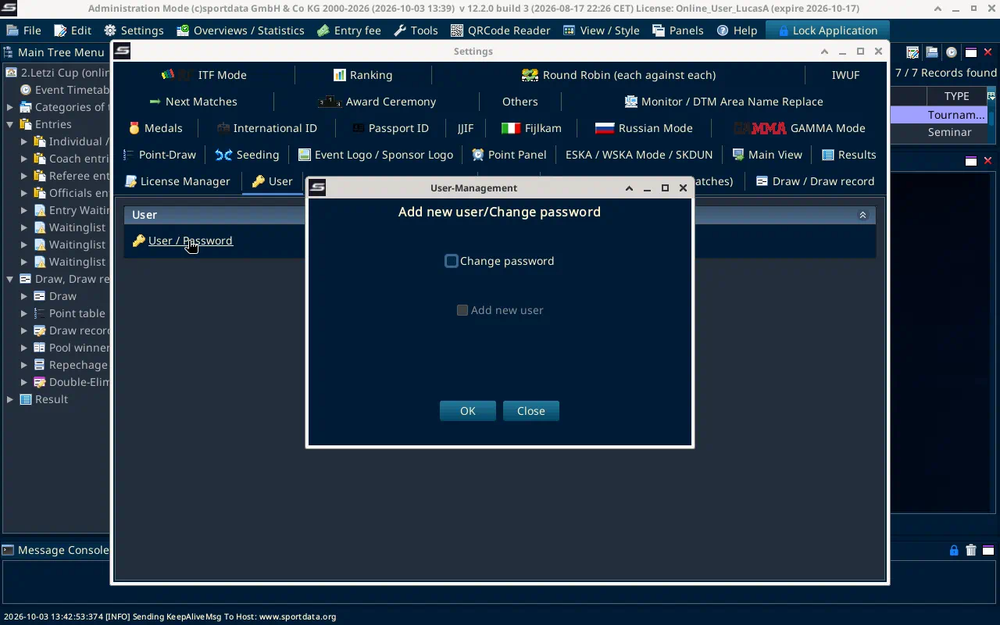
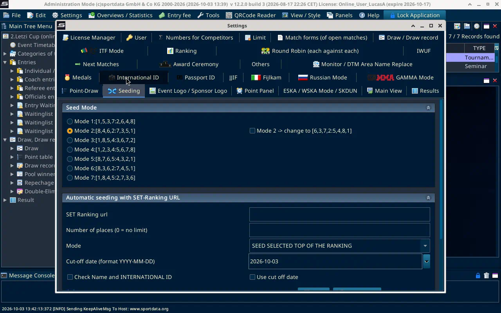
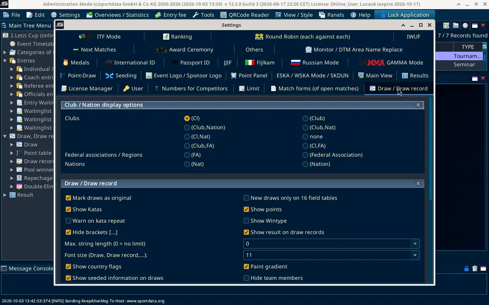
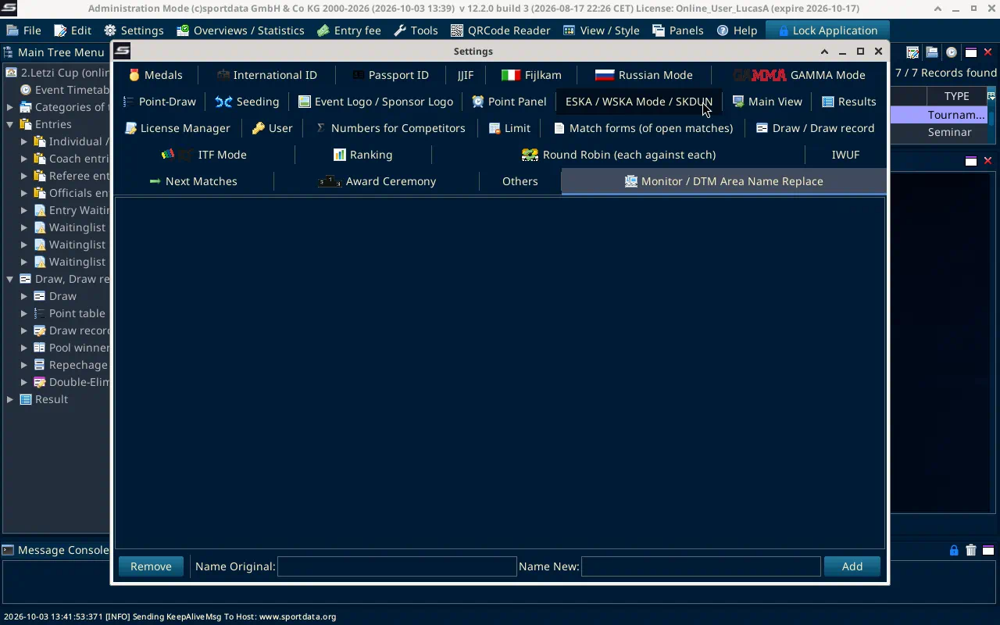

# Go offline

Checked on SET OVR 12.2.0 build 3, 3 Oct 2026.

There is no Go offline command in File, Settings, or Tools. The local server is the connection window that opens when SET starts.

## Connect to the local database

Start SET. After the license, the window is Connection Settings.

Choose **Use local / network database**. The other choices are Use integrated database, Use SET-Online database, and Import Database-Backup from SQL file.

The form then shows:

- ONLINE System / TYPE. Kickboxing is `www.sportdata.org/kickboxing`.
- Database Type
- Database, plus a Local H2 Databases list
- Server and Port
- DB-Username and DB-Password
- Test connection
- Connect

Create DB User for remote access stayed greyed out. Do not use the names already in the boxes. They are whatever this install last stored, not the event setup. This session stopped before Connect, so a finished local login is not confirmed here.

## Checks from the process document

These are under Settings, then Settings, once you are in Administration Mode.

### User

Settings, then User, then User / Password. The dialog is Add new user/Change password. Add new user is a checkbox. The process document says the local user is set/set. The form behind that checkbox was not opened, and no user was created.

### Seeding

Settings, then Seeding. The process document says Mode 3. On this screen that row is `Mode 3:[1,8,5,4:3,6,7,2]`. Mode 2 was already selected. It was not changed.

### Draw record

Settings, then Draw / Draw record. The block is Club / Nation display options. The process document says Club/Nat. The close labels here are `(Club,Nat)` and `(Club,Nation)`. Which of those two to use was not confirmed, and the selected radio was left as it was.

### Area names

Settings, then Monitor / DTM Area Name Replace. Fill Name Original and Name New, then Add. The process document example is Ring 1 replaced with Tatami 1. The list was empty. Nothing was added.

