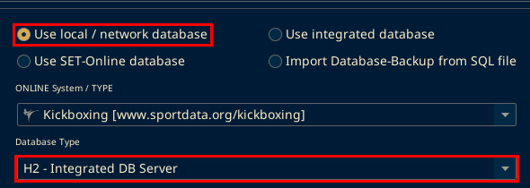
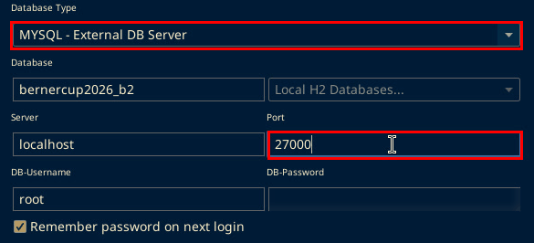
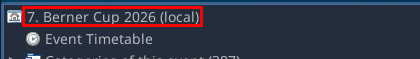
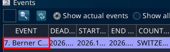
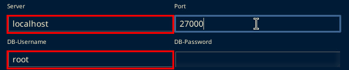

# Local server without MariaDB

Confirmed on the Berner Cup PCs on 3 Oct 2026. SET was v12.2.0 build 2.

## Database mode

The working database was not MariaDB. SET was set to Use local / network database, Kickboxing, MYSQL - External DB Server.

The port was 27000.

On SET 12.2.0 build 3 (local test, 6 Oct 2026): Database Type offers only H2 - Integrated DB Server and MYSQL - External DB Server. The local copy uses H2 - Integrated DB Server. That is the local copy's setting. The venue setting stays MYSQL - External DB Server on port 27000.

This is the setting the venue server PC uses: Database Type MYSQL - External DB Server and Port 27000. On SET 12.2.0 build 3 (local test, 6 Oct 2026): with MYSQL selected, Port and DB-Username become editable, "Create DB User for remote access" becomes active, and "Local H2 Databases..." greys out. In the test 27000 was typed into Port and Connect was not pressed. Database Type was then set back to H2 - Integrated DB Server and Port back to 3306. The DB-Password field is blurred in the screenshot.

On a laptop or any PC other than the server, press Connect only once the server PC is reachable. Run Test connection first. See "Scale PC test" below.

The database name that opened 7. Berner Cup 2026 was 2026bernercup. A database field of mydb opened 1. Alpen Open 2026 instead. Confirm the event list says 7. Berner Cup 2026 before continuing.

On SET 12.2.0 build 3 (local test, 6 Oct 2026): the window title does not show the event name. Check the top node of Panels, then Main Tree Menu. On the local copy it read 7. Berner Cup 2026 (local). The EVENT column of the Events panel shows the same name, cut off as 7. Berner C...

## Server PC

On the server PC (Haupttisch), Server was localhost. The DB user was root. The SET login that worked on the scale PC was the username from the database backup. That login was not the Windows user and was not the admin login.

The venue server PC was not available for a screenshot. On SET 12.2.0 build 3 (local test, 6 Oct 2026) the same two fields showed Server localhost and DB-Username root.

ipconfig on the Haupttisch showed IPv4 192.168.x.125, mask 255.255.255.0, and Wi-Fi disconnected. That address was then changed to 192.168.x.10 so the scale PC could reach it.

The scale PC address seen earlier was 192.168.x.227. The router was 192.168.x.254.

## Scale PC test

The Test connection that succeeded used Server 192.168.x.10, port 27000, database 2026bernercup, and user root. Do not click Connect until Test connection succeeds.

The venue Test connection was not captured. The screenshot is the local test on SET 12.2.0 build 3 (6 Oct 2026), against the H2 copy and not a server PC. The "Attention!" box said "Connecting the database was successful".

## Address already in use

An earlier PC was already at 192.168.x.10. That PC did not work. Private and Public firewalls were enabled, and nothing was listening on port 27000. Do not use that PC as the setup. The working server was the Haupttisch after its address was set to 192.168.x.10.

## SQL import

The SQL file used was 2026bernercup.sql. It was imported with Import Database-Backup from SQL file. A finished import log said Server localhost, Port 27000, DB-Username root, and created database 2026bernercup.
