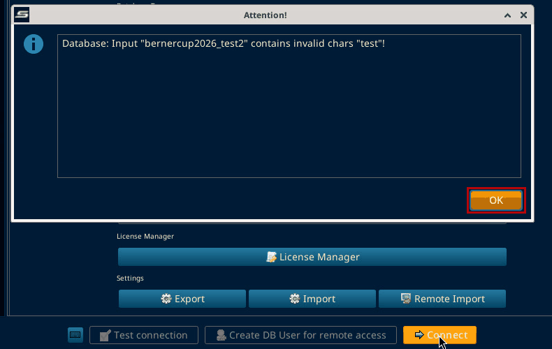
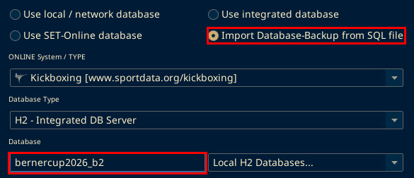
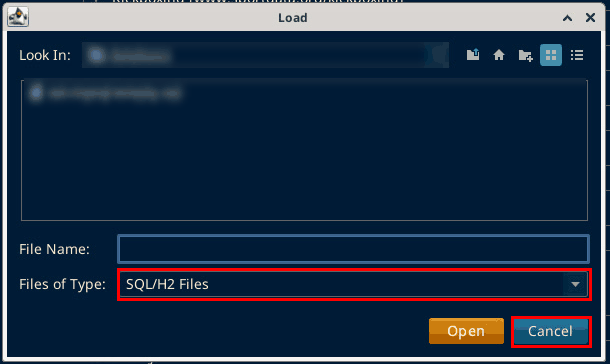
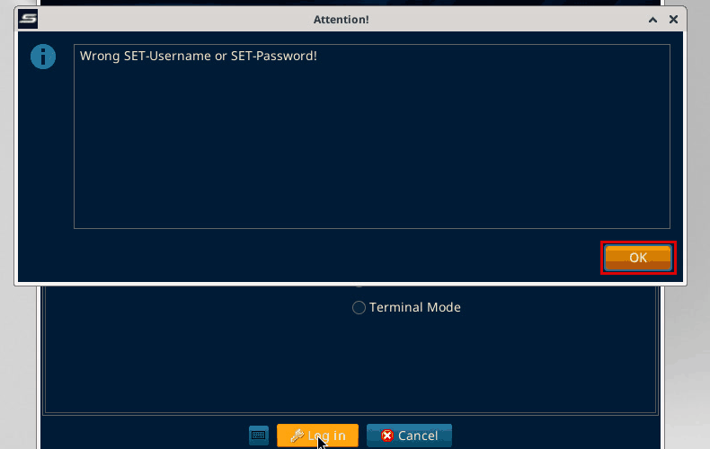

# Open a SET database backup (.sql) on another PC

Tested on SET v12.2.0 build 3 on 6 Oct 2026. The venue runs v12.2.0 build 2.

This uses SET's own import on the Connection Settings screen. It creates a new integrated H2 database on this PC. The live server is not touched.

SET reads this backup format itself (every line ends in [EOL]). Do not import the file with a MySQL or MariaDB tool.

You need the .sql backup file and the SET-Username and SET-Password used at the venue's SET. The backup carries the venue's SET users.

## Video tutorial

This 2 minute 26 second video shows the import from the "Import Database-Backup from SQL file" step to the event opening. It has English subtitles and a voiceover.

<video controls width="100%" preload="metadata" src="video/open-sql-backup/set-sql-import-tutorial.mp4"></video>

If the video does not play, open or download it here: [set-sql-import-tutorial.mp4](video/open-sql-backup/set-sql-import-tutorial.mp4 ':ignore').

The name you type in the Database field can be any name you choose. It does not have to match the original or an existing database name. For example 123456 works. The name must not already exist on this PC and must not contain the word test.

On SET 12.2.0 build 3 (local test, 2026-10-08): the Berner Cup backup was imported under the name 123456, then Lucas_A logged in and the event 7. Berner Cup 2026 opened normally.

## Steps

1. Start SET. In "Select network interface", click OK. Leave "Do not ask again" unticked. The interface address is blacked out.

2. In "SET OVR License Grant and Restriction", click OK. The Connection Settings screen opens.

3. Select "Import Database-Backup from SQL file". An "Attention!" box says "Enter a new name for the database to import!"

4. Click OK on the Attention! box.

5. Click the Database field and type a name for the imported database. The name can be any name you choose. It does not have to match the original or an existing database name. Examples: bernercup2026_import or 123456. The name must not already exist on this PC. SET has a "Database exists already!" message for a name that is already used. The name must not contain the word test. SET stops with: Database: Input "<name>" contains invalid chars "test"!

On SET 12.2.0 build 3 (local test, 6 Oct 2026): the existing name bernercup2026_b2 was typed with "Import Database-Backup from SQL file" selected, then Connect was clicked.

SET did not show "Database exists already!" at that point. The "Load" file picker opened instead, with Files of Type: SQL/H2 Files. Cancel was clicked. So the name check was not reached before the file picker in this test, and when the message appears is not confirmed. The folder and file list are blurred in the screenshot.

6. Click Connect. A "Load" file window opens.

7. In Load, type the path of your .sql backup file in the File Name field.

8. Click Open. The "Start import H2 Database from sql file" window runs. It took about 30 seconds for the Berner Cup backup. The file name is blacked out.

9. The log ends with "Read Lines", "Import Statements" (both 3764 for the Berner Cup backup), "Setting database import date..." and "Finished import!". Then "Attention! Process finished!" appears. Click OK.

10. Click Close on the import window. The file path line is blacked out.

11. Select "Use local / network database". The Database field keeps the name you typed.

12. Click Connect. The "SET Login" window opens.

13. Enter the SET-Username and SET-Password from the venue's SET. Click Log in. The login fields are blacked out. Type the username exactly as SET stores it, including the underscore and capitals, for example Lucas_A, not Lucas A. A space instead of the underscore gives "Wrong SET-Username or SET-Password!" and empties the password field.

14. In "Event data", click the event row, here "7. Berner Cup 2026".

15. Click Next. "Loading Event, please wait..." runs for about 10 seconds.

16. The main screen opens. The Main Tree Menu shows the event with "(local)" after its name, here "7. Berner Cup 2026 (local)".

## If it fails

SET has the message "Database exists already!" for a name that is already used. On SET 12.2.0 build 3 (local test, 6 Oct 2026) it did not appear before the Load file picker, and the test was cancelled there, so the point where it appears is not confirmed. Pick a name that does not exist yet. Any name works, for example 123456.

SET stops with Database: Input "<name>" contains invalid chars "test"! if the name contains the word test. Click OK and pick a name without test, for example bernercup2026_import.

SET shows "Wrong SET-Username or SET-Password!" if the username or password does not match. Click OK. Check the username is typed exactly as SET stores it, with the underscore and capitals, for example Lucas_A. After a wrong login the password field is empty, so type the password again.

