# Open a SET database backup (.sql) on another PC

Tested on SET v12.2.0 build 3 on 6 Oct 2026. The venue runs v12.2.0 build 2.

This uses SET's own import on the Connection Settings screen. It creates a new integrated H2 database on this PC. The live server is not touched.

SET reads this backup format itself (every line ends in [EOL]). Do not import the file with a MySQL or MariaDB tool.

You need the .sql backup file and the SET-Username and SET-Password used at the venue's SET. The backup carries the venue's SET users.

1. Start SET. In "Select network interface", click OK. Leave "Do not ask again" unticked. The interface address is blacked out.

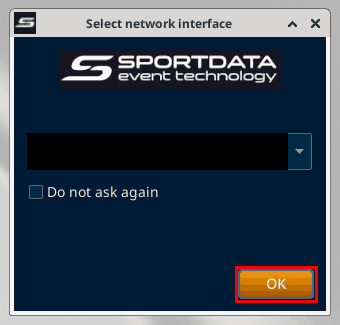

2. In "SET OVR License Grant and Restriction", click OK. The Connection Settings screen opens.

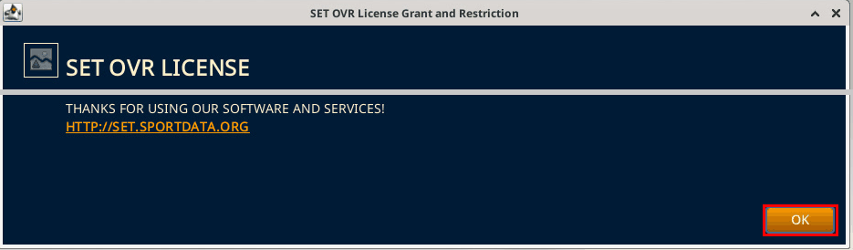

3. Select "Import Database-Backup from SQL file". An "Attention!" box says "Enter a new name for the database to import!"

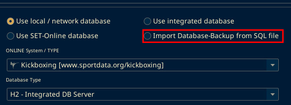

4. Click OK on the Attention! box.

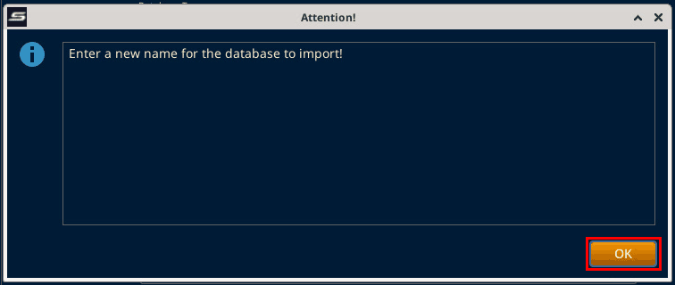

5. Click the Database field and type a new name for the imported database, for example bernercup2026_import. The name must not exist yet. If it exists, SET stops with "Database exists already!"

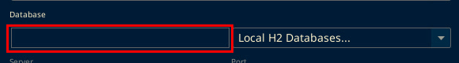

6. Click Connect. A "Load" file window opens.

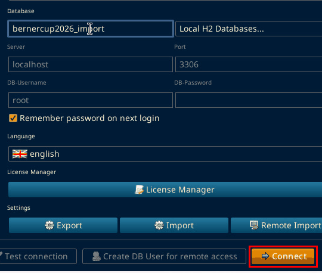

7. In Load, type the path of your .sql backup file in the File Name field.

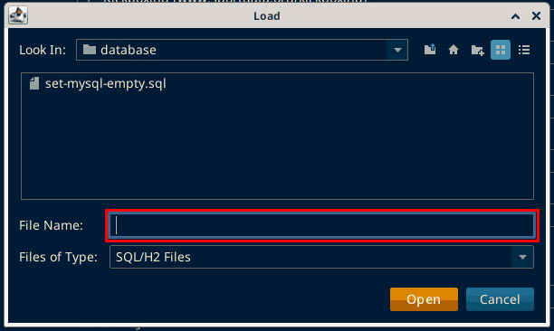

8. Click Open. The "Start import H2 Database from sql file" window runs. It took about 30 seconds for the Berner Cup backup. The file name is blacked out.

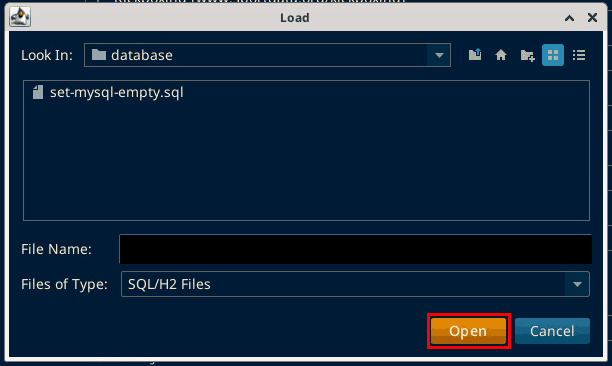

9. The log ends with "Read Lines", "Import Statements" (both 3764 for the Berner Cup backup), "Setting database import date..." and "Finished import!". Then "Attention! Process finished!" appears. Click OK.

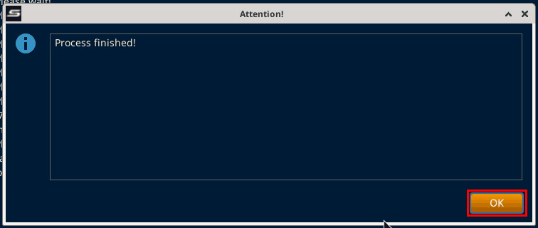

10. Click Close on the import window. The file path line is blacked out.

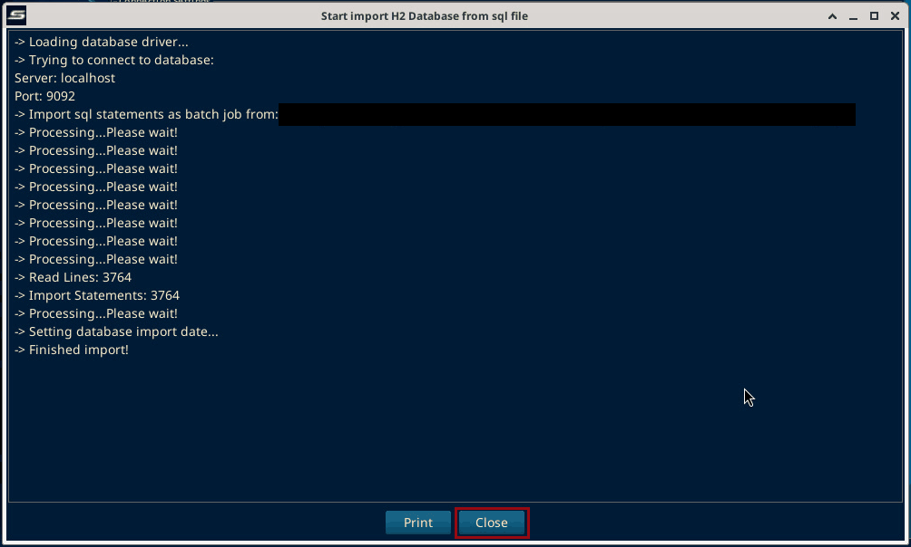

11. Select "Use local / network database". The Database field keeps the new name.

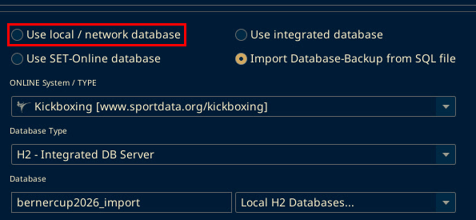

12. Click Connect. The "SET Login" window opens.

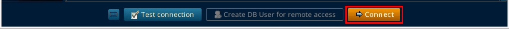

13. Enter the SET-Username and SET-Password from the venue's SET. Click Log in. The login fields are blacked out.

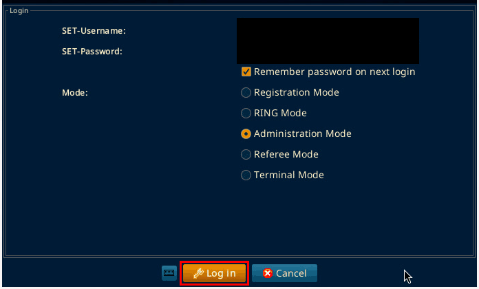

14. In "Event data", click the event row, here "7. Berner Cup 2026".

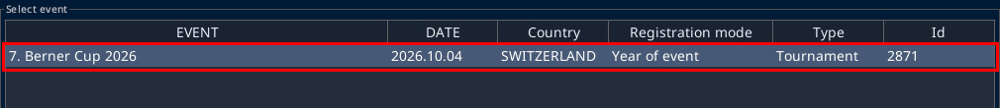

15. Click Next. "Loading Event, please wait..." runs for about 10 seconds.

16. The main screen opens. The Main Tree Menu shows the event with "(local)" after its name, here "7. Berner Cup 2026 (local)".

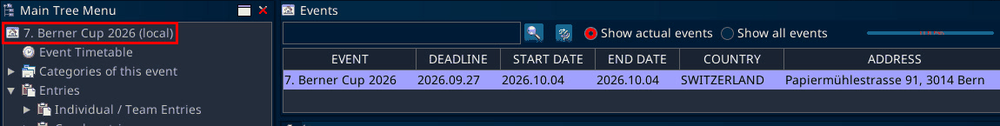

## If it fails

"Database exists already!" means the name in step 5 is taken. Go back to step 3 and type a different name.
