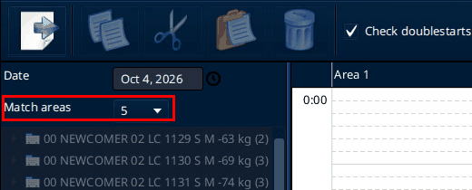
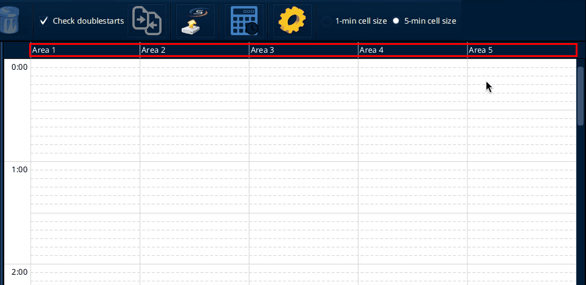

# Preparations

Source: process document added 3 Oct 2026.

Sportdata admins align with leadership on:

- how many areas are needed
- the time plan
- equipment

This follows the entries and the room itself (cables, and so on).

In SET, the number of areas is set in SET DTM. Open Panels, then SET DTM, then click the big icon (tooltip Edit DTM). The SET DTM v 2.0.0 window opens. Match areas is at the top left, under Date.

The time plan is built in the same window. The grid has one column per area and one row per hour. How to fill it is on [Ring](ring.md), section Timetable.

On SET 12.2.0 build 3 (local test, 6 Oct 2026): the copy had 5 match areas on Oct 4, 2026. The grid was scrolled to 0:00, so the visible part was empty. The venue timetable is not shown here.
