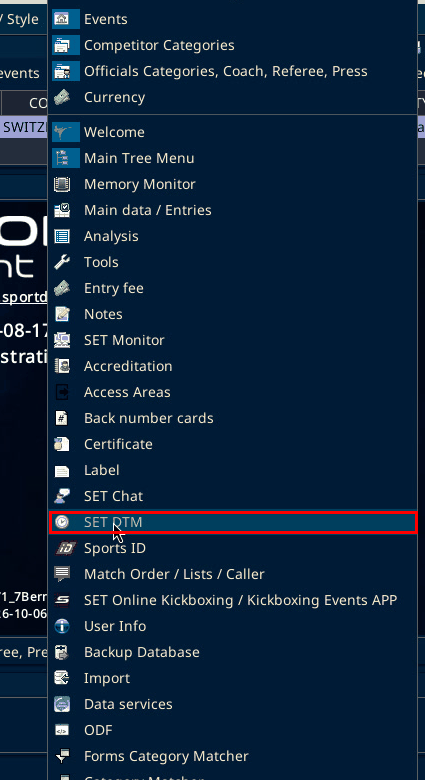
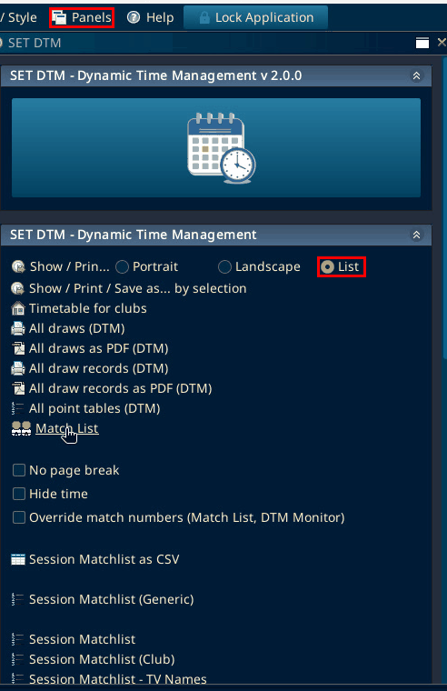
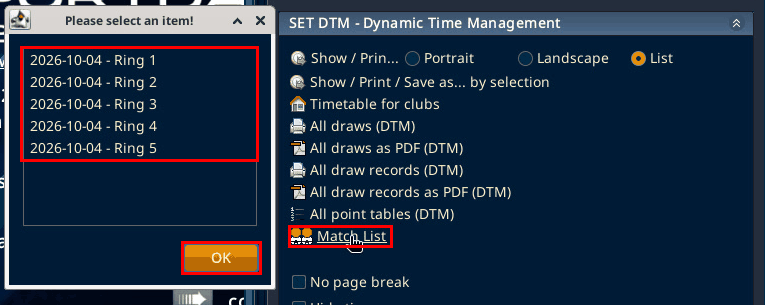
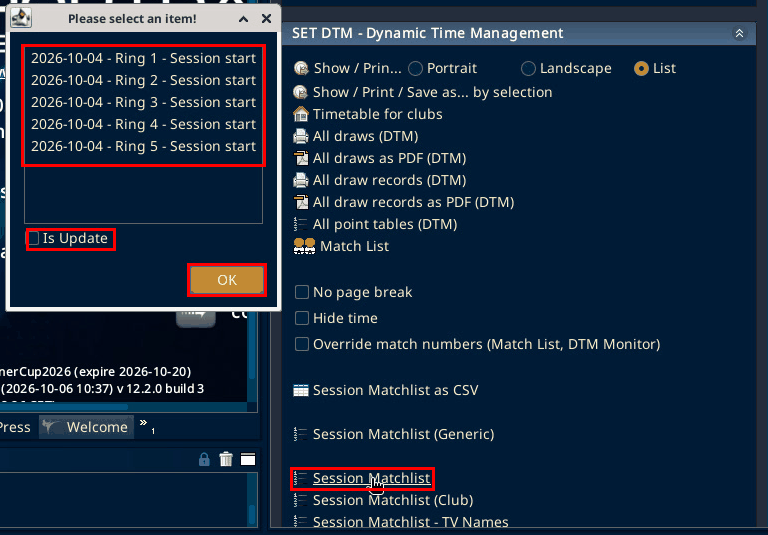
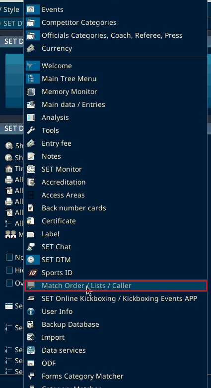
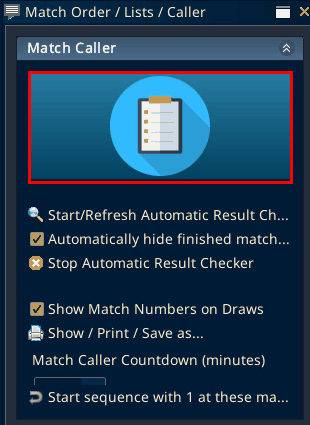
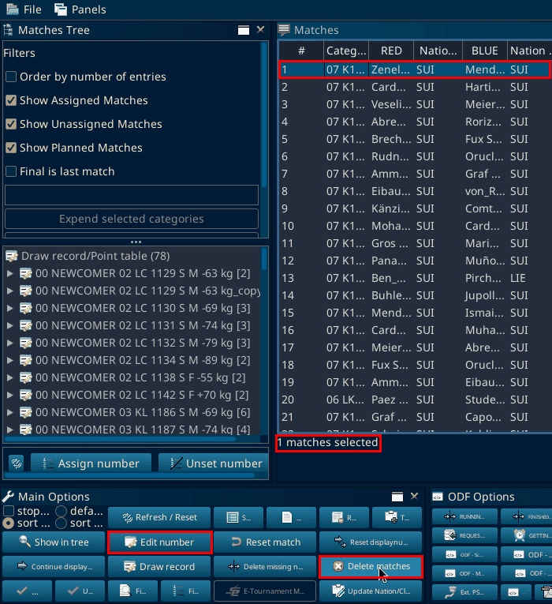

# Printing and publishing the match list

Source: process document added 3 Oct 2026. The menu paths on this page were checked on SET 12.2.0 build 3 on 6 Oct 2026.

## Set DTM to List

Open Panels, then "SET DTM". In the "Show / Prin..." row, choose "List". The other two choices are "Portrait" and "Landscape". If "List" is not visible, widen the SET DTM panel by dragging its left edge.

The panel also has "Show / Print / Save as... by selection", "Timetable for clubs", the "All draws" and "All draw records" items, "All point tables (DTM)", "Match List", the checkboxes "No page break", "Hide time" and "Override match numbers (Match List, DTM Monitor)", and the Session Matchlist items.

## Match List

You can print via "Match List" in the SET DTM panel. The process document called it "Match list (DTM)". It opens "Please select an item!" with one entry per day and ring, for example "2026-10-04 - Ring 1" to "2026-10-04 - Ring 5". Pick one and click "OK".

## Session Matchlist

The cleaner way, once the word Session is in the timetable: print via "Session Matchlist". Select the areas and days. Every session that contains the word Session is offered. Pick the session and print it.

On the local test, "Session Matchlist" opened "Please select an item!" with entries such as "2026-10-04 - Ring 1 - Session start" to "2026-10-04 - Ring 5 - Session start", an "Is Update" checkbox and "OK". The SET DTM panel also has "Session Matchlist as CSV", "Session Matchlist (Generic)", "Session Matchlist (Club)" and "Session Matchlist - TV Names".

## Upload to Sportdata

Save that same document as a PDF and upload it to the event page in Sportdata. Description as appropriate, type Event information. If you upload a new one, remove the previous file. Number them.

The upload was not tested on 6 Oct 2026, because it goes online.

## If something changes

1. Go back to match calling. Open Panels, then "Match Order / Lists / Caller". The side panel is headed "Match Caller". Click the big Match Caller icon. The "Match calling" window opens.

2. Select the match. The status line shows "1 matches selected".

3. Click "Delete matches". It is in the "Main Options" bar at the bottom of "Match calling". The local test did not click it.

4. Go back to the draw and fix it.

5. Return to this list and insert it again at the right number. Shift the others.

"Edit number" is in the same "Main Options" bar, with "Show in tree", "Reset match", "Draw record", "Delete missing n..." (cut off on screen) and "Refresh / Reset". "Assign number" and "Unset number" are under the draw record list on the left. Re-inserting at a number was not tested.
