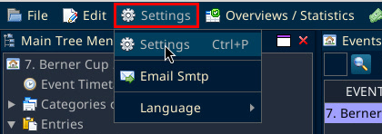
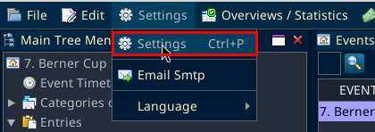
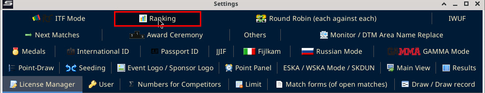
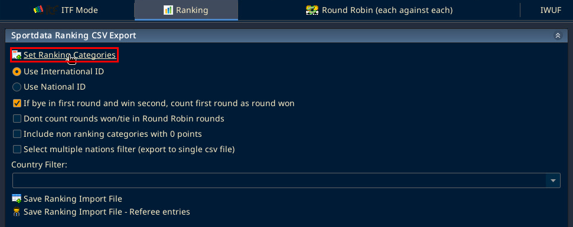
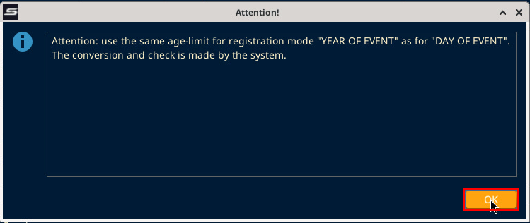
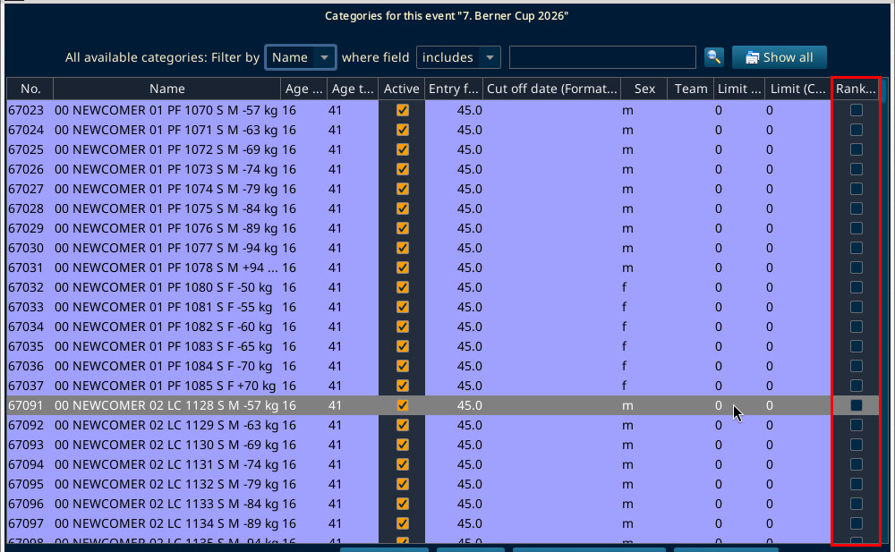
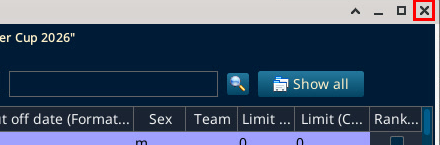
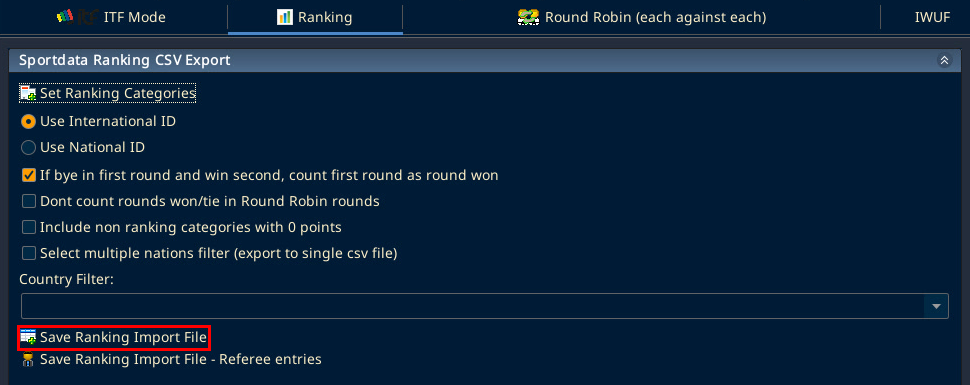
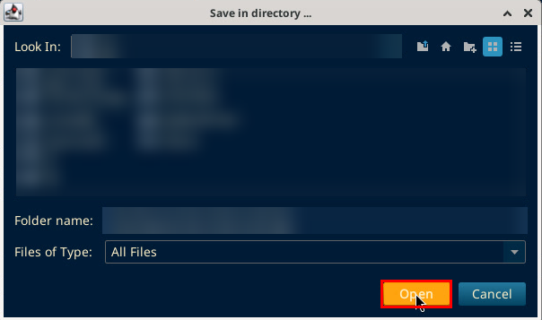
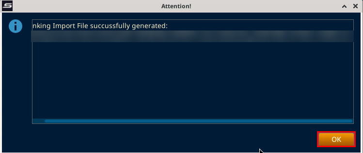

# Ranking export

Source: the Sportdata [Ranking documentation](https://setold.sportdata.org/wp/2019/03/21/ranking-documentation/), section "Import results from a Sportdata Event". A colleague followed these steps and confirmed they work. The SET steps were checked on SET 12.2.0 build 3 (local test on a copy of the database, 8 Oct 2026). The import in the Ranking Admin is online and was not tested, so it has no screenshots. File paths are blurred in the screenshots.

> **Important:** Only categories ticked in the Ranking column are exported. If the exported file is empty, no category is ticked.

## Export the ranking file in SET

1. Click "Settings" in the menu bar.

2. Choose "Settings" (Ctrl+P). The "Settings" window opens.

3. Click the "Ranking" tab.

4. The tab moves to the bottom row of tabs and the panel "Sportdata Ranking CSV Export" opens. Click "Set Ranking Categories".

The other options on the panel were left as they were in the test: "Use International ID" selected, "If bye in first round and win second, count first round as round won" ticked, the other three boxes unticked, and Country Filter empty.

5. An "Attention!" message asks to use the same age limit for registration mode "YEAR OF EVENT" as for "DAY OF EVENT". Click OK.

6. The window "Categories of this event" opens with all categories of the event. Tick the box in the "Ranking" column (far right) for every category that counts for the ranking. The "Active" column is a different column, leave it as it is.

In the test no category was ticked in the Ranking column, so the exported file was empty. Ticking was not tested on the copy.

7. Close the window with the X at the top right. The window has no OK or Cancel button.

8. Back on the Ranking tab, click "Save Ranking Import File". If SET asks for nations, choose them. In the test the Country Filter was empty and SET did not ask.

9. A "Save in directory ..." window opens. Pick the folder, then click Open.

10. SET saves the file as CSV (UTF-8) and shows "Ranking Import File successfully generated:" with the full path. The file name looks like SET_RANKING_EXPORT_local_kickboxing_(date)_(time)_(database name).csv. Click OK.

## Import the file in the Ranking Admin

These steps are online. They come from the Sportdata ranking documentation and were confirmed by a colleague. They were not tested here and have no screenshots.

1. In the Ranking Admin, go to Results, then New/Delete/Import Results, section "Import Ranking Results".
2. Choose the right event in the list at the top of the page.
3. Upload the CSV file with the Upload button.
4. Click Submit below the CSV data preview.
5. Wait until the import has finished. It can take a few minutes. Do not leave the page or click anywhere while it runs.
6. Clear the cache. Otherwise the ranking does not show the new results.
