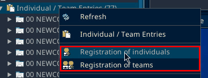
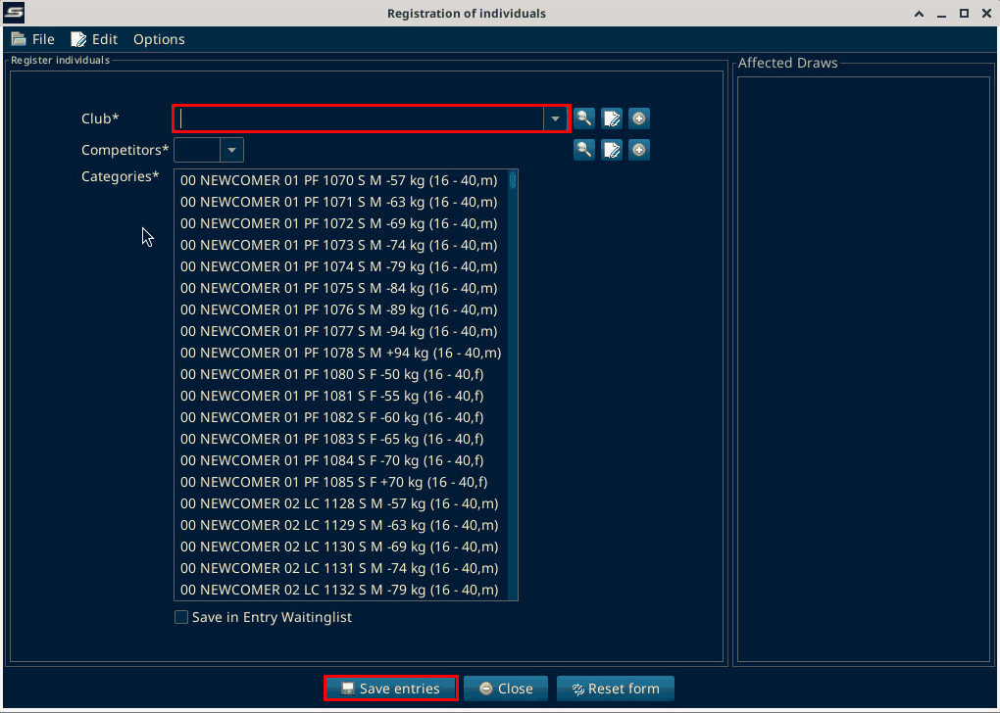

# Registration

Source: process document added 3 Oct 2026.

Registration starts for athletes in the different categories, including Grand Champion, team, and the rest.

Online payments are ideally done at this stage as well.

## Register entries in SET

In the Main Tree Menu, right-click "Individual / Team Entries". The menu has "Registration of individuals" and "Registration of teams".

"Registration of individuals" opens a window with "Club*", "Competitors*" and the "Categories*" list. Below the list is the checkbox "Save in Entry Waitinglist". The buttons are "Save entries", "Close" and "Reset form".

On SET 12.2.0 build 3 (local test, 6 Oct 2026): the window was opened and closed without saving. "Registration of teams" was only seen in the menu.
