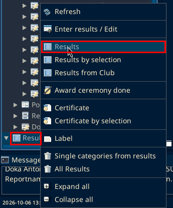
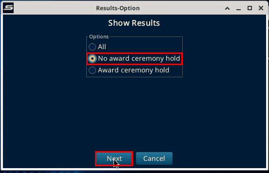
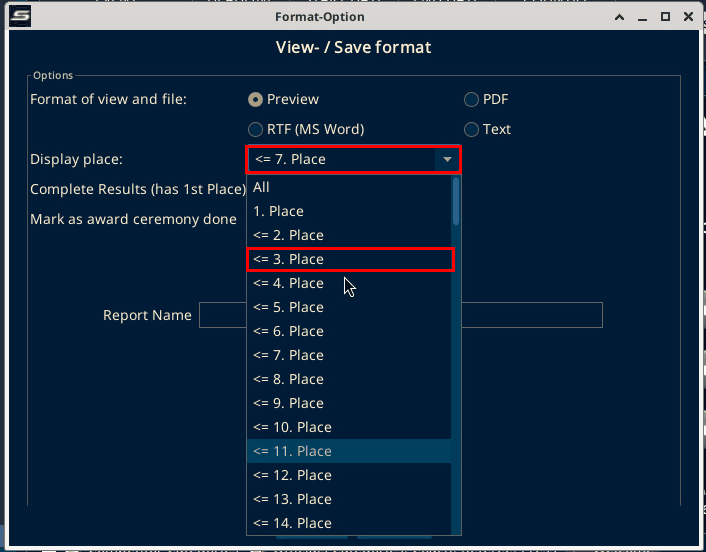
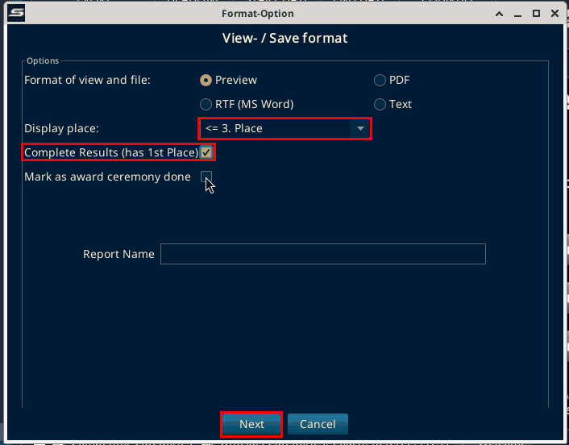
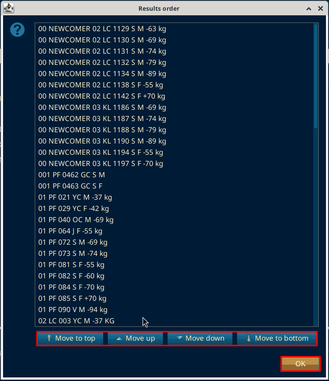
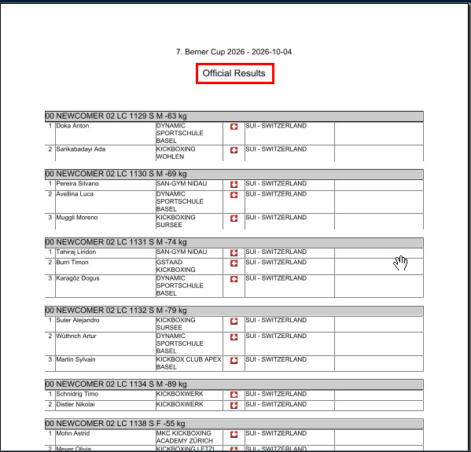
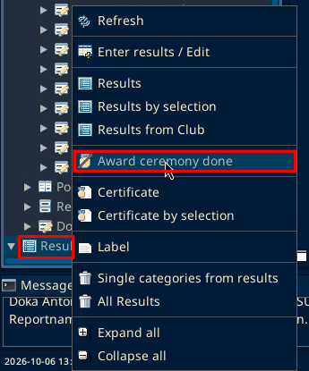
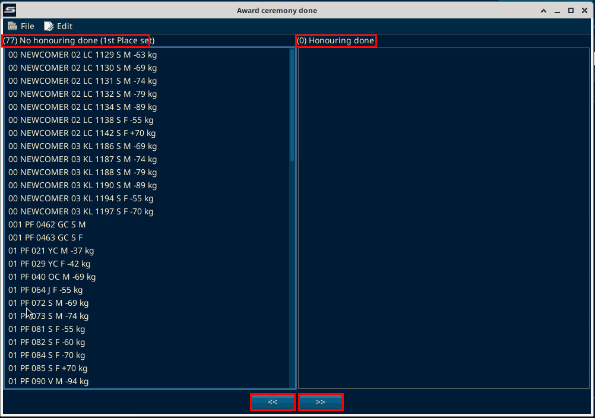
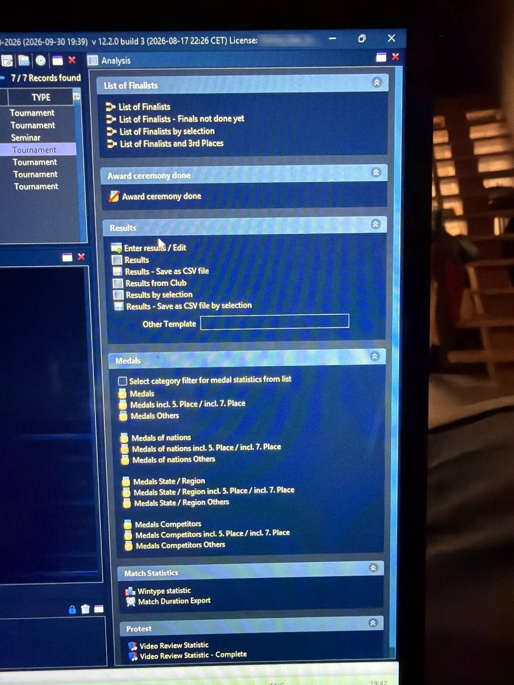

# Results

Source: process document added 3 Oct 2026. The menu paths on this page were checked on SET 12.2.0 build 3 on 6 Oct 2026.

In the Results tab, check results with "No award ceremony hold".

Not found on SET 12.2.0 build 3 (local test, 6 Oct 2026): a tab named "Results". Found instead: the "Result" menu in the Main Tree Menu, below. The venue photo at the bottom of this page shows the "Analysis" panel, which has a "Results" section and "Award ceremony done".

## Show results without award ceremony

Generate them and print them.

1. In the Main Tree Menu, right-click "Result". The menu has "Refresh", "Enter results / Edit", "Results", "Results by selection", "Results from Club", "Award ceremony done", "Certificate", "Certificate by selection", "Label", "Single categories from results" and "All Results". Choose "Results".

2. The "Results-Option" window is headed "Show Results". It has "All", "No award ceremony hold" and "Award ceremony hold". Select "No award ceremony hold" and click "Next".

3. The "Format-Option" window is headed "View- / Save format". It offers "Preview", "PDF", "RTF (MS Word)" and "Text". Set "Display place:" to "<= 3. Place". The default is "<= 7. Place".

4. Tick "Complete Results (has 1st Place)". Do not tick "Mark as award ceremony done". That is a separate later step. Click "Next".

5. A "Results order" window opens with "Move to top", "Move up", "Move down" and "Move to bottom". Click "OK".

6. A preview titled "Official Results" opens. Print from there. The preview was opened on the local test. Printing was not tested.

## Award ceremony done

Then right-click "Result" and choose "Award ceremony done". Mark the categories that have been printed and move them to the right side.

The window has two lists. The left one is "No honouring done (1st Place set)". The right one is "Honouring done". Moving categories to the right with ">>" marks them as done. "<<" moves them back. No categories were moved on the local test.

## Venue photo

The venue photo shows the "Analysis" panel with "Award ceremony done" and the "Results" section.

