# Ring

Source: process document added 3 Oct 2026. Laszlo's 1 Oct chat note matches the "do not overwrite" rule.

Checked on SET 12.2.0 build 3 on 6 Oct 2026, on a local test copy. The screenshots come from that test. Athlete names are blurred.

The ring has its own entry list and order, supplied by the ring organizers.

Tatami draws: [Tatamis](tatamis.md).

## Draws

1. In the Main Tree Menu, right-click Draw, then click Generate draws by selection. The Generate draws window opens.
2. Manually select every relevant category. Ring categories start with 05.
3. That covers LC, FC, and K1.

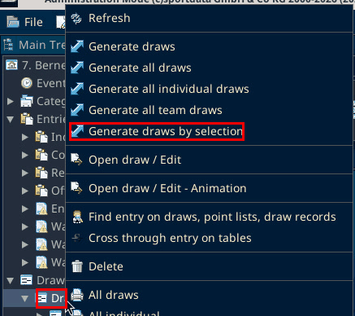

Not found on SET 12.2.0 build 3 (local test, 6 Oct 2026). Found instead: the Generate draws list on this copy has no 05 rows. It goes from 03 KL straight to 06 LK, then 07 K1. Nothing was generated in the test.

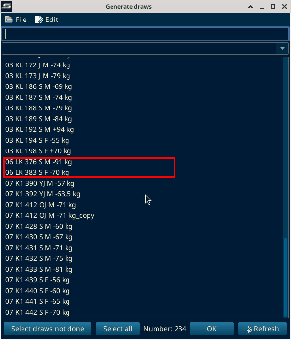

## Draw records

1. Right-click Draw record, then click Save draws as draw records by selection. The window is titled Save all draws as draw records.
2. Select all the ring categories again.
3. The OK button only shows when the window is maximized. Click the maximize button in the title bar first.

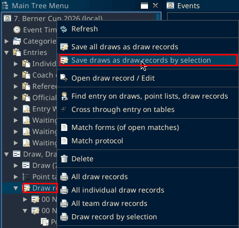

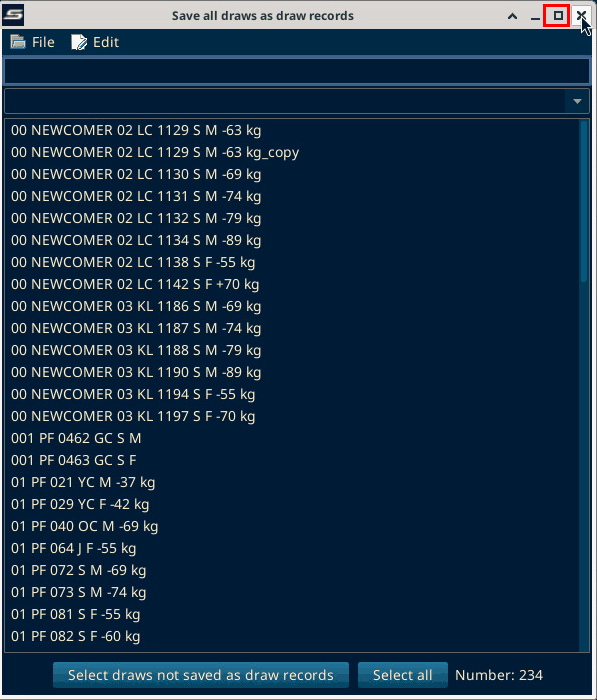

In the test the window was closed without saving.

## Match the ring plan

Check the draws against the plan the ring organizers supplied.

1. In the tree, under Draw, right-click the category, then click Open draw / Edit.
2. In the draw window, click Edit, then Manually changes. The Manual draw window opens.
3. Change the order. Do this only for categories with 3 or more athletes. Shift them to match the plan: click one athlete, Ctrl+click the other, then click Shift.
4. Click Repaint draw.

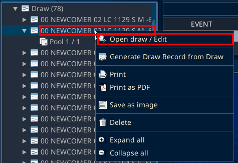

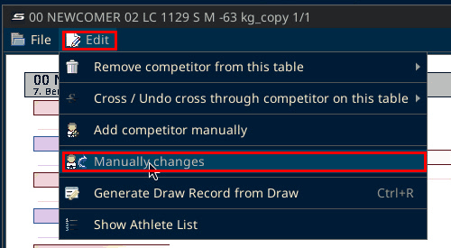

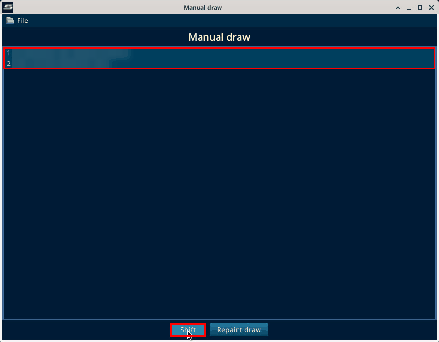

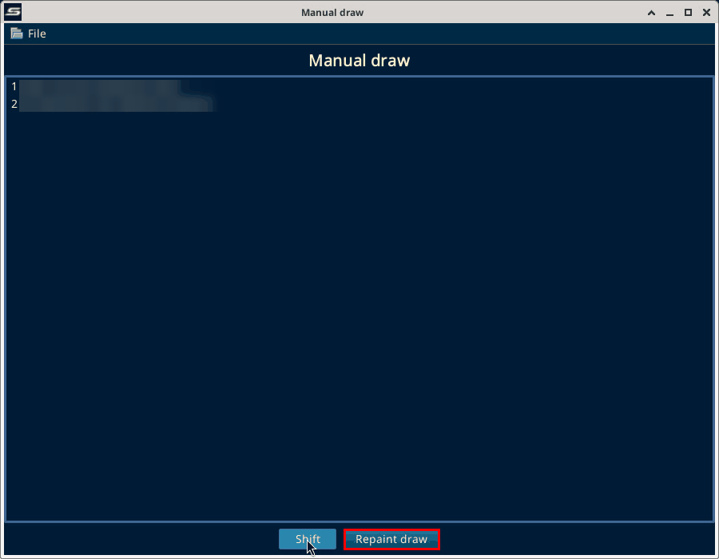

When you exit and it asks, save and overwrite the draw records as well. On build 3, closing the draw window showed these boxes, all titled "Attention!". The test category was 00 NEWCOMER 02 LC 1129 S M -63 kg_copy.

1. "Do you want to save this table?" Click Yes.
2. "Draw: 00 NEWCOMER 02 LC 1129 S M -63 kg_copy-Pool1 - Do you really want to overwrite it?" Click Yes.
3. "00 NEWCOMER 02 LC 1129 S M -63 kg_copy already saved as draw record! - Do you really want to overwrite it?" Click Yes.
4. "Do you really want to save all draws as draw records? -> Categories: 1" Click Yes. The Save all draws as draw records window shows behind this box.
5. "Process finished!" Click OK.

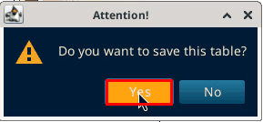

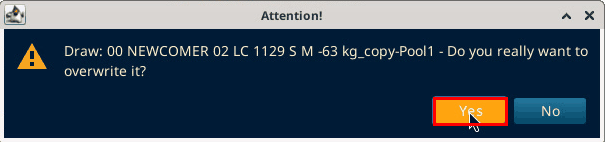

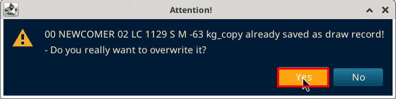

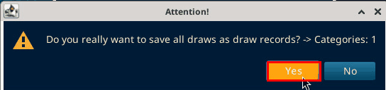

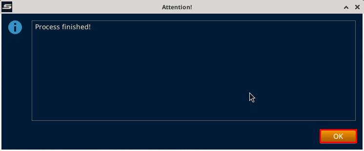

## Match order (caller)

Lists, then Caller. This opens from the panel. A new window starts blank.

Panels is open. Match Order / Lists / Caller is in that menu.

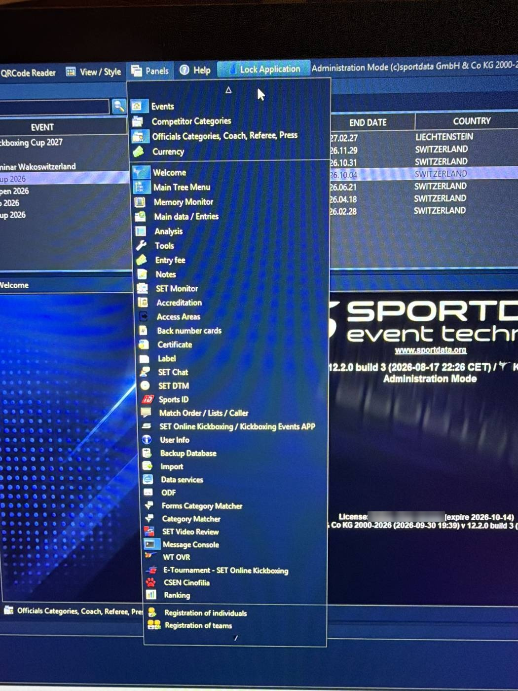

On build 3: Panels, then Match Order / Lists / Caller. In the Match Caller side panel, click the big icon. The Match calling window opens.

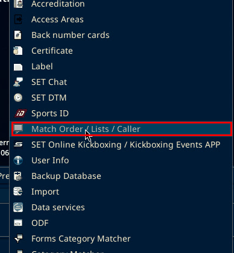

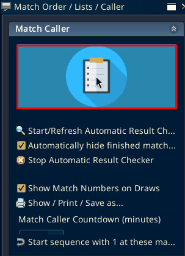

Not found on SET 12.2.0 build 3 (local test, 6 Oct 2026): a blank window. Found instead: the Match calling window opened with the matches already in this copy, so the added fight got number 29.

On the left are all available draw records per category. On build 3 this is the Matches Tree panel, with the Draw record/Point table tree.

1. Draw records, then Expand all.
2. In chronological order, double-click a fight to add it to the list. It gets the next number.
3. The numbers should match the plan.
4. Add blank fights too, with no entries.

Not found on SET 12.2.0 build 3 (local test, 6 Oct 2026): Expand all. Found instead: a button "Expend selected categories" (SET's spelling) above the Draw record/Point table tree.

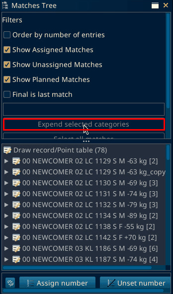

In the test, double-clicking the Final of the _copy category added it. The tree then showed ">>assigned<< 1 [#29]  Final  Pool1" and the match list showed it as number 29.

![Tree entry >>assigned<< 1 [#29] Final Pool1](img/ring/04d-assigned-29.png)

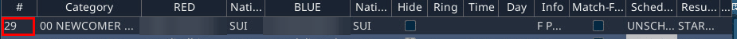

Not found on SET 12.2.0 build 3 (local test, 6 Oct 2026): a button for blank fights or blank rows. Found instead: these controls in the Main Options panel of the Match calling window, read with the panel maximized. Labels that SET cuts off are shown as they appear.

- stop autom. refresh (checkbox)
- default sort, sort by day/tatami..., sort by day/time/t... (options)
- Refresh / Reset
- Show not hidden match...
- Match-Forms
- Reset print Match-Forms
- Template
- Show in tree
- Edit number
- Reset match
- Reset displaynumber
- Continue displaynumber
- Draw record
- Delete missing numbers
- Delete matches
- Call
- Unset Call
- Filter by FOP / day
- Filter by session
- E-Tournament Match Results (greyed out)
- Update Nation/Club Display Option

At normal size most of these labels are cut off.

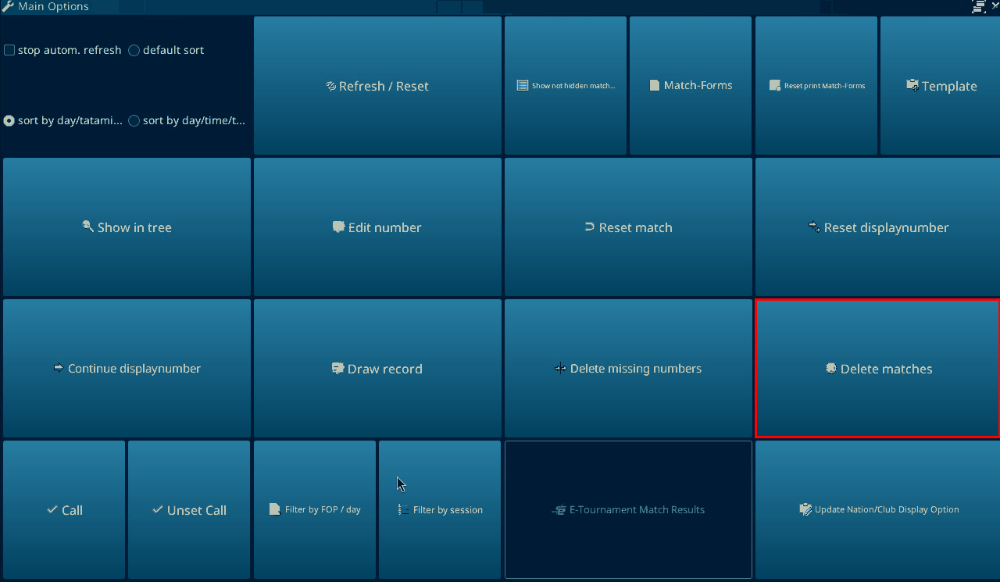

If a fight is definitely not happening, delete the draws and the draw records. The match list updates on its own. If it does not, use Delete matches on the match calling table.

On build 3, select the fight in the match list, then click Delete matches in the Main Options panel. A box titled "Delete matches" asks "Do you really want to delete all selected matches?" Click Yes. In the test, number 29 left the list.

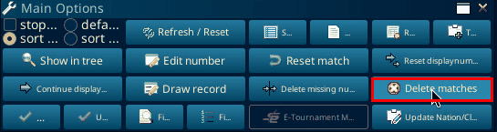

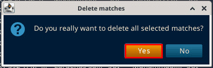

## Timetable

Set up the DTM with the number of areas, including every day if needed. Add dummy entries for the weigh-ins. That part matters.

On build 3: Panels, then SET DTM. In the SET DTM - Dynamic Time Management v 2.0.0 panel, click the big icon (tooltip Edit DTM). The SET DTM v 2.0.0 window opens with Date, Match areas and one column per area.

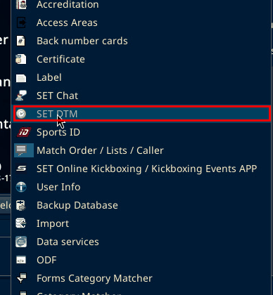

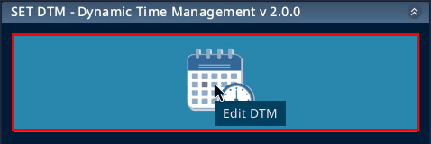

Add a blank row with the word Session at the start of the fights, so reports can be generated.

On build 3 there is no visible Add custom Item button. Right-click the timetable grid, then click Add custom Item (Ctrl+A). It adds an item named "New". Double-click the item to edit it. The editor has Starttime, Endtime, Item name, Location, Actions and Color. Type the name in Item name. In the test it was renamed to "Session test".

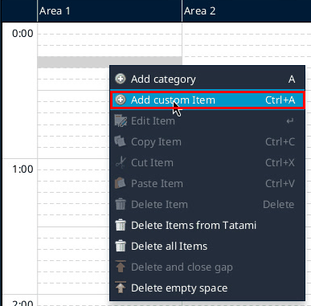

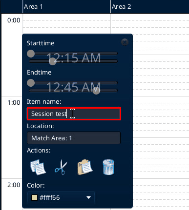

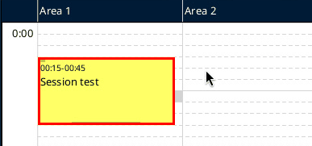

Select the categories for that day and that area, and add them to the timetable. Add the rest in a later pass by picking a different day or area.

On build 3, Add to Timetable is a button in the Timetable Options panel at the bottom right of the Match calling window, next to Add/Replace to Timetable, Remove from Timetable and Select Competitors with double... (cut off). The right-click menu on the SET DTM grid has Add category. Neither was clicked in the test. Nothing was uploaded.

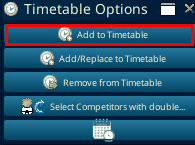
