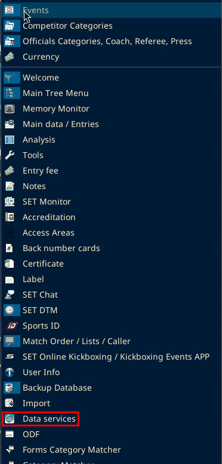
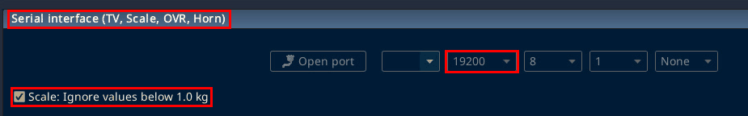
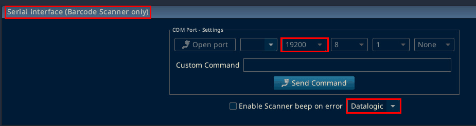
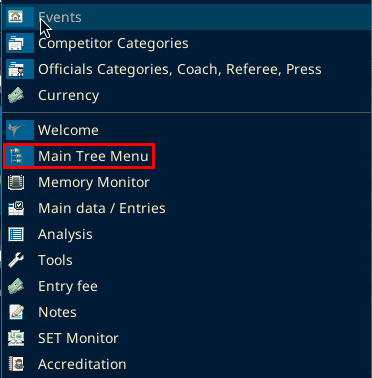
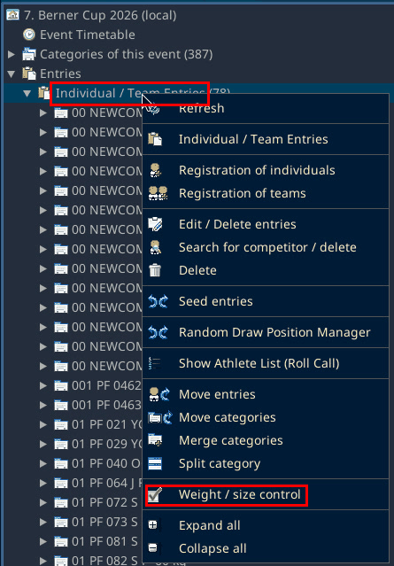
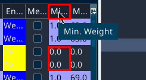
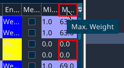
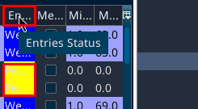
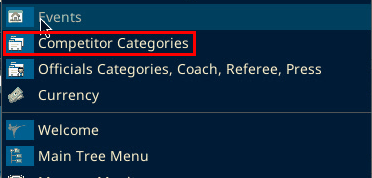

# Scale and scanner troubleshooting

Confirmed on the Berner Cup PCs on 3 Oct 2026. SET was v12.2.0 build 2.

## Serial devices

The scanner and the scale are separate USB serial devices (FTDI). In Device Manager the working serial settings were 9600, 8 data bits, parity none, 1 stop bit, and flow none.

SET has two sections: Serial interface (Barcode Scanner only) and Serial interface (TV, Scale, OVR, Horn). Both used 9600, 8, 1, None.

Both sections are in Panels, then Data services. Expand each section by its title.

On SET 12.2.0 build 3 (local test, 6 Oct 2026): both sections showed 19200, 8, 1, None. That is the local copy's default. It does not change the venue value of 9600. The scale section has Open port, a COM dropdown, and the Scale: Ignore values below 1.0 kg checkbox. The barcode section has COM Port - Settings with Open port and a COM dropdown, Custom Command with Send Command, Enable Scanner beep on error, and a scanner dropdown set to Datalogic.

## Port assignment

The assignment that worked was scanner on COM5 and scale on COM6. The scale needed a power cycle after the port move. An earlier wrong assignment was scanner on COM3 and scale on COM5.

The scale option Ignore values below 1.0 kg was checked. On screen it reads Scale: Ignore values below 1.0 kg. It sits under Serial interface (TV, Scale, OVR, Horn) in Data services.

## Weigh-in window

To open Weight / size control, open Panels, then Main Tree Menu. Right-click Individual / Team Entries and choose Weight / size control.

The QR reader default action that matched the Sport Data page was Weight / size control connected with the scale. Keep that window open. A scan then opens the athlete. Access Control is the wrong window.

The console showed NO EOT found while the scanner was on the wrong port. After the COM swap it showed BarCode Data Received and BarCode EOT found.

## Weights that do not stay saved

If a weight shows on screen and the Weighed status does not stay saved, check the category limits. On the Weight / size control list, Min. Wei. and Max. Wei. were 0.0 on every visible row, and the status stayed Pending. The Sport Data automatic weigh-in page says the status changes to Weighted only when the stable weight is inside the category range, and Min. Weight must not be zero.

On SET 12.2.0 build 3 (local test, 6 Oct 2026): the column titles are cut off. Mi... has the tooltip Min. Weight. M... has the tooltip Max. Weight. En... has the tooltip Entries Status. Most rows show a minimum of 1.0 and a maximum such as 63.0, 69.0 or 74.0. Two rows show 0.0 and 0.0 with a yellow status. The footer counts the statuses, for example P: 11 (4%) and W: 223 (95%). A row with 0.0 and 0.0 means the category limits are not set.

At the venue on v12.2.0 build 2, Panels did not list Competitor Categories.

On SET 12.2.0 build 3 (local test, 6 Oct 2026): Panels does list Competitor Categories, second from the top.

The Sport Data page says that panel is under Panels after an administration-mode login, or it is already open. The click that fills the zero limits on this build is not confirmed yet.

If weights are not saving, look at Min. Wei. and Max. Wei. If they are 0.0, the category limits are not set.
