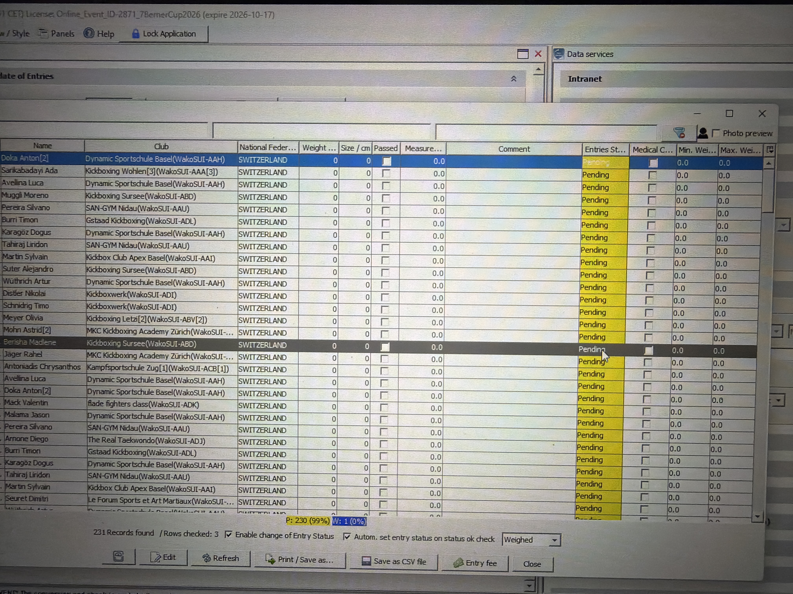
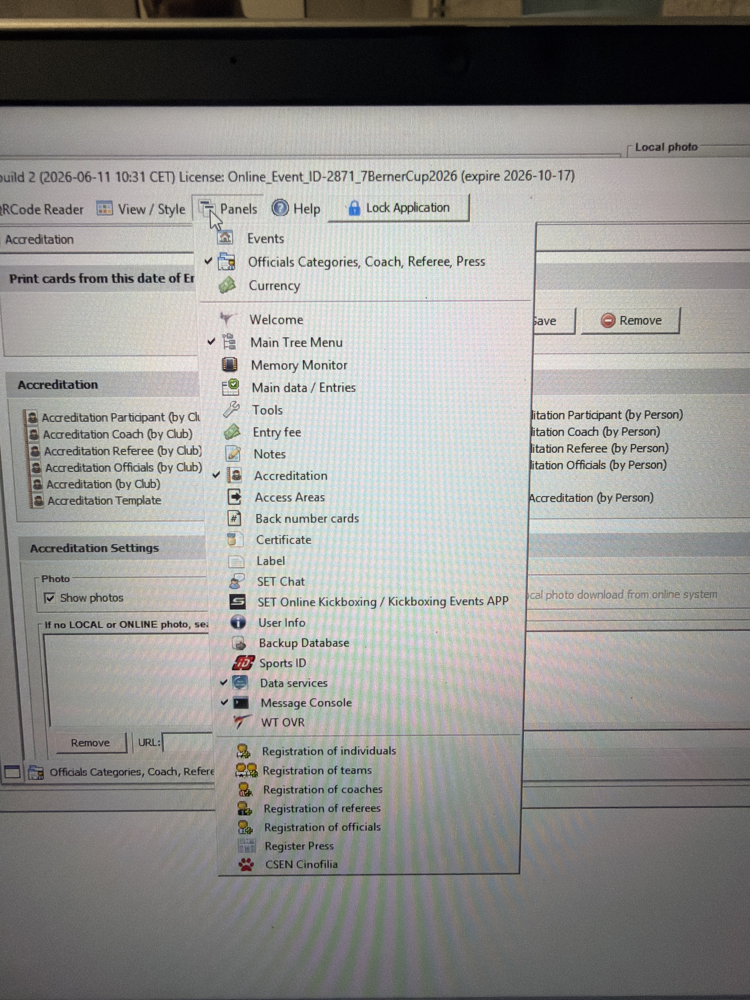

# Scale and scanner troubleshooting

Confirmed on the Berner Cup PCs on 3 Oct 2026. SET was v12.2.0 build 2.

## Serial devices

The scanner and the scale are separate USB serial devices (FTDI). In Device Manager the working serial settings were 9600, 8 data bits, parity none, 1 stop bit, and flow none.

SET has two sections: Serial interface (Barcode Scanner only) and Serial interface (TV, Scale, OVR, Horn). Both used 9600, 8, 1, None.

## Port assignment

The assignment that worked was scanner on COM5 and scale on COM6. The scale needed a power cycle after the port move. An earlier wrong assignment was scanner on COM3 and scale on COM5.

The scale option Ignore values below 1.0 kg was checked.

## Weigh-in window

The QR reader default action that matched the Sport Data page was Weight / size control connected with the scale. Keep that window open. A scan then opens the athlete. Access Control is the wrong window.

The console showed NO EOT found while the scanner was on the wrong port. After the COM swap it showed BarCode Data Received and BarCode EOT found.

## Weights that do not stay saved

If a weight shows on screen and the Weighed status does not stay saved, check the category limits. On the Weight / size control list, Min. Wei. and Max. Wei. were 0.0 on every visible row, and the status stayed Pending. The Sport Data automatic weigh-in page says the status changes to Weighted only when the stable weight is inside the category range, and Min. Weight must not be zero.

On this v12.2 screen, Panels did not list Competitor Categories.

The Sport Data page says that panel is under Panels after an administration-mode login, or it is already open. The click that fills the zero limits on this build is not confirmed yet.

If weights are not saving, look at Min. Wei. and Max. Wei. If they are 0.0, the category limits are not set.
