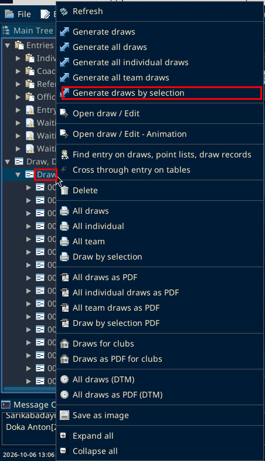
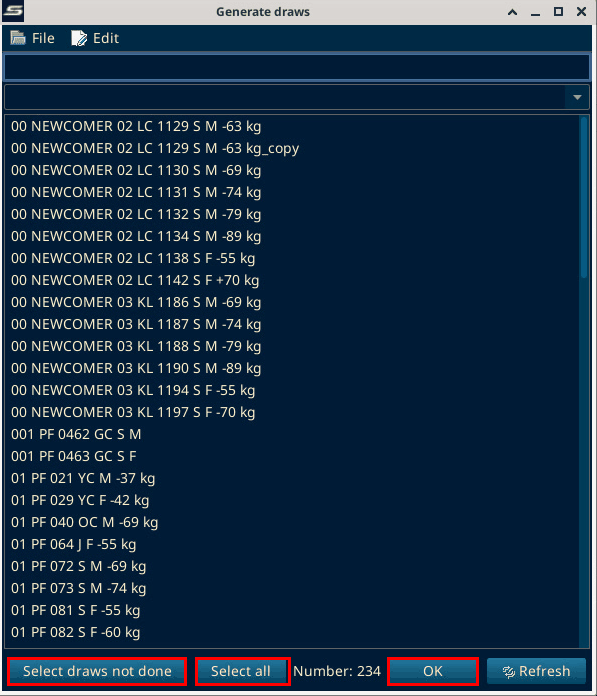
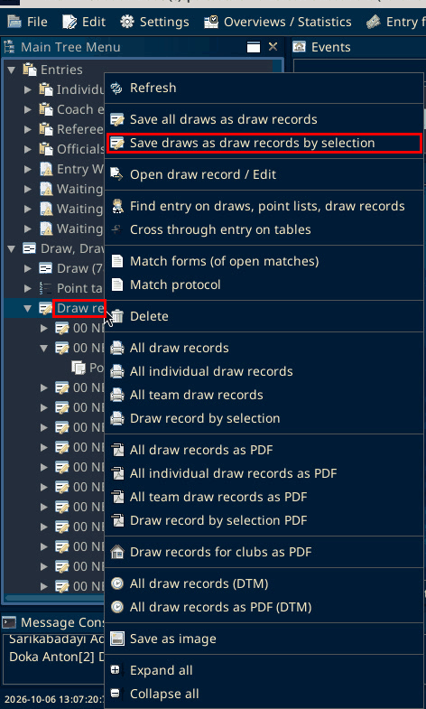
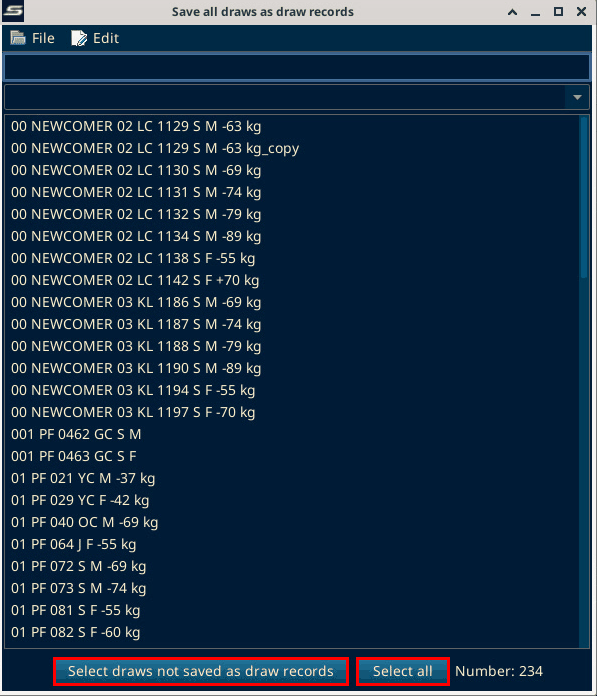
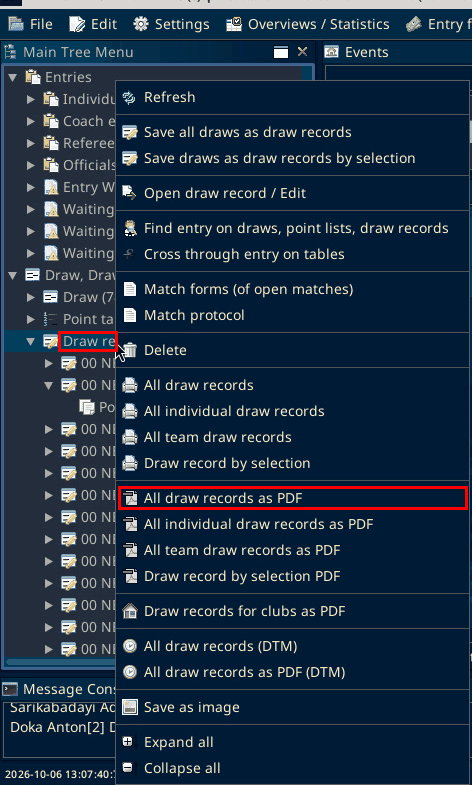
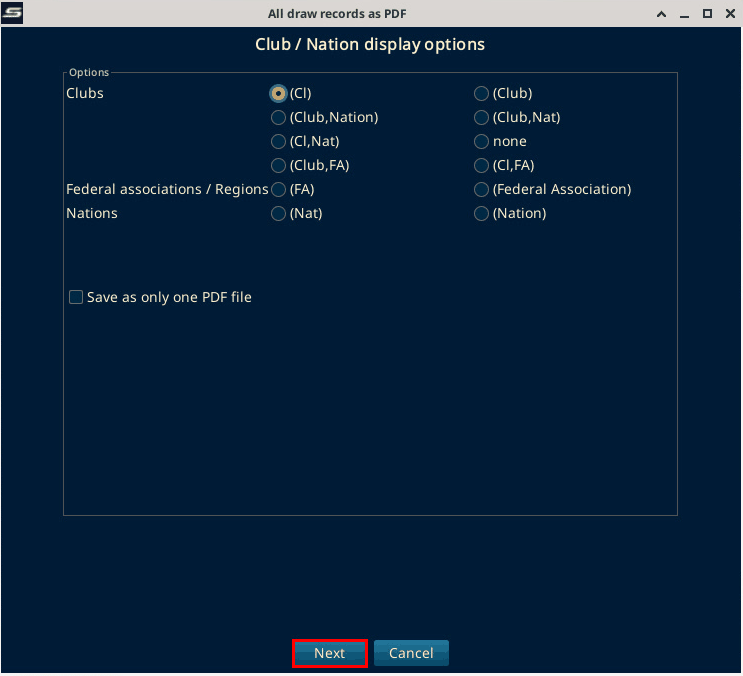
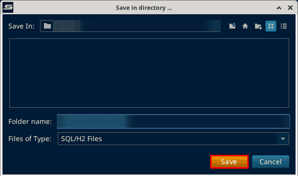
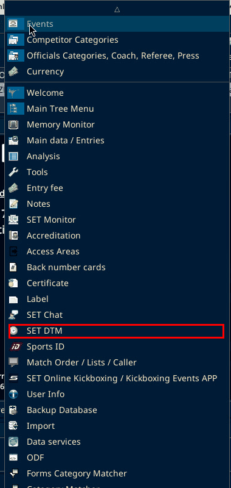
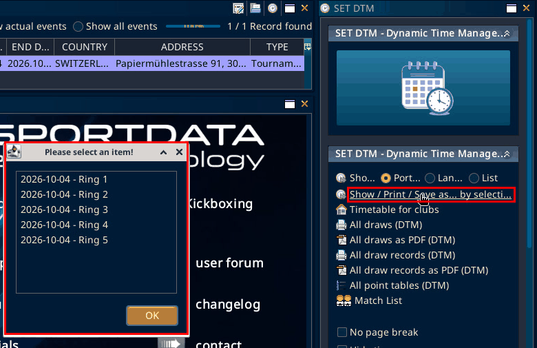

# Tatamis

Source: process document added 3 Oct 2026. The menu paths on this page were checked on SET 12.2.0 build 3 on 6 Oct 2026.

Ring draws, draw records, and match calling: [Ring](ring.md).

Copy a category for an extra match after matches have started: [Extra match](extra-match.md).

## Draws

In the Main Tree Menu, right-click "Draw", then "Generate draws by selection", and select the tatami categories.

The window is titled "Generate draws". At the bottom are "Select draws not done", "Select all", "OK" and "Refresh".

If draws already exist, use "Select draws not done" so you do not overwrite or regenerate them.

## Draw records

Right-click "Draw record", then "Save draws as draw records by selection". Select the tatami categories.

The window is titled "Save all draws as draw records". At the bottom are "Select draws not saved as draw records" and "Select all". The OK button is hidden until you maximize the window.

Also use "Select draws not saved as draw records", so existing records are not overwritten.

## Print

Venue note (Lucas, 4 Oct 2026, SET 12.2.0 build 2): List, then All draw records as PDF. Select the areas you want for that day.

Not found on SET 12.2.0 build 3 (local test, 6 Oct 2026). Found instead: there is no "List" or "Print" submenu. "All draw records as PDF" is directly in the right-click menu on "Draw record".

It opens "Club / Nation display options".

Next goes straight to a "Save in directory ..." dialog. There is no ring or day choice.

The folder path is blurred in the screenshot.

To print only certain rings or days, use SET DTM below.

## Big overview

For the big overview, use "Show / Print / Save as... by selection" (the second option).

Open Panels, then "SET DTM".

Click "Show / Print / Save as... by selection". A "Please select an item!" window lists one entry per day and ring, for example "2026-10-04 - Ring 1" to "2026-10-04 - Ring 5". Pick the entry and click "OK".

That makes a short list per area, in time order, so people can see the plan.
