# Upload results to SET Online

Source: the Sportdata knowledge base article [Upload draws, timetable & results](https://set.sportdata.org/knowledge-base/upload-draws-timetable-results/) and Lucas's process. The menu paths were checked on SET 12.2.0 build 3 (local test, 6 Oct 2026). The knowledge base screenshots are from SET v11 and are not copied here.

> **Warning:** Clicking "Upload results to SET Online on www.sportdata.org / Kickboxing Events APP" uploads at once. There is no extra step. SET pushes the results online as an XML file and they show on the event page under Results. On SET 12.2.0 build 3 (local test, 6 Oct 2026) the upload lines were only hovered, never clicked. Nothing was uploaded.

## Upload results

1. Click "Panels" in the menu bar.

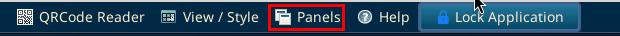

2. Choose "SET Online Kickboxing / Kickboxing Events APP". The panel opens on the right side, headed "SET Online Kickboxing / Kickboxing Events APP". Widen it by dragging its left edge, or double click its title bar to expand it (the knowledge base tip), so the full line texts show.

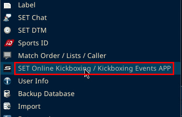

On SET 12.2.0 build 3 (local test, 6 Oct 2026) the panel opened already wide on the right side. Its title bar and left edge are boxed below. The drag and the double click were not tried in the test.

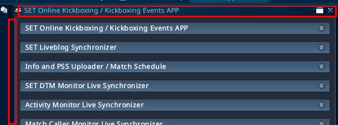

3. Scroll down the panel to the "Results" section. Its sections from top to bottom are "SET Online Kickboxing / Kickboxing Events APP", "SET Liveblog Synchronizer", "Info and PSS Uploader / Match Schedule", "SET DTM Monitor Live Synchronizer", "Activity Monitor Live Synchronizer", "Match Caller Monitor Live Synchronizer", "Match Caller Area Monitor Live Synchronizer", "SET DTM - Dynamic Time Management", "Draw, Draw record, Point Draw...", "Results", "Download online photo" and "Online Downloads Section". The arrow at the right end of each title opens or closes the section.

On SET 12.2.0 build 3 (local test, 6 Oct 2026), with every section closed except "Online Downloads Section":

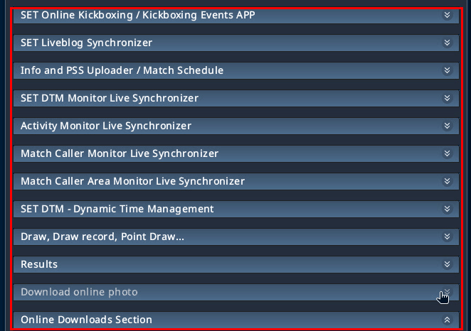

4. Click "Upload results to SET Online on www.sportdata.org / Kickboxing Events APP". Its tooltip reads "Upload results to SET Online on www.sportdata.org". The upload starts at once.

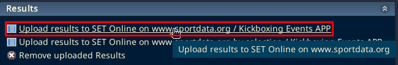

The local install has these texts for the results upload: "Generating results as XML data", "Processing...Please wait!" and "Process finished!". On a failure it has "Error on uploading the results!". If the upload fails, check the internet connection. (The last sentence is from the knowledge base.) The knowledge base also says to select the "Attention!" option for any necessary alerts. On the local test no window was opened, so this was not seen.

## Upload only some categories

Use "Upload results to SET Online on www.sportdata.org by selection / Kickboxing Events APP" to upload chosen categories only. The selection window was not opened on the local test.

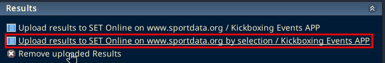

## Remove uploaded results

"Remove uploaded Results" takes the uploaded results off the event page. Its tooltip is misspelled "Remove uplaoded Results" in SET. It was not clicked on the local test.

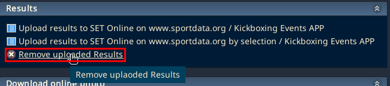

## Upload draws during the event

Draws, draw records and point draws can be uploaded the same way during the event, once they are final. In the "Draw, Draw record, Point Draw..." section click "Upload draws and records to SET Online on www.sportdata.org / Kickboxing Events APP". Its tooltip reads "Upload draws and records to SET Online on www.sportdata.org". The section also has "Upload draws and records to SET Online on www.sportdata.org by selection / Kickboxing Events APP" and "Remove uploaded Draws, Draw Records and Point Lists". The knowledge base says to select either all draws or by selection, and that a confirmation pop up appears once completed. Not clicked on the local test.

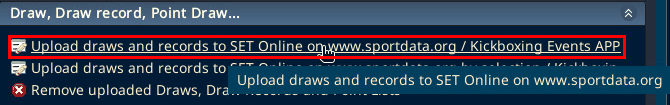

On SET 12.2.0 build 3 (local test, 6 Oct 2026) the other two lines were only hovered, never clicked. The "by selection" line has the tooltip "Upload draws and records to SET Online on www.sportdata.org by selection".

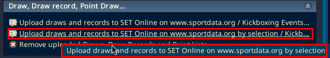

"Remove uploaded Draws, Draw Records and Point Lists" showed no tooltip in the test.

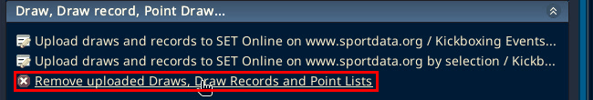

## Timetable

The "SET DTM - Dynamic Time Management" section has "Upload timetable to SET Online on www.sportdata.org / Kickboxing Events APP", the same "by selection" line and "Remove online time table on www.sportdata.org". The local install asks "Do you really want to upload the time table to be available and visible for public on www.sportdata.org?" before the timetable upload. The knowledge base says to press yes, and that a pop up confirms the upload. Not clicked on the local test.

On SET 12.2.0 build 3 (local test, 6 Oct 2026) the three lines were only hovered, never clicked. "Upload timetable to SET Online on www.sportdata.org / Kickboxing Events APP" has the tooltip "Upload timetable to SET Online on www.sportdata.org".

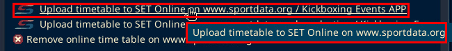

The by selection line reads "Upload timetable to SET Online on www.sportdata.org by selection / Kickboxing Ev" (cut off on screen). No tooltip showed for it in the test.

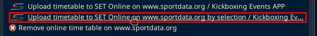

"Remove online time table on www.sportdata.org" has the same text as its tooltip.

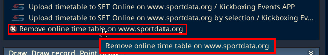

## Check the event page

From the knowledge base: On the event page on sportdata.org, click the "Results" button to see the official results. Click "Draws" and then a category to see the uploaded draws. The "Timetable" section shows the uploaded timetable. It shows the individual matches only if the timetable was built from the match caller. If it was built only from categories and pools, the individual matches do not show.

## Knowledge base steps

From the knowledge base article, lightly edited:

1. Go to Panels.
2. Click on SET Online.
3. Go to the drop down menu SET DTM - Dynamic Time Management. You can upload the entire timetable or by selection as well as remove the current timetable from online. Tip: Double click the top of the window where it first says SET Online Test / Test Events App to fully expand the window so you can see more.
4. Press yes to confirm that you want to publish and allow the public to see the timetable.
5. A pop up will confirm that the upload was successfully processed. If unsuccessful, check the internet connection.
6. In the draw, draw record, point table drop down list select either all draws or by selection.
7. Once completed, a confirmation pop up will appear.
8. To publish results go to the results drop down and select upload results.
9. Select the "Attention!" option for any necessary alerts.
10. Within the menu of the event page, find and click on the TIMETABLE section.
11. Click on the DRAWS button, then on the desired category.
12. On the event page, click on the results button.

On SET 12.2.0 build 3 the results line uploads at once, without a confirm step (Lucas).

On SET 12.2.0 build 3 (local test, 6 Oct 2026) the panel title reads "SET Online Kickboxing / Kickboxing Events APP", not "SET Online Test / Test Events App". The SET DTM - Dynamic Time Management lines for step 3 are shown under Timetable above.
