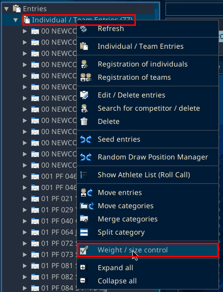
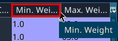
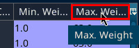
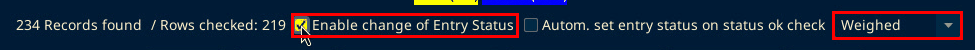
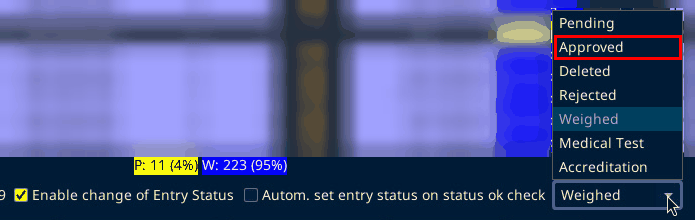
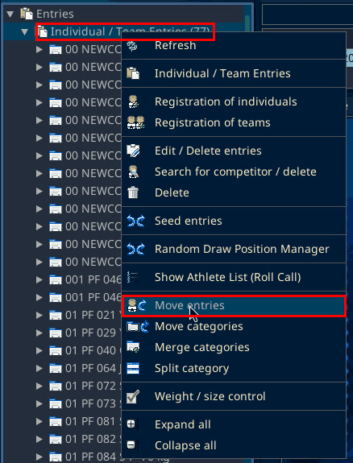
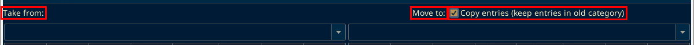

# Weigh-ins

Source: process document added 3 Oct 2026. The menu locations on this page were checked on SET 12.2.0 build 3 on 6 Oct 2026.

On the day of the event, or the day before, athletes come to weigh-in.

Ideally everyone is weighed and marked in the system as weighed, and they fit the category they registered in.

If someone is overweight, decide case by case:

- Leave them rejected. They do not fight.
- Move them up into a higher division that already has other fighters. That needs a manual approval. See [Move up a division](weigh-ins.md?id=move-up-a-division).
- If they are only slightly over (about 100 g), they come to the Sportdata control desk. You can approve it manually, and only in a very limited way. See [Approve someone who is slightly over](weigh-ins.md?id=approve-someone-who-is-slightly-over).

## Open Weight / size control

"Weight / size control" is not in the Tools menu. In the Main Tree Menu, right-click "Individual / Team Entries" and choose "Weight / size control".

## Min. Wei. and Max. Wei.

If a weight shows and does not stay saved, check Min. Wei. and Max. Wei. on the Weight / size control list. The column headers are cut off as "Min. Wei…" and "Max. Wei…". The full names, shown when you hover over the header, are "Min. Weight" and "Max. Weight".

The server setup and the scale checks are on the [Local server](local-server.md) and [Scale and scanner](scale-troubleshooting.md) pages.

## Approve someone who is slightly over

1. At the bottom of Weight / size control are the checkbox "Enable change of Entry Status", then "Autom. set entry status on status ok check", then a status dropdown. The dropdown is greyed out until "Enable change of Entry Status" is ticked. Tick "Enable change of Entry Status".

2. In the dropdown, pick "Approved". The statuses are Pending, Approved, Deleted, Rejected, Weighed, Medical Test and Accreditation. The entry status is set there.

## Move up a division

In the same right-click menu on "Individual / Team Entries", choose "Move entries".

The window has "Take from:", "Move to:", the "Copy entries (keep entries in old category)" checkbox and a "Move" button.

The steps are on the Extra match page under [B. Copy the two athletes](extra-match.md?id=b-copy-the-two-athletes).
