# Weigh-ins

Source: process document added 3 Oct 2026. The menu locations on this page were checked on SET 12.2.0 build 3 on 6 Oct 2026.

On the day of the event, or the day before, athletes come to weigh-in.

Ideally everyone is weighed and marked in the system as weighed, and they fit the category they registered in.

No venue weigh-in was captured. On SET 12.2.0 build 3 (local test, 6 Oct 2026) the footer of Weight / size control counts the statuses, for example P: 11 (4%) and W: 223 (95%).

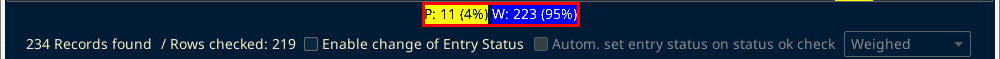

If someone is overweight, decide case by case:

- Leave them rejected. They do not fight.
- Move them up into a higher division that already has other fighters. That needs a manual approval. See [Move up a division](weigh-ins.md?id=move-up-a-division).
- If they are only slightly over (about 100 g), they come to the Sportdata control desk. You can approve it manually, and only in a very limited way. See [Approve someone who is slightly over](weigh-ins.md?id=approve-someone-who-is-slightly-over).

## Open Weight / size control

"Weight / size control" is not in the Tools menu. In the Main Tree Menu, right-click "Individual / Team Entries" and choose "Weight / size control".

## Min. Wei. and Max. Wei.

If a weight shows and does not stay saved, check Min. Wei. and Max. Wei. on the Weight / size control list. The column headers are cut off as "Min. Wei…" and "Max. Wei…". The full names, shown when you hover over the header, are "Min. Weight" and "Max. Weight".

The server setup and the scale checks are on the [Local server](local-server.md) and [Scale and scanner](scale-troubleshooting.md) pages.

## Approve someone who is slightly over

1. At the bottom of Weight / size control are the checkbox "Enable change of Entry Status", then "Autom. set entry status on status ok check", then a status dropdown. The dropdown is greyed out until "Enable change of Entry Status" is ticked. Tick "Enable change of Entry Status".

2. Click the athlete's Entries Status cell (header "En..."). A dropdown opens in the cell.

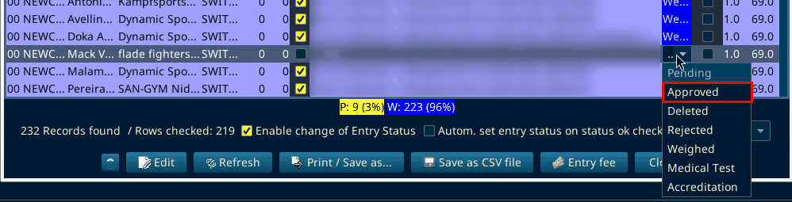

3. Pick "Approved". The statuses are Pending, Approved, Deleted, Rejected, Weighed, Medical Test and Accreditation. The status saves at once and the cell turns green.

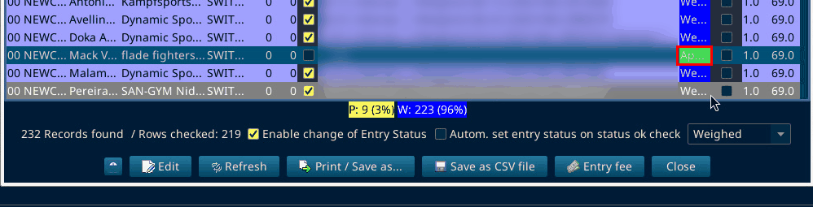

To reject an athlete, pick "Rejected" in the same cell.

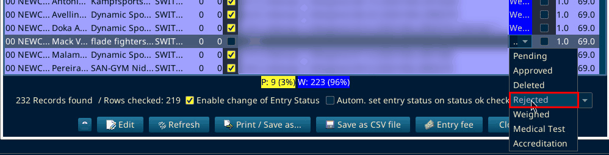

4. The status dropdown in the footer does not set the status of a row by itself. It is only used when a row's Passed box is ticked and "Autom. set entry status on status ok check" is on.

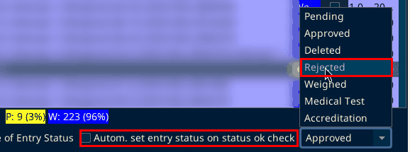

The right-click menu on an athlete row has "Weight / size control", "Edit", "Move entries", "Entry fee", "Accreditation" and "Accreditation Preview". It has no status item.

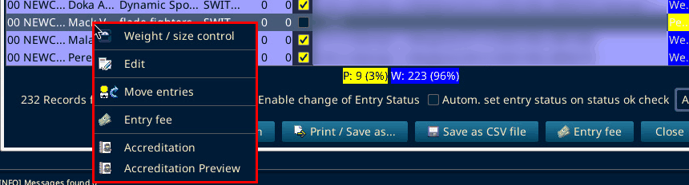

On SET 12.2.0 build 3 (local test, 6 Oct 2026): Approved was set in the cell for one athlete and then set back to Pending.

## Change the status of several athletes

1. Open "Overviews / Statistics", then "All entries" (Ctrl+9).

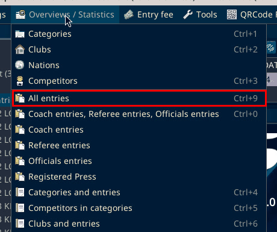

2. In "Athlete Entries", select the rows. Click "Change status" in the footer. The button is cut off as "Change stat...".

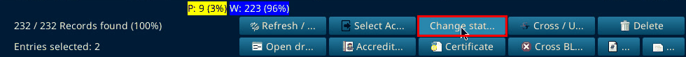

3. The prompt "Change status:" asks "Please select the status for all selected entries". Pick the status in the list.

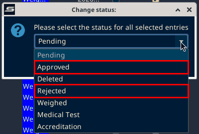

4. Click "OK".

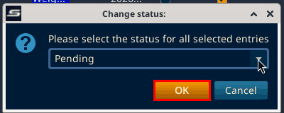

On SET 12.2.0 build 3 (local test, 6 Oct 2026): Cancel was clicked, so no status was changed this way.

## Move up a division

In the same right-click menu on "Individual / Team Entries", choose "Move entries".

The window has "Take from:", "Move to:", the "Copy entries (keep entries in old category)" checkbox and a "Move" button.

On SET 12.2.0 build 3 (local test, 6 Oct 2026) the controls look like this up close. Open the "Take from:" dropdown and pick the source category.

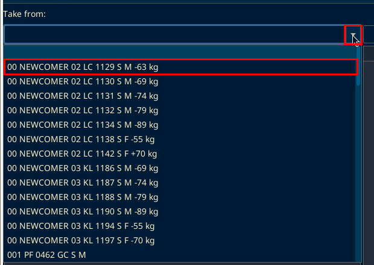

Open the "Move to:" dropdown and pick the target category.

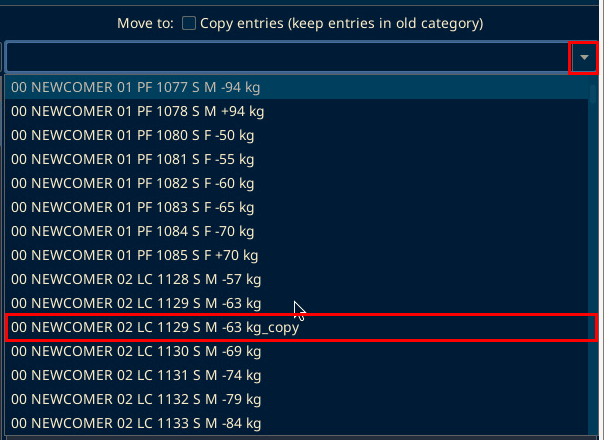

"Copy entries (keep entries in old category)" keeps the athlete in the old category as well. The Extra match page checks it.

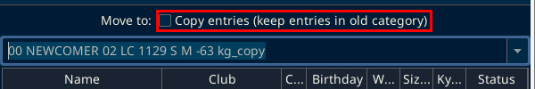

"Move" is at the bottom of the window.

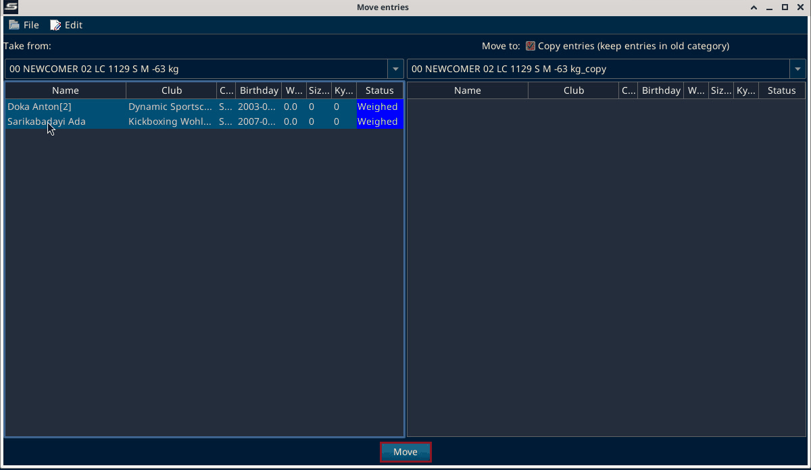

The steps are on the Extra match page under [B. Copy the two athletes](extra-match.md?id=b-copy-the-two-athletes).
