# Wrong name monitor (workaround)

This page is a workaround. It is not a proper fix. The proper fix is not known.

Confirmed on 4 Oct 2026 at 7. Berner Cup, SET v12.2.0 build 2, on the PC that runs SET Monitor, Administration Mode.

## What happened

Opening or refreshing the display showed this dialog: Attention: Names of Tatamis must end with a number (e.g. TATAMI 1, TATAMI 2). Wrong name: monitor.

The monitors kept cycling through the tatamis and the ring while that dialog was on the admin PC.

Settings, Monitor / DTM Area Name Replace, already listed Ring 5 through Ring 1 mapped to RING and Tatami 4 through Tatami 1. That list was correct. It did not contain monitor. Leave that list as it is.

On SET 12.2.0 build 3 (local test, 6 Oct 2026): the Monitor / DTM Area Name Replace list was empty on the local copy. The venue list above is the one that matters at the event.

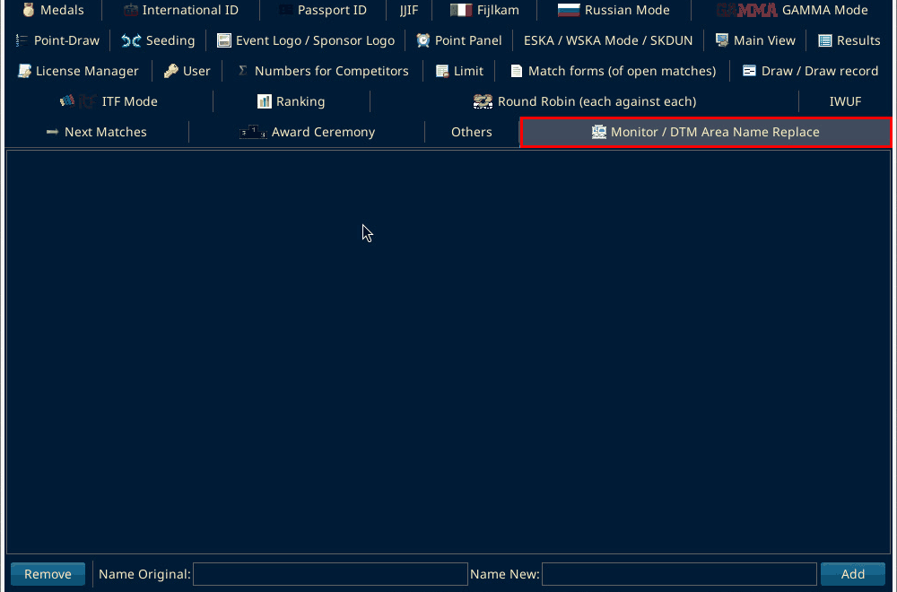

The venue list itself was not rebuilt on the local copy. The next shot shows the format of one row after Add, using the process document example Ring 1 replaced with Tatami 1. The test row was removed again afterwards.

The screen shows the Wrong name: monitor dialog and the area-name replace list.

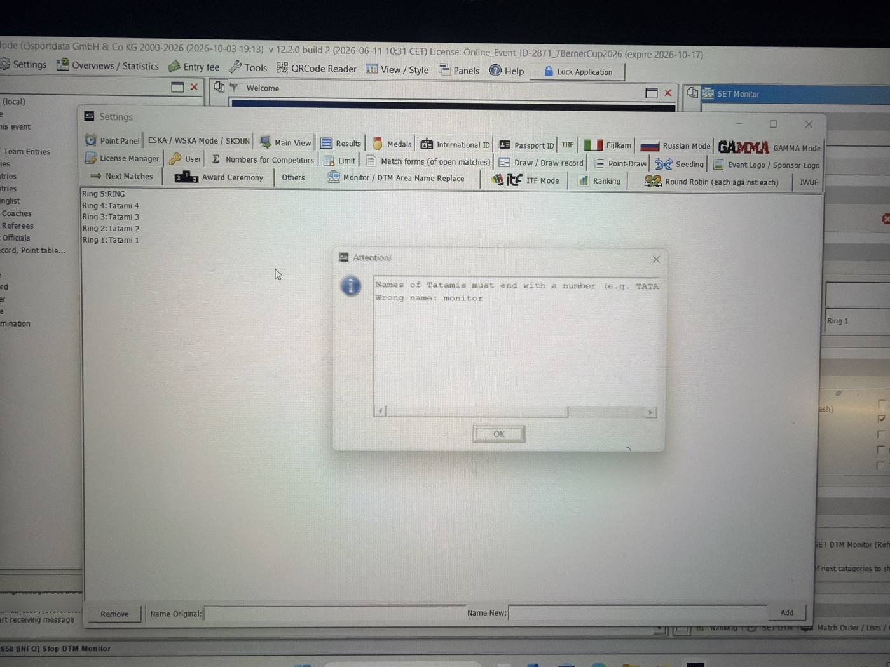

The next two shots show the Wrong name: monitor dialog.

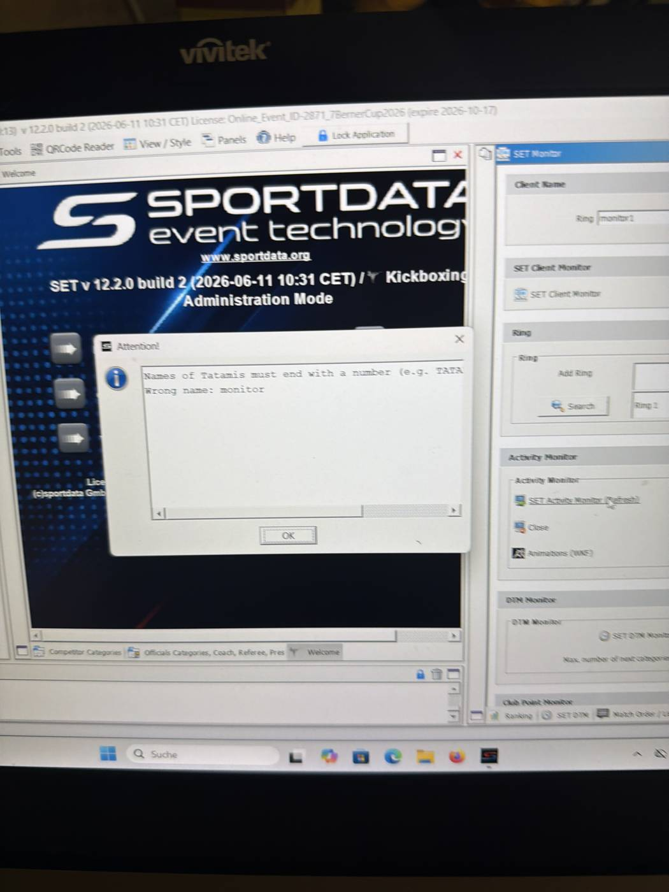

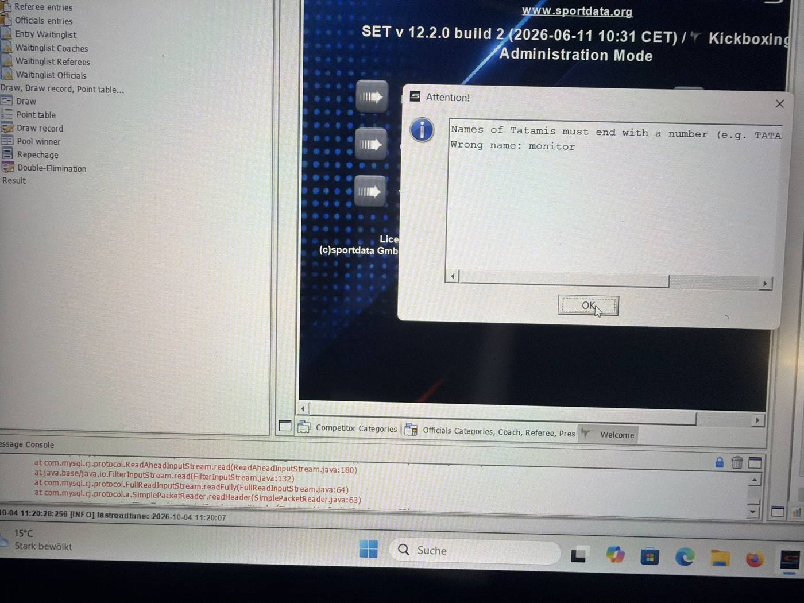

SET Monitor is open. Client Name is monitor1. The Wrong name: monitor dialog is on the screen.

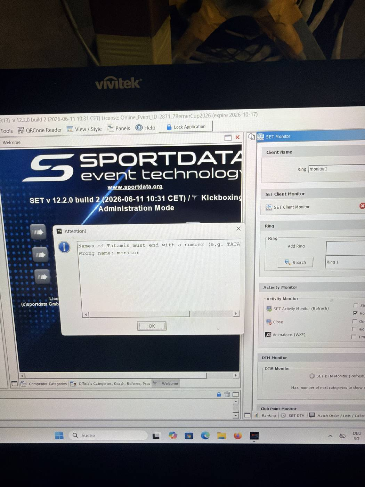

SET Monitor is under Panels. It is also a tab at the bottom of the window.

Panels is open. SET Monitor is in that menu.

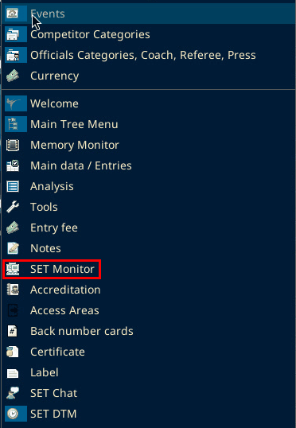

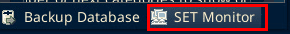

On SET 12.2.0 build 3 (local test, 6 Oct 2026): the same two ways in were confirmed.

On that window, Client Name was blank, then saved as monitor1. The word monitor in the window title is not the client name.

Client Name is monitor. Search, Remove, both Refresh buttons, and Close are on the window.

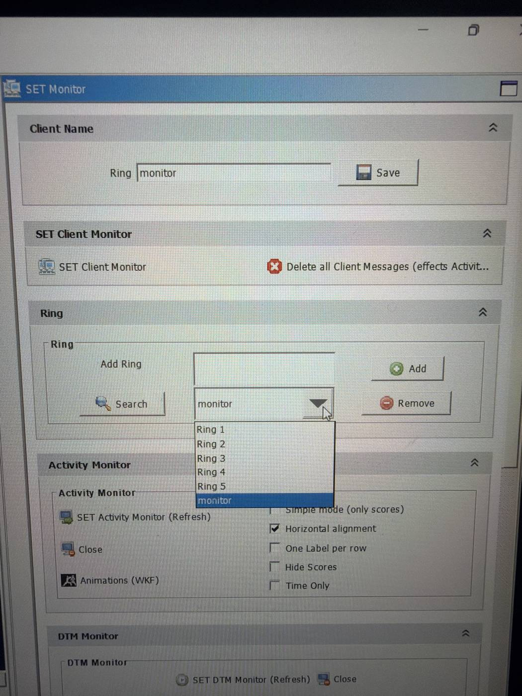

On SET 12.2.0 build 3 (local test, 6 Oct 2026): the Client Name section is at the top of SET Monitor. In a narrow panel only the word Ring shows. With the panel maximized, Ring is the label in front of the field, and the field read Tatami 1 on the local copy. A Save button is next to the field. Below it is SET Client Monitor with SET Client ... and Delete all Cl... (both cut off on screen).

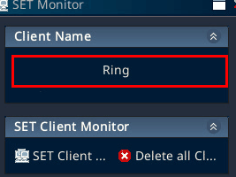

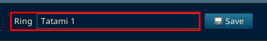

On SET 12.2.0 build 3 (local test, 6 Oct 2026) monitor1 was typed in the field and saved with Save.

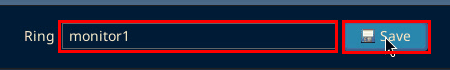

Client Name is monitor1. The dropdown lists Ring 1 to Ring 5.

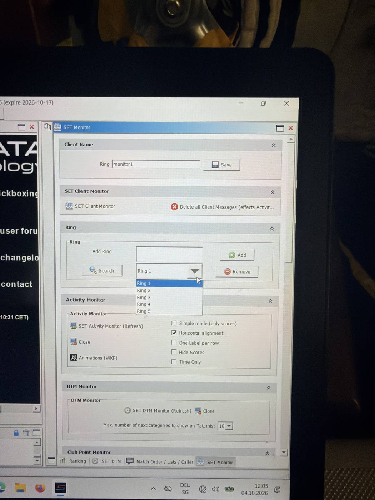

The Ring dropdown separately listed Ring 1, Tatami 1, Ring 2, Ring 3, Ring 4, Ring 5, and monitor. Remove takes monitor off the list. Search puts monitor back. After Remove, without Search, the list was only Ring 1 through Ring 5.

On SET 12.2.0 build 3 (local test, 6 Oct 2026): the Ring section has Add Ring with Add, then Search, the Ring dropdown, and Remove. The dropdown was empty at first. monitor was typed in Add Ring and Add was clicked. The dropdown then showed monitor.

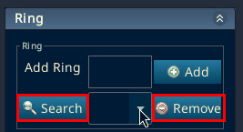

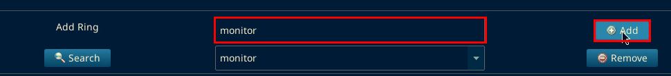

The open dropdown listed only monitor.

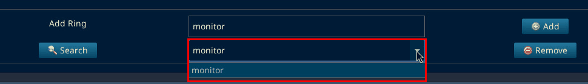

Remove took monitor off, and the dropdown was empty again.

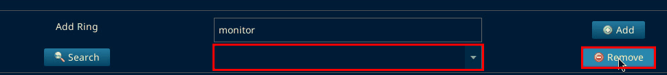

Search was only hovered, not clicked, because at the venue Search put monitor back.

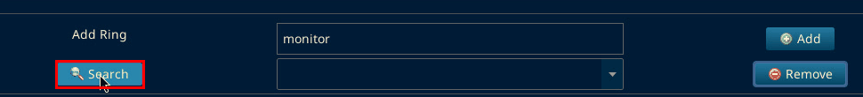

At the end of the test Client Name was set back to Tatami 1 and saved.

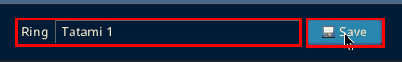

No "Names of Tatamis must end with a number" dialog came up in the local test. That dialog was only seen at the venue.

Pressing SET DTM Monitor (Refresh) or SET Activity Monitor (Refresh) brought the same Wrong name: monitor dialog back. That happened even when the dropdown no longer showed monitor.

## Workaround

The steps below are a workaround. They are not the correct permanent fix.

1. Click OK on the dialog.
2. Do not press Search.
3. Do not press SET DTM Monitor (Refresh) or SET Activity Monitor (Refresh) while the screens are already cycling.

This does not remove the stored name monitor.

## Confirmed later on 4 Oct 2026

This was confirmed on the display the same day. It is not a proper fix.

SET Activity Monitor (Refresh) is the fight and score screen. SET DTM Monitor (Refresh) is the timetable. Pressing SET DTM Monitor (Refresh) makes the timetable show and cycle.

The score screen still flashes between tatamis, for example between tatami 1 and tatami 2. Activity Monitor must still be open in the background. It had not been closed. The Close button under Activity Monitor is the control on the SET Monitor window, directly under SET Activity Monitor (Refresh). Closing the settings panel does not stop the score screen.

The Wrong name: monitor dialog still returns when the rotation reaches the stored name monitor. Click OK. That is not fixed.

On SET 12.2.0 build 3 (local test, 6 Oct 2026): the Activity Monitor button reads SET Activity... on screen. Its tooltip is SET Activity Monitor. Close is directly under it in the Activity Monitor section. The DTM Monitor section has SET DTM Monitor (Refresh). No refresh button was pressed and no Wrong name dialog came up, so the venue photos above are the only record of that dialog.

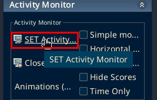

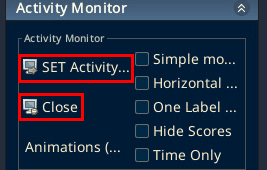

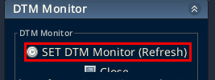
